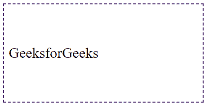
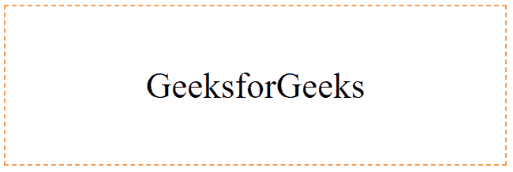

# 如何用 CSS 垂直居中文字？

> 原文:[https://www . geesforgeks . org/如何使用 css 垂直居中文本/](https://www.geeksforgeeks.org/how-to-vertically-center-text-with-css/)

在本文中，我们将了解如何使用 CSS 垂直对齐文本&将通过示例看到它的实现。虽然 CSS2 不支持垂直对齐。但是，我们可以通过组合一些属性来垂直对齐中心块。诀窍是指定将外部块格式化为表格单元格，因为表格单元格的内容可以垂直居中。我们将使用[垂直对齐属性](https://www.geeksforgeeks.org/css-vertical-align-property/)来指定表格框或内嵌元素的垂直对齐。

下面的示例将段落放在具有特定高度的块的中心。一个单独的示例显示了一个在浏览器窗口中垂直居中的段落，因为它位于一个绝对定位的块内，并且与窗口一样高。

```css
DIV.container {
    min-height: 10em;
    display: table-cell;
    vertical-align: middle }
...
DIV {
  GeeksforGeeks
}
```

**示例:**本示例将垂直对齐属性和显示属性一起用作表格单元格。

## 超文本标记语言

```css
<!DOCTYPE html>
<html>

<head>
    <title>Horizontal and Vertical alignment</title>
    <style>
    div {
        height: 200px;
        width: 400px;
        border: 2px dashed #4b2869;
    }

    .container {
        min-height: 10em;
        display: table-cell;
        vertical-align: middle;
    }
    </style>
</head>

<body>
    <div class="container">GeeksforGeeks</div>
</body>

</html>
```

**输出:**



有一种更通用的方法，它指定了垂直对齐文本的另一种方式。该解决方案适用于单行和多行文本，但仍需要一个固定高度的容器。

```css
div {
  height: 200px;
  line-height: 200px;
  text-align: center;
  border: 2px dashed #f69c55;
}
span {
  display: inline-block;
  vertical-align: middle;
  line-height: normal;
}
```

CSS 只是调整 div 的大小，通过将 div 的行高设置为其高度来垂直居中对齐跨度，并使跨度成为一个具有垂直对齐:中间的内联块。然后，它将跨度的行高设置回正常高度，因此其内容将自然地在块内流动。

**示例:**该示例描述了将内容物与容器的固定高度垂直对齐。

## 超文本标记语言

```css
<!DOCTYPE html>
<html>

<head>
    <title> Horizontal and Vertical alignment </title>
    <style>
    div {
        height: 200px;
        line-height: 200px;
        text-align: center;
        border: 2px dashed #f69c55;
    }

    span {
        display: inline-block;
        vertical-align: middle;
        line-height: normal;
    }
    </style>
</head>

<body>
    <div>
      <span>GeeksforGeeks</span>
      </div>
</body>

</html>
```

**输出:**



CSS 是网页的基础，通过设计网站和网络应用程序用于网页开发。你可以通过以下 [CSS 教程](https://www.geeksforgeeks.org/css-tutorials/)和 [CSS 示例](https://www.geeksforgeeks.org/css-examples/)从头开始学习 CSS。