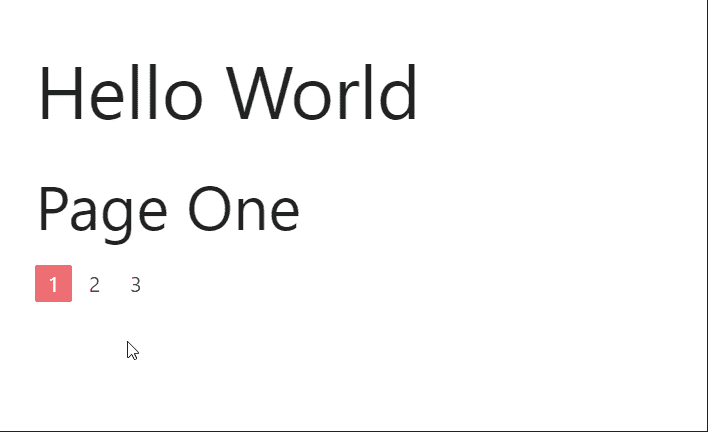

# 如何在物化 CSS 中创建分页？

> 原文:[https://www . geesforgeks . org/how-we-create-paging-in-物化-css/](https://www.geeksforgeeks.org/how-to-we-create-pagination-in-materialize-css/)

物化 CSS 是一个前端用户界面库，由谷歌使用 HTML、CSS 和 JavaScript 的组合创建。它基本上是一种将经典设计与现代创新和技术相结合的设计语言。谷歌开发物化 CSS 的目的是为他们在互联网上的所有产品提供统一的系统设计。物化 CSS 也被称为材料设计。

在本文中，我们将讨论一个在几乎所有网站中都可以找到的非常有用的组件，即分页。分页可以在多个网站上看到，最常见的例子是谷歌搜索。您可以在每个谷歌搜索页面的底部看到如上所示的分页标签。分页有助于以更好的方式显示大量数据。

让我们借助一个例子来理解这一点:假设你已经在亚马逊网站上搜索了手机，现在，亚马逊有成千上万的手机要显示，这些手机无法在一个屏幕上显示，如果它在一个网页上显示所有选项，它将变得非常长，用户必须做一个非常忙乱的滚动，给用户或客户带来非常糟糕的体验。取而代之的是，我们可以在每页上显示假设 20 部手机，并在最后分页，这样用户就可以浏览它们。

现在，让我们通过使用物化 CSS 来理解如何使用分页。让我们用下面的语法为这个页面添加分页代码。

**语法:**

```css
<ul class="pagination">
    <li class="active"><a href="#!">1</a></li>
    <li class="waves-effect"><a href="#!">2</a></li>
    <li class="waves-effect"><a href="#!">3</a></li>
    <li class="waves-effect"><a href="#!">4</a></li>
    <li class="waves-effect"><a href="#!">5</a></li>
</ul>
```

现在，默认情况下，所有没有任何网址的按钮都不会链接到任何页面。我们可以将每个页面按钮链接到不同的页面，还可以通过增加或减少列表项目的数量来增加或减少页面的数量。

现在，这里有一个我们用 4 页创建的基本分页的例子:

*   如果我们点击页码，下一页将被导航。
*   被点击的页面会高亮显示。

**示例:**在下面的示例中，我们将创建 3 个可以使用导航访问的文件。

## 第 1 页. html

```css
<!DOCTYPE html>
<html>

<head>
    <!-- Compiled and minified CSS -->
    <link rel="stylesheet" href=
"https://cdnjs.cloudflare.com/ajax/libs/materialize/1.0.0/css/materialize.min.css">

    <!-- Compiled and minified JavaScript -->
    <script src=
"https://cdnjs.cloudflare.com/ajax/libs/materialize/1.0.0/js/materialize.min.js">
    </script>
</head>

<body class="container">
    <h1>Hello World</h1>
    <h2>Page One</h2>
    <ul class="pagination">
        <li class="waves-effect active">
          <a href="/page1.html">1</a>
        </li>
        <li class="waves-effect">
          <a href="/page2.html">2</a>
        </li>
        <li class="waves-effect">
          <a href="/page3.html">3</a>
        </li>
    </ul>
</body>

</html>
```

## 第 2 页. html

```css
<!DOCTYPE html>
<html>

<head>
    <!-- Compiled and minified CSS -->
    <link rel="stylesheet" href=
"https://cdnjs.cloudflare.com/ajax/libs/materialize/1.0.0/css/materialize.min.css">

    <!-- Compiled and minified JavaScript -->
    <script src=
"https://cdnjs.cloudflare.com/ajax/libs/materialize/1.0.0/js/materialize.min.js">
    </script>
</head>

<body class="container">
    <h1>Hello World</h1>
    <h2>Page Two</h2>
    <ul class="pagination">
        <li class="waves-effect">
          <a href="/page1.html">1</a>
        </li>
        <li class="waves-effect active">
          <a href="/page2.html">2</a>
        </li>
        <li class="waves-effect">
          <a href="/page3.html">3</a>
        </li>
    </ul>
</body>

</html>
```

## 第 3 页. html

```css
<!DOCTYPE html>
<html>

<head>
    <!-- Compiled and minified CSS -->
    <link rel="stylesheet" href=
"https://cdnjs.cloudflare.com/ajax/libs/materialize/1.0.0/css/materialize.min.css">

    <!-- Compiled and minified JavaScript -->
    <script src=
"https://cdnjs.cloudflare.com/ajax/libs/materialize/1.0.0/js/materialize.min.js">
      </script>
</head>

<body class="container">
    <h1>Hello World</h1>
    <h2>Page Three</h2>
    <ul class="pagination">
        <li class="waves-effect">
          <a href="/page1.html">1</a>
        </li>
        <li class="waves-effect">
          <a href="/page2.html">2</a>
        </li>
        <li class="waves-effect active">
          <a href="/page3.html">3</a>
        </li>
    </ul>
</body>

</html>
```

**输出:**

