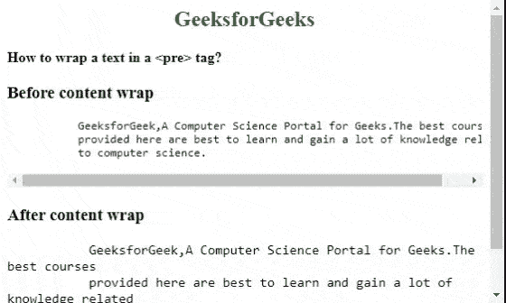

# 如何在

```css
 tag using CSS ?
```

中换行

> 原文:[https://www . geeksforgeeks . org/如何使用 css 将文本包装在预标记中/](https://www.geeksforgeeks.org/how-to-wrap-a-text-in-a-pre-tag-using-css/)

在本文中，我们将学习如何将文本包装在

```css
标签中。<>标记用于显示预格式化文本块，该文本块保留了网页浏览器忽略的文本空格、换行符、制表符和其他格式化字符。默认情况下、<pre>标签不支持< pre >标签。在以规定的方式呈现大文本的情况下，网络浏览器会显示一个水平滚动条。用户正面临着一部分一部分阅读整行的问题。
```

**进场:**

*   首先，我们创建一个包含

    ```css
    标签的 HTML 文档。
    ```

*   现在，使用 CSS [**overflow-x**](https://www.geeksforgeeks.org/css-overflow-x-property/) 属性设置为“自动”，当内容溢出时自动添加滚动条。
*   将[](https://www.geeksforgeeks.org/css-white-space-property/)****属性设置为“预包装”。****
*   ****最后，使用设置为“断字”的主[自动换行](https://www.geeksforgeeks.org/css-word-wrap-property/)属性，这样超过容器宽度的单词将被任意断开，以适合容器的边界。****

******示例:******

## ****超文本标记语言****

```css
**<!DOCTYPE html>
<html>

<head>
    <style>
        #gfg {
            overflow-x: auto;
            white-space: pre-wrap;
            word-wrap: break-word;
            font-size: 15px;
        }

        pre {
            overflow-x: auto;
        }
    </style>
</head>

<body>
    <h2 style="color:green;text-align:center;">
        GeeksforGeeks
    </h2>
    <b>
        How to wrap a text in a <pre> tag?
    </b>

    <h3>
        Before content wrap
    </h3>

    <pre>
            GeeksforGeek,A Computer Science Portal 
            for Geeks. The best courses provided 
            here are best to learn and gain a lot 
            of knowledge related to computer science.
    </pre>

    <h3>
        After content wrap
    </h3>

    <!-- html pre tag starts -->
    <pre id="gfg">
            GeeksforGeek,A Computer Science Portal 
            for Geeks. The best courses provided 
            here are best to learn and gain a lot 
            of knowledge related to computer science.
    </pre>
    <!-- html pre tag ends -->
</body>

</html>**
```

******输出:******

********