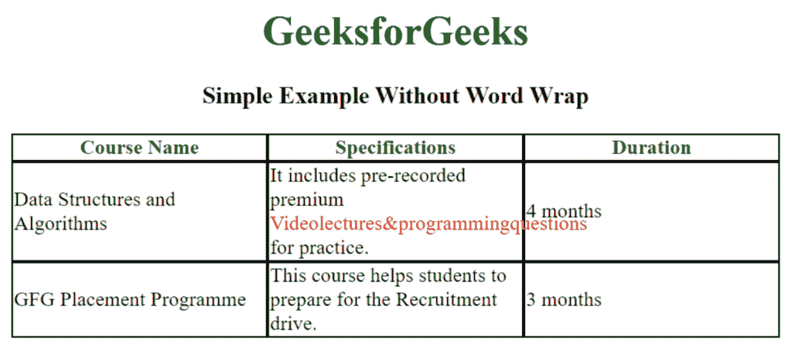
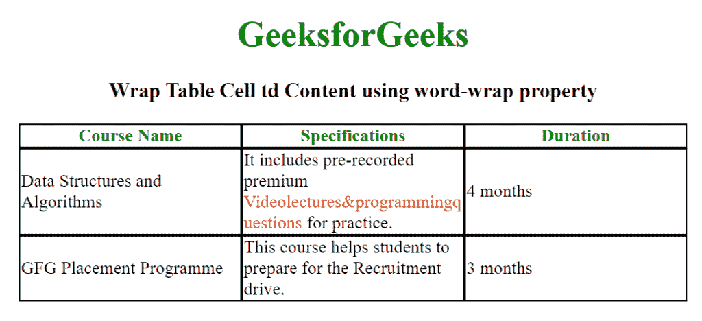
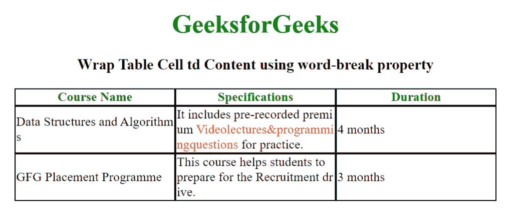

# 如何使用 CSS 包装表格单元格内容？

> 原文: [https://www .吉斯弗格斯。org/how-wrap-table-cell-TD-content-use-CSS/](https://www.geeksforgeeks.org/how-to-wrap-table-cell-td-content-using-css/)

HTML 中的表格都是荒诞的元素。将 CSS 属性应用于表元素并不是一件容易的事情。作为一个高度结构化的元素，CSS 属性有时会在结构的层次结构中丢失。表格的内容也很可能会改变表格的结构或尺寸。例如，表格单元格中的长单词会导致单元格宽度增加。如果您解决了这个问题，长单词可能会跨越单元格边界。我们可以通过对单元格数据进行自动换行来避免这种情况。

有两种方法**使用 CSS 将表格单元格< td >内容换行，如下所示:**

*   [**Use wrap attribute:**](https://www.geeksforgeeks.org/css-word-wrap-property/) This attribute is used to allow long words to wrap to the next line.
*   [**Use hyphenation attribute:**](https://www.geeksforgeeks.org/css-word-break-property/) This attribute is used to specify how to hyphenate a word when it reaches the end of a line. Line breaks in text may appear in some spaces, such as spaces or hyphens.

**示例:**

## HTML

```html
<!DOCTYPE html>
<html>

<head>
    <title>
        How to wrap table cell
        td content using CSS?
    </title>

    <style>
        h1, h3 {
            text-align: center;
        }
        table {
            border-spacing: 0px;
            table-layout: fixed;
            margin-left:auto;
            margin-right:auto;
        }
        th {
            color: green;
            border: 1px solid black;
        }
        td {
            border: 1px solid black;
        }
    </style>
</head>

<body>
    <h1 style="color:green;">GeeksforGeeks</h1>

    <h3>Simple Example Without Word Wrap</h3>

    <table width="600">
        <tr>
            <th>Course Name</th>
            <th>Specifications</th>
            <th>Duration</th>
        </tr>

        <tr>
            <td>Data Structures and Algorithms</td>
            <td>
                It includes pre-recorded premium
                <span style="color: red;">
                    Videolectures&programmingquestions
                </span> for practice.
            </td>
            <td>4 months</td>
        </tr>

        <tr>
            <td>GFG Placement Programme</td>
            <td>
                This course helps students to prepare
                for the Recruitment drive.
            </td>
            <td>3 months</td>
        </tr>
    </table>
</body>

</html>
```

**输出:**



**注意:**在上表中，我们定义了一个 600px 的**表宽，并将表-布局应用为固定的**。注意标记为红色的长单词**是通过去除空格而形成的，例如目的。**

**方法一:** **使用换行属性:**换行:断字；属性用于在适当的断点处断开长单词。

**示例:**

## HTML

```html
<!DOCTYPE html>
<html>

<head>
    <title>
        How to wrap table cell
        td content using CSS?
    </title>

    <style>
        h1,
        h3 {
            text-align: center;
        }

        table {
            border-spacing: 0px;
            table-layout: fixed;
            margin-left: auto;
            margin-right: auto;
        }

        th {
            color: green;
            border: 1px solid black;
        }

        td {
            border: 1px solid black;
            word-wrap: break-word;
        }
    </style>
</head>

<body>
    <h1 style="color:green;">GeeksforGeeks</h1>

    <h3>Wrap Table Cell td Content using word-wrap property</h3>

    <table width="600">
        <tr>
            <th>Course Name</th>
            <th>Specifications</th>
            <th>Duration</th>
        </tr>

        <tr>
            <td>Data Structures and Algorithms</td>
            <td>
                It includes pre-recorded premium
                <span style="color: red;">
                    Videolectures&programmingquestions
                </span> for practice.
            </td>
            <td>4 months</td>
        </tr>

        <tr>
            <td>GFG Placement Programme</td>
            <td>
                This course helps students to prepare
                for the Recruitment drive.
            </td>
            <td>3 months</td>
        </tr>
    </table>
</body>

</html>
```

**输出:**



**方法二:** **使用断字属性:**断字:断全；属性用于在任何字符处断开单词。

**示例:**

## HTML

```html
<!DOCTYPE html>
<html>

<head>
    <title>
        How to wrap table cell
        td content using CSS?
    </title>

    <style>
        h1,
        h3 {
            text-align: center;
        }

        table {
            border-spacing: 0px;
            table-layout: fixed;
            margin-left: auto;
            margin-right: auto;
        }

        th {
            color: green;
            border: 1px solid black;
        }

        td {
            border: 1px solid black;
            word-break: break-all;
        }
    </style>
</head>

<body>
    <h1 style="color:green;">GeeksforGeeks</h1>

    <h3>Wrap Table Cell td Content using word-break property</h3>

    <table width="600">
        <tr>
            <th>Course Name</th>
            <th>Specifications</th>
            <th>Duration</th>
        </tr>

        <tr>
            <td>Data Structures and Algorithms</td>
            <td>
                It includes pre-recorded premium
                <span style="color: red;">
                    Videolectures&programmingquestions
                </span> for practice.
            </td>
            <td>4 months</td>
        </tr>

        <tr>
            <td>GFG Placement Programme</td>
            <td>
                This course helps students to prepare
                for the Recruitment drive.
            </td>
            <td>3 months</td>
        </tr>
    </table>
</body>

</html>
```

**输出:**



**注:**请注意两者属性的胜负差异。word-wrap 属性将单词换行到新的一行，而 word-break 属性继续跟随该流，并在任何适当的字符处换行。

HTML 是网页的基础，通过结构化网站和 web apps 用于网页开发。遵循本 [HTML 教程](https://www.geeksforgeeks.org/html-tutorials/)和 [HTML 示例](https://www.geeksforgeeks.org/html-examples/)可以从头开始学习 HTML。

CSS 是网页的基础，通过对网站和 web apps 进行样式化，用于网页开发。遵循本 [CSS 教程](https://www.geeksforgeeks.org/css-tutorials/)和 [CSS 示例](https://www.geeksforgeeks.org/css-examples/)可以从头开始学习 CSS。