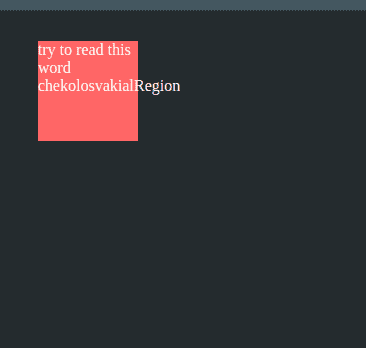
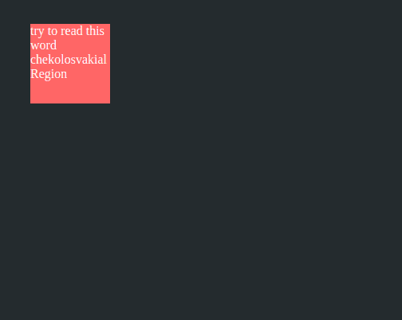

# 如何使用 CSS 对框内外的文字进行换行？

> 原文:[https://www . geeksforgeeks . org/如何使用-css/](https://www.geeksforgeeks.org/how-to-wrap-text-inside-and-outside-box-using-css/) 包装盒子内外的文本

在本文中，我们将介绍如何使用 CSS 属性在框内外包装文本。

**方法:**我们将使用“ [*”溢出包装*](https://www.geeksforgeeks.org/css-overflow-wrap-property/) ”属性。当内容的长度超过父组件的长度时，此属性就会出现在图片中。“*溢出包装*属性可以主要有五个值。

*   常态
*   中断词
*   继承
*   最初的
*   复原

“正常”值将根据浏览器的正常断线规则断线。“*继承*”将继承父元素的属性。但我们要找的价值是“*断语*”。

**“**”T2【断字】“属性将断开任何超出父块或分区边界的字符串或单词，并将尝试将内容放入提供新行的块中。

我们将把*高度*和*宽度*属性设为固定值，而不是*自动*，因为自动会根据内容长度增加宽度。

**HTML 代码:**我们创建了一个 *div* ，类名为“ *box* ，负责给定固定的*高度*、*宽度、*和溢出条件。在这个 *div* 框中，我们有我们的内容 [< *p >*](https://www.geeksforgeeks.org/html-paragraph/) 标签，它保存字符串值。

## 超文本标记语言

```css
<!DOCTYPE html>
<html lang="en">

<head>
    <meta charset="UTF-8">
    <meta http-equiv="X-UA-Compatible" content="IE=edge">
    <meta name="viewport" content=
        "width=device-width, initial-scale=1.0">

    <style>
        body {
            background-color: #242B2E;
            color: white;
        }

        .box {
            margin: 30px;
            height: 100px;
            width: 100px;
            background-color: #FF6666;
            overflow-wrap: break-word;
        }

        .p {
            color: white;
            margin: 5px;
            padding: 10px;
        }
    </style>
</head>

<body>
    <div class="box">
        <p>
            try to read this word 
            chekolosvakialRegion
        </p>
    </div>
</body>

</html>
```

**无溢出条件的类框:**如果类“*框*将上面使用的 CSS 改为如下。

在上面，我们没有在类框中给出任何溢出条件，所以会遵循正常的行为，并且在没有指定分隔线之前不会换行，分隔线是空白的。在这种情况下，我们的内容会溢出盒子。

**输出:**



超越界限的内容

**有溢出条件的类框:**如果用以下代码修改上述 CSS。

在父块框上提供溢出条件后，我们实现了内容的换行。每当 *< p >* 标签内容试图超出边界时，我们的 o*verflow-wrap:break-word***会将单词*【chekolosvakialrion】*断开，并尝试放入框中。**

****输出:****

**

溢出换行:断字** 

**我们已经使用 CSS 属性成功地包装了盒子内外的内容。**