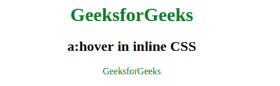

# 如何写一个:在内嵌 CSS 中悬停？

> 原文:[https://www . geesforgeks . org/how-write-a hover-in-inline-CSS/](https://www.geeksforgeeks.org/how-to-write-ahover-in-inline-css/)

它被称为伪选择器，用于当用户在元素上移动鼠标时选择所有元素。它可以用于所有元素。必须在文档中声明一个元素，以查看该选择器在所有元素中的工作情况。

**例 1:**

```html
<!DOCTYPE html>
<html>
    <head>
        <title>a:hover in inline CSS</title>
        <style>
            h1 {
                color:green;
            }
            body {
                text-align:center;
            }
            a {
                text-decoration:none;
                color:green;
            }
        </style>
    </head>
    <body>
        <h1>GeeksforGeeks</h1>
        <h2>a:hover in inline CSS</h2>
        <a href="#" onMouseOver="this.style.color='red'"
        onMouseOut="this.style.color='green'" >GeeksforGeeks</a>
    </body>
</html>                    
```

**输出:**


**示例 2:** 本示例使用 JavaScript 在 CSS 中显示一个:悬停内容。调用 onmouseover 和 onmouseout 事件属性来显示 a:悬停内容。

```html
<!DOCTYPE html>
<html>
    <head>
        <title>a:hover in inline CSS</title>
        <style>
            h1 {
                color:green;
            }
            body {
                text-align:center;
            }
            a {
                text-decoration:none;
                color:green;
            }
        </style>
        <script>
            function mouseover() {
                document.getElementById("gfg").style.color = "red";
            }

            function mouseout() {
                document.getElementById("gfg").style.color = "green";
            }
        </script>
    </head>
    <body>
        <h1>GeeksforGeeks</h1>
        <h2>a:hover in inline CSS</h2>
        <a href = "#" id="gfg" onmouseover="mouseover()" 
        onmouseout="mouseout()">GeeksforGeeks</a>
    </body>
</html>                    
```

**输出:**


**支持的浏览器:**悬停选择器支持的浏览器如下:

*   苹果 Safari 3.1
*   谷歌 Chrome 4.0
*   Firefox 2.0
*   歌剧 9.6
*   Internet Explorer 7.0

HTML 是网页的基础，通过构建网站和网络应用程序用于网页开发。您可以通过以下 [HTML 教程](https://www.geeksforgeeks.org/html-tutorials/)和 [HTML 示例](https://www.geeksforgeeks.org/html-examples/)从头开始学习 HTML。

CSS 是网页的基础，通过设计网站和网络应用程序用于网页开发。你可以通过以下 [CSS 教程](https://www.geeksforgeeks.org/css-tutorials/)和 [CSS 示例](https://www.geeksforgeeks.org/css-examples/)从头开始学习 CSS。