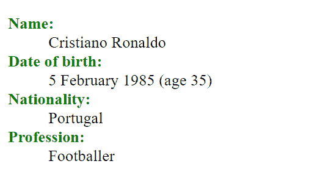
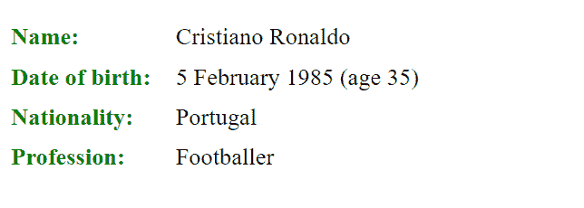

# 如何用 CSS 将

和

元素写在同一行？

> 原文:[https://www . geesforgeks . org/how-write-dt-and-DD-element-on-the-online-use-CSS/](https://www.geeksforgeeks.org/how-to-write-dt-and-dd-element-on-the-same-line-using-css/)

[< dt >](https://www.geeksforgeeks.org/html-dt-tag/) 和 [< dd >](https://www.geeksforgeeks.org/html-dd-tag/) 标签在 [< dl >](https://www.geeksforgeeks.org/html-dl-tag/) (定义描述列表)标签中一起使用，以定义术语或给出它们的描述。使用< dt >标签指定描述列表。< dd >标签代表定义描述，用于表示描述列表中项目的描述或定义。< dl >标签用于表示描述列表。该标签与< dt >和< dd >标签一起使用。

**示例 1:** 本示例使用 [< dt >](https://www.geeksforgeeks.org/html-dt-tag/) 和 [< dd >](https://www.geeksforgeeks.org/html-dd-tag/) 标签内的 [< dl >](https://www.geeksforgeeks.org/html-dl-tag/) 标签，并在不同行显示< dt >和< dd >内容。

## 超文本标记语言

```css
<!DOCTYPE html>
<html>

<head>
    <title>
        How to write dt and dd element
        on the same line using CSS ?
    </title>

    <style>
        dt {
            font-weight: bold;
            color: green;
        }

        dt::after {
            content: ":";
        }
    </style>
</head>

<body>
    <dl>
        <dt>Name</dt>
        <dd>Cristiano Ronaldo</dd>
        <dt>Date of birth</dt>
        <dd>5 February 1985 (age 35)</dd>
        <dt>Nationality</dt>
        <dd>Portugal</dd>
        <dt>Profession</dt>
        <dd>Footballer</dd>
    </dl>
</body>

</html>
```

**输出:**



**示例 2:** 本示例使用 [< dt >](https://www.geeksforgeeks.org/html-dt-tag/) 和 [< dd >](https://www.geeksforgeeks.org/html-dd-tag/) 标记在 [< dl >](https://www.geeksforgeeks.org/html-dl-tag/) 标记内，并使用 CSS 在同一行显示< dt >和< dd >内容。

## 超文本标记语言

```css
<!DOCTYPE html>
<html>

<head>
    <style>
        dt {
            float: left;
            clear: left;
            width: 110px;
            font-weight: bold;
            color: green;
        }

        dt::after {
            content: ":";
        }

        dd {
            margin: 0 0 0 80px;
            padding: 0 0 0.5em 0;
        }
    </style>
</head>

<body>
    <dl>
        <dt>Name</dt>
        <dd>Cristiano Ronaldo</dd>
        <dt>Date of birth</dt>
        <dd>5 February 1985 (age 35)</dd>
        <dt>Nationality</dt>
        <dd>Portugal</dd>
        <dt>Profession</dt>
        <dd>Footballer</dd>
    </dl>
</body>

</html>
```

**输出:**

