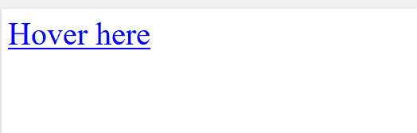

# CSS 中 a:before 和 a:after 的悬停条件怎么写？

> 原文:[https://www . geesforgeks . org/how-write-how-hover-condition-for-abefore-and-aaafter-in-CSS/](https://www.geeksforgeeks.org/how-to-write-hover-condition-for-abefore-and-aafter-in-css/)

CSS 中的**:**之前和**:**之后的选择器用于在元素前后添加内容。【悬停】是伪类，【前 T4】是伪元素。在 CSS 中，伪元素写在伪类之后。

**语法:**

```html
a:hover::before {
    // CSS Property
}
a:hover::after {
    // CSS Property
}

```

在 CSS3 中，双冒号(::)用于表示伪元素。对于 IE8 或更早版本，使用单个冒号(CSS2 语法)。

**示例 1:** 本示例对元素中的 a:before 和 a:after 使用:悬停条件。

```html
<!DOCTYPE html>
<html>
   <head>
       <title>
           :hover condition for a:before
           and a:after 
       </title>
      <!-- Style to add hover condition -->
      <style>
         a:hover::before {
            content: "Before -";
         }
         a:hover::after {
            content: "-after";
         }
      </style>
   </head>

   <body>
      <a href="#" > Hover here </a>
   </body>
</html>
```

**鼠标移过前:**

**鼠标移过后:**


**示例 2:** 本示例对元素中的 a:before 和 a:after 使用:悬停条件。

```html
<!DOCTYPE html>
<html>
    <head>
        <title>
            :hover condition for a:before
            and a:after 
        </title>

        <style>
            a:hover::before {
                content: "Before -";
                background-color: green;
            }
            a:hover::after{
                content: "-after";
                background-color: green;
            }
        </style>
    </head>

    <body>
        <a href="#" > GeeksForGeeks </a>
    </body>
</html>
```

**鼠标移过之前:**

**鼠标移过**
之后

HTML 是网页的基础，通过构建网站和网络应用程序用于网页开发。您可以通过以下 [HTML 教程](https://www.geeksforgeeks.org/html-tutorials/)和 [HTML 示例](https://www.geeksforgeeks.org/html-examples/)从头开始学习 HTML。

CSS 是网页的基础，通过设计网站和网络应用程序用于网页开发。你可以通过以下 [CSS 教程](https://www.geeksforgeeks.org/css-tutorials/)和 [CSS 示例](https://www.geeksforgeeks.org/css-examples/)从头开始学习 CSS。