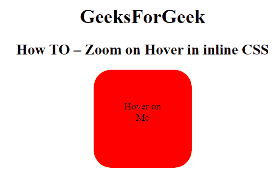

# 如何使用 CSS 缩放悬停上的元素？

> 原文:[https://www . geeksforgeeks . org/how-zoom-on-how-a-element-how-how-how-on-how-how-how-how-how-how-on-how-how-how-how-how-how-how-how](https://www.geeksforgeeks.org/how-to-zoom-an-element-on-hover-using-css/)

在本文中，我们将学习如何使用 CSS 缩放悬停。它被称为伪选择器，用于在用户将鼠标移动到元素上时选择所有元素。当用户悬停在元素上时，会调用缩放函数来增加元素的尺寸。它可以用于所有元素。必须在文档中声明一个元素，才能看到这个选择器在所有元素中的工作情况。

**示例:**

```css
<!DOCTYPE html>
<html>

<head>
    <title>
        How to zoom an element
        on Hover using CSS ?
    </title>
    <meta name="viewport" content=
        "width=device-width, initial-scale=1">

    <style>
        * {
            box-sizing: border-box;
        }

        .sudo {

            padding: 50px;
            background-color: red;
            transition: transform .2s;
            width: 160px;
            height: 160px;
            margin: 0 auto;
            border-radius: 29px;
        }

        .sudo:hover {
            -ms-transform: scale(4.6);
            /* IE 9 */
            -webkit-transform: scale(1.5);
            /* Safari 3-8 */
            transform: scale(1.5);
        }
    </style>
</head>

<body>
    <center>
        <h1>
            GeeksForGeek
        </h1>

        <h2>
            How TO – Zoom on Hover
            in inline CSS
        </h2>

        <div class="sudo">
            Hover on Me
        </div>
    </center>
</body>

</html>
```

**输出:**

*   **悬停在红框前:**
    
*   **悬停在红框上后:**
    

**支持的浏览器:**支持的浏览器如下:

*   谷歌 Chrome
*   微软公司出品的 web 浏览器
*   火狐浏览器
*   苹果 Safari
*   歌剧