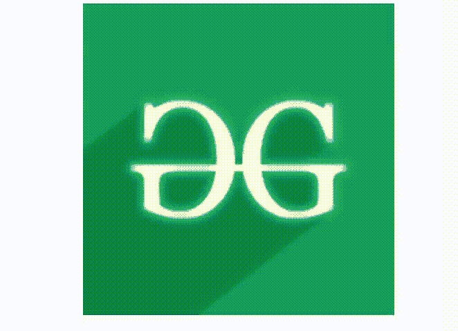

# 如何使用 CSS 缩放鼠标悬停时的图像？

> 原文:[https://www . geesforgeks . org/如何使用 css 缩放鼠标悬停图像/](https://www.geeksforgeeks.org/how-to-zoom-an-image-on-mouse-hover-using-css/)

图像缩放效果用于在鼠标悬停或单击时对图像进行缩放。这种类型的效果主要用于投资组合网站。在我们想要在图像上显示用户细节的情况下，它非常有用。

有两种方法可以创建鼠标悬停效果。

*   使用 JavaScript
*   使用 CSS

在本文中，我们将看到如何使用 CSS 在悬停时缩放图像。本文包含两段代码。第一部分包含 HTML 代码，第二部分包含 CSS 代码。

**HTML 代码:**在本节中，我们将使用 HTML 创建悬停效果上的图像缩放的基本结构。

```css
<!DOCTYPE html>
<html>

<head>
    <meta charset="UTF-8" />
    <meta name="viewport" content=
        "width=device-width, initial-scale=1.0" />

    <title>
        How to Zoom an Image on
        Mouse Hover using CSS?
    </title>
</head>

<body>
    <div class="geeks">
        
    </div>
</body>

</html>
```

**CSS 代码:**在本节中，我们将使用一些 CSS 属性来缩放鼠标悬停时的图像。为了创建缩放效果，我们将使用过渡和变换属性。

```css
<style>
    .geeks {
        width: 300px;
        height: 300px;
        overflow: hidden;
        margin: 0 auto;
    }

    .geeks img {
        width: 100%;
        transition: 0.5s all ease-in-out;
    }

    .geeks:hover img {
        transform: scale(1.5);
    }
</style>
```

**完整代码:**在本节中，我们将结合以上两个部分，使用 HTML 和 CSS 创建鼠标悬停时的图像缩放效果。

**示例:**

```css
<!DOCTYPE html>
<html>

<head>
    <meta charset="UTF-8" />
    <meta name="viewport" content=
        "width=device-width, initial-scale=1.0" />

    <title>
        How to Zoom an Image on
        Mouse Hover using CSS?
    </title>

    <style>
        .geeks {
            width: 300px;
            height: 300px;
            overflow: hidden;
            margin: 0 auto;
        }

        .geeks img {
            width: 100%;
            transition: 0.5s all ease-in-out;
        }

        .geeks:hover img {
            transform: scale(1.5);
        }
    </style>
</head>

<body>
    <div class="geeks">
        
    </div>
</body>

</html>
```

**输出:**


HTML 是网页的基础，通过构建网站和网络应用程序用于网页开发。您可以通过以下 [HTML 教程](https://www.geeksforgeeks.org/html-tutorials/)和 [HTML 示例](https://www.geeksforgeeks.org/html-examples/)从头开始学习 HTML。

CSS 是网页的基础，通过设计网站和网络应用程序用于网页开发。你可以通过以下 [CSS 教程](https://www.geeksforgeeks.org/css-tutorials/)和 [CSS 示例](https://www.geeksforgeeks.org/css-examples/)从头开始学习 CSS。