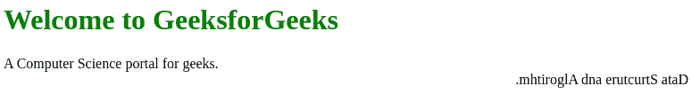
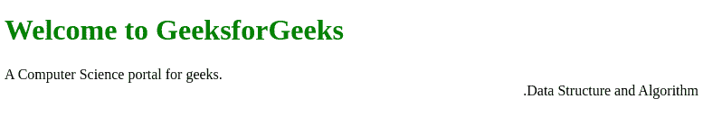

# CSS 中如何使用 unicode-bidi 属性？

> 原文:[https://www . geesforgeks . org/how-unicode-bidi-property-is-in-CSS/](https://www.geeksforgeeks.org/how-unicode-bidi-property-is-used-in-css/)

Unicode-bidi 属性在 CSS 中使用 **unicode-bidi 属性**，该属性与方向属性一起应用于 HTML 中，以确定如何在文档中处理双向文本。

**注意:**direction CSS 属性设置文本的方向( **rtl** 表示从右向左书写的语言， **ltr** 表示从左向右书写的语言)。

**语法:**

```html
unicode-bidi: embed|bidi-override;
```

**属性值:**

*   **正常:**为默认值。
*   **嵌入:**该值用于开启额外的嵌入级别
*   **双向覆盖**:该值为内联元素创建覆盖，如果是块元素，则为不在另一个块元素内的内联级后代创建覆盖。

**示例 1:** 使用双向覆盖属性值覆盖浏览器的双向文本算法，

**注意:Unicode 双向算法**是 Unicode 文本标准的一部分，描述了用户在呈现 Unicode 文本时应该如何对字符进行排序。

## 超文本标记语言

```html
<!DOCTYPE html>
<html>

<head>
    <style>
        h1 {
            color: green;
        }

        .gfg {
            direction: rtl;
            unicode-bidi: bidi-override;
        }
    </style>
</head>

<body>
    <h1>Welcome to GeeksforGeeks</h1>

    <div>A Computer Science portal for geeks.</div>
    <div class="gfg">Data Structure and Algorithm.</div>
</body>

</html>
```

**输出:**



**示例 2:** 使用允许元素中双向文本的嵌入属性值。

## 超文本标记语言

```html
<!DOCTYPE html>
<html>

<head>
    <style>
        h1 {
            color: green;
        }

        .gfg {
            direction: rtl;
            unicode-bidi: emb;
        }
    </style>
</head>

<body>
    <h1>Welcome to GeeksforGeeks</h1>

    <div>A Computer Science portal for geeks.</div>
    <div class="gfg">Data Structure and Algorithm.</div>
</body>

</html>
```

**输出:**



**支持的浏览器:**direction 属性支持的浏览器如下:

*   谷歌 Chrome 2.0
*   Internet Explorer 5.5
*   Firefox 1.0
*   歌剧 9.2
*   苹果 Safari 1.3