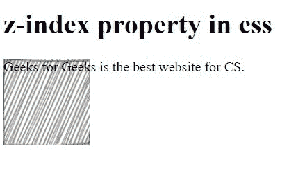
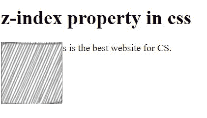

# 【z-index 在 CSS 中是如何工作的？

> 原文:[https://www.geeksforgeeks.org/how-z-index-works-in-css/](https://www.geeksforgeeks.org/how-z-index-works-in-css/)

在本文中，我们将看到 *[z-index](https://www.geeksforgeeks.org/css-z-index-property/)* 如何在 CSS 中工作。Z-index 作为屏幕上可见元素的堆栈。我们可以将 number 赋给 z-index 属性，以将其赋给堆栈中的一个位置。分配的号码可以是负数。数量较多的分配前面的位置，数量较少的分配后面的位置。例如，一个 *img* 标签的 z-index 为 1，另一个 h1 标签的 z-index 为 2。因此 z-index 等于 2 的标签将出现在 z-index 等于 1 之前，即 h1 标签内容将堆叠在 img 标签上。所有元素的默认 z 索引为 0。

**语法:**

```
z-index: number;
```

**方法:**在这个例子中，我们将使用一个图像标签和头标签来相互堆叠。我们将为图像标签分配 z 索引。

**示例 1:** 在下面的代码中，我们试图通过为图像标签分配-1 的 z 索引来将 h1 头堆叠在图像上。

## 超文本标记语言

```
<!DOCTYPE html>
<html lang="en">

<head>
  <style>
    #image1{   
      height: 100px;
      width: 100px;
      z-index: -1;
      position: absolute;
    }
  </style>
</head>

<body>
    <h1>z-index property in css</h1>
    <div id="image1"></div>
         
     <p>Geeks for Geeks is the best website for CS.</p>

</body>

</html>
```

**输出:**



**示例 2:** 在下面的代码中，我们试图通过为图像标签分配 1 的 z 索引来将图像堆叠在 h1 头上。

## 超文本标记语言

```
<!DOCTYPE html>
<html lang="en">

<style>
  #image1{   
    height: 100px;
    width: 100px;
    z-index: 1;
    position: absolute;
  }
</style>

<body>
  <h1>z-index property in css</h1>
  <div id="image1"></div>
  
  <p>Geeks for Geeks is the best website for CS.</p>

</body>

</html>
```

**输出:**

