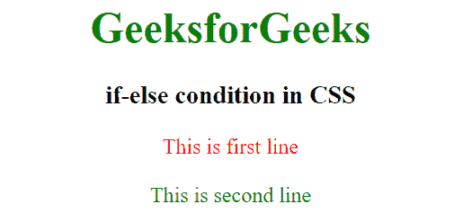

# CSS 中的 if/else 条件

> 原文:[https://www.geeksforgeeks.org/if-else-condition-in-css/](https://www.geeksforgeeks.org/if-else-condition-in-css/)

给定一个 HTML 文件，我们需要在 CSS 中使用 if-else 条件来应用。
不，我们不能在 CSS 中使用 if-else 条件，因为 CSS 不支持逻辑。但是我们可以使用下面讨论的 if-else 的一些替代方法:
**方法 1:** 在这个方法中，我们将使用 HTML 文件中的类来实现这一点。我们将根据我们想要在 CSS 中应用的条件来定义不同的类名。

*   假设我们想根据行号改变文本的颜色，那么 if-else 条件将是:

```css
if(line1){
   color : red;
}else{
   color : green;
}
```

*   通过使用上面讨论的方法，我们将创建类，然后在其中应用 CSS:

```css
.color-line1{
   color : red;
}
.color-line2{
   color : green;
}
```

因此，上面的类将只对使用这些类的 HTML 标签执行。
**例:**

## 超文本标记语言

```css
<html> 

<head> 
    <title> 
        If-else condition in CSS
    </title> 

    <!-- Applying CSS -->
    <style>
        /* First line CSS */
        .color-line1{
            color : red;
        }

        /* Second line CSS */
        .color-line2{
            color: green;
        }
    </style>
</head> 

<body style="text-align:center;"> 

    <h1 style="color:green;"> 
        GeeksforGeeks 
    </h1> 

    <h3> 
        If-else condition in CSS
    </h3>
    <span class="color-line1">This is first line</span>
    <br><br>
    <span class="color-line2">This is second line</span>

</body> 

</html> 

```

**输出:**



**方法 2:** 我们可以使用像 [SASS](https://sass-lang.com/) 这样的 CSS 预处理程序，它允许我们在其中编写条件语句。即使使用了 SASS，也必须预处理样式表，这意味着条件是在编译时评估的，而不是在运行时。
**语法:**

```css
$type: line;
p {
  @if $type == line1 {
    color: blue;
  } @else if $type == line2 {
    color: red;
  } @else if $type == line3 {
    color: green;
  } @else {
    color: black;
  }
}
```

要了解更多关于 SASS 的信息[请点击此处](https://www.geeksforgeeks.org/css-preprocessor-sass/)
要阅读关于 SASS 中 if-else 的信息[请点击此处](https://www.geeksforgeeks.org/sass-if-and-else/)
**支持的浏览器:**

*   谷歌 Chrome
*   微软公司出品的 web 浏览器
*   火狐浏览器
*   歌剧
*   旅行队

CSS 是网页的基础，通过设计网站和网络应用程序用于网页开发。你可以通过以下 [CSS 教程](https://www.geeksforgeeks.org/css-tutorials/)和 [CSS 示例](https://www.geeksforgeeks.org/css-examples/)从头开始学习 CSS。