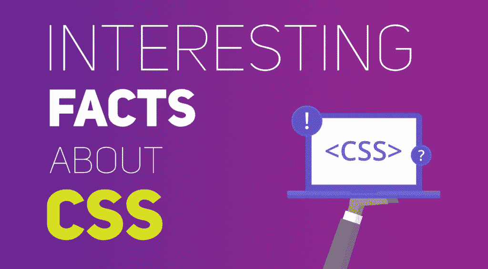

# 关于 CSS 的有趣事实

> 原文:[https://www.geeksforgeeks.org/interesting-facts-about-css/](https://www.geeksforgeeks.org/interesting-facts-about-css/)

**[CSS](https://www.geeksforgeeks.org/css-tutorials/)** 代表层叠样式表。这种样式表语言用于定义用某种标记语言(如 HTML)编写的文档的表示形式。CSS 现在已经成为建立博客和网站的一个非常重要的部分。

**以下是一些关于 CSS 的有趣事实:**

1.  1994 年，在欧洲粒子物理研究所与计算机科学家蒂姆·伯纳斯·李一起工作时，霍恩·威姆·利首次提出了 CSS。
2.  制作 CSS 的动机是提供一个系统来设计正在呈现的信息的风格(在当时，这是完全缺乏的)，并将设计的过程与内容创建的过程隔离开来。
3.  CSS 的规范由万维网联盟(W3C)维护。1998 年 3 月，RFC 2318 注册了用于 css 的互联网媒体类型(MIME 类型)文本/css。W3C 为 CSS 文档提供免费的 CSS 验证服务。
4.  与由单个文档组成的 CSS2 不同，CSS3 被分成许多单独的模块，这提高了功能和工作的便利性。
5.  CSS3 设法在开发速度上树立了新的试金石。现在它的许多功能都包含了过去需要 CSS 和 Javascript 组合的部分。因此，在生产、装载和最终产品的过程中节省了时间。
6.  有了 CSS，我们可以玩图像和动画。在内容引起观众注意之前，页面布局、动画和图像质量是第一个影响因素。图像过滤器在 CSS 上很容易获得，我们可以在这里做到这一点，而不必工作或从任何其他软件获得帮助。
7.  有了 CSS，我们可以制作更好的背景。所以背景不再需要枯燥和静止。以前，我们需要一些额外的编程和脚本，但现在这可以很容易地用 CSS3 来完成。
8.  像 Internet Explorer 和 Firefox 这样的浏览器处理 CSS 样式的呈现过程有不同的方式。，如果你想从一个真正空白的新样式表开始，你可以使用 reset.css 来重置所有的基本样式。这是少数几个常用的重置 css 框架——埃里克·迈耶的 CSS 重置，雅虎重置 CSS，的黎波里
9.  没有办法给一个 CSS 规则命名，这将允许客户端脚本(例如)参考一个规则，即使它的任何选择器改变了。
10.  在不使用 CSS 的情况下，网页设计者用像 HTML 表格这样的技术布局网页是非常典型的事情，这些技术阻碍了视力受损用户的可访问性