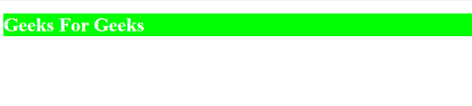
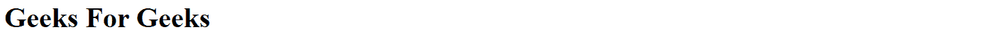
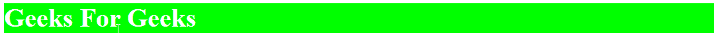

# 原子 CSS 介绍及示例

> 原文:[https://www . geesforgeks . org/introduction-to-atomic-CSS-with-examples/](https://www.geeksforgeeks.org/introduction-to-atomic-css-with-examples/)

原子 CSS 旨在使用作为单一用途样式单元的类来解决一些传统的 CSS 问题。原子 CSS 使用不可变的类，这些类完全负责将单元样式应用于用户界面的选定组件。简而言之，原子 CSS 是一种样式的一个规则。它试图以一种可预测的方式使样式更加多变。

**传统 CSS 的问题:** CSS 被广泛用于为 web 应用程序提供样式。像萨斯和 LESS 这样的 CSS 预处理器被用来简化造型。然而，在一个巨大的 web 应用程序的开发过程中，整个应用程序中使用的样式有很多重复。CSS 代码重复的原因有几个，例如:

*   使用不同组件的不同开发人员可能会用他们喜欢的样式编写自己的 CSS 代码
*   样式差异很小的组件具有样式重复的主要属性

伴随着这些问题，由于担心覆盖 CSS，构建巨大的 web 应用程序会在开发人员中造成混乱。这使得开发更加耗时和低效。

**使用原子 CSS 解决的问题**使用原子 CSS 解决了以下问题:

*   代码冗余或重复的减少。
*   CSS 覆盖混乱。
*   关于不同开发人员在应用程序不同部分工作的问题。
*   减少调试样式所消耗的时间。

**维护原子 CSS 类中的一致性:**在开发类时，可以通过遵循特定的样式来维护原子 CSS 中类的一致性。这可以通过以下步骤完成:

1.  参考[原子 CSS 参考](https://acss.io/reference.html)页面。
2.  需要创建的课程类型可以在这个网站上输入和搜索。
3.  该网站将返回作为结果使用的类名，这可以由所有开发人员在代码中使用，以保持代码的一致性。

**示例 1:** 这个示例演示了原子 CSS 的一个简单工作示例。

*   **步骤 1:** 创建一个 HTML 文档，并为网站添加起始代码。创建一个样式表并将其链接到这个 HTML 文档。

*   **第二步:**在正文中，添加一个分部标签和标题标签，标题标签中包含如下所示的类:

    ## 超文本标记语言

    ```css
    <!DOCTYPE html>
    <html>

    <head>
        <title>
            GfG Atomic CSS Example
        </title>
        <link rel="stylesheet" 
            type="text/css" href="styles.css">
    </head>

    <body>
        <div class="Bgc(#00FF00)">
            <h1 class="C(#FFFFFF)">
                Geeks For Geeks
            </h1>
        </div>
    </body>

    </html>
    ```

*   **Step 3:** Define the classes used in the HTML page in the stylesheet and add the required styling corresponding to the name of the class.

    ```css
    .Bgc\(\#00FF00\) {
      background-color: #00ff00;
    }
    .C\(\#FFFFFF\) {
      color: #ffffff;
    }

    ```

    顾名思义， **Bgc(#00FF00)** 用来添加绿色(#00FF00)作为背景色， **C(#FFFFFF)** 用来添加白色(#FFFFFF)作为文字的颜色。这个例子现在可以在浏览器上运行。

**输出:**



**伪类:**这些是为了指定特定状态而添加到选择器中的元素。一些带有相应后缀图的伪类如下:

<figure class="table">

| Pseudo class | Suffix graph |
| --- | --- |
| : Focus | f |
| : activate | a |
| : hover | h |
| : selected |

</figure>

**示例 2:** 在此示例中，一个伪类与 Atomic CSS 一起使用。

**步骤 1:** 创建一个 HTML 文档，并为网站添加起始代码。创建一个样式表并将其链接到这个 HTML 文档。

**步骤 2:** 添加一个容器类，该容器类的第一个子分部包含标题文本。

## 超文本标记语言

```css
<!DOCTYPE html>
<html>

<head>
    <title>
        GfG Atomic CSS Pseudo
        Class Example
    </title>
    <link rel="stylesheet" 
        type="text/css" href="./styles.css">
</head>

<body>
    <div class="container">
        <h1 class="D(1):h">
            Geeks For Geeks
        </h1>
    </div>
</body>

</html>
```

**步骤 3:** 在样式表中定义 HTML 页面中使用的 **D(1):h** 类，并添加与该类名称对应的所需样式。

```css
.D\(1\)\:h:hover {
  background-color: green;
  color: white;
}

```

顾名思义， **D(1)** 是容器内部的第一个子分部。给它添加一个悬停伪类，比如 **D(1):悬停，**并将其表示为 **D(1):h** 使其符合 Atomic CSS 语法。因此，使用:hover 伪类，只要元素悬停在上面，就应用给定的样式类。

*   **Before Hover:**

    
    *   **悬停后:**

        