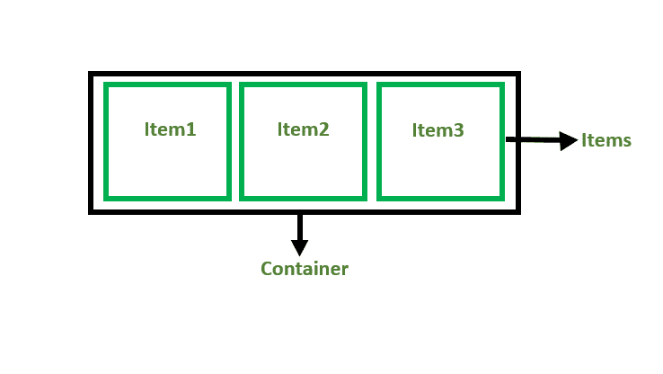
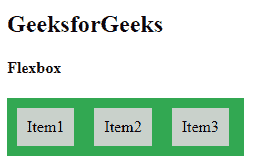
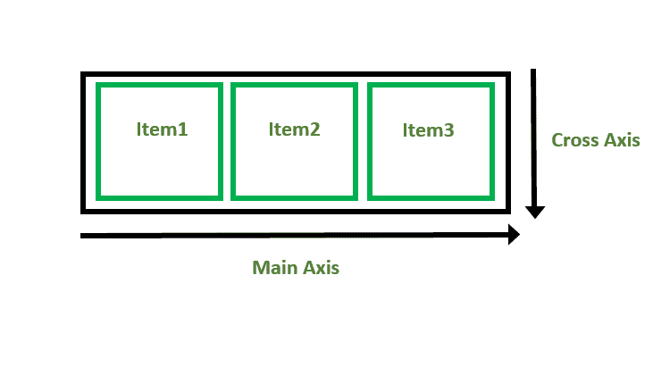
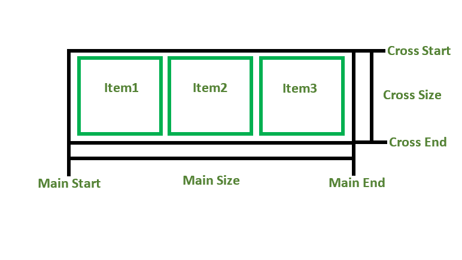

# CSS Flexbox 简介

> 原文:[https://www.geeksforgeeks.org/introduction-to-css-flexbox/](https://www.geeksforgeeks.org/introduction-to-css-flexbox/)

CSS 中的**柔性盒**或柔性盒模型是一种一维布局模型，它具有灵活高效的布局，项目之间有分布的空间来控制它们的对齐结构，即。，它是一个布局模型，提供了一种简单明了的方式来排列容器中的项目。Flexbox 对于创建小规模布局很有用& 反应灵敏，移动友好。

**柔轮的特点:**

*   给予了很大的灵活性。
*   项目的排列和对齐。
*   适当的间距
*   项目的排序和排序。
*   Bootstrap 4 构建在 flex 布局之上。

在 flexbox 模型之前，我们有 4 种布局模式:

*   **Block:** 用于制作网页中的版块。
*   **内联:**用于文字。
*   **表格:**用于二维表格数据。
*   **Positioned:** 用于元素的显式位置。

弹性箱有两个主要组件:

*   **Flex 容器**:包含各种分部的父“div”称为 Flex 容器。
*   **柔性物品**:容器“div”内的物品为柔性物品。



为了创建 flexbox，我们需要创建一个 flex 容器，并将 display 属性设置为 flex。

## 超文本标记语言

```html
<!DOCTYPE html>
<html>

<head>
    <title>Flexbox Tutorial</title>
    <style>
    .flex-container {
        display: flex;
        background-color: #32a852;
    }

    .flex-container div {
        background-color: #c9d1cb;
        margin: 10px;
        padding: 10px;
    }
    </style>
</head>

<body>
    <h2>GeeksforGeeks</h2>
    <h4> Flexbox</h4>
    <div class="flex-container">
        <div>Item1</div>
        <div>Item2</div>
        <div>Item3</div>
    </div>
</body>

</html>
```

**输出:**



**Flexbox 轴:**使用 Flexbox 时，我们处理两个轴:

*   主茎
*   横轴



**主轴:**

*   默认情况下，主轴从左向右延伸。
*   **主启动:**主轴的启动称为主启动。
*   **主尺寸:**主起点和主终点之间的长度称为主尺寸。
*   **主端:**端点称为主端。
*   主轴和横轴



**从左到右:**

```html
flex-direction: row;
```

**从右向左:**

```html
flex-direction: row-reverse;
```

**从上到下:**

```html
flex-direction: column;
```

**自下而上:**

```html
flex-direction: column;
```

**横轴:**横轴将垂直于主轴。

*   默认情况下，横轴垂直于主轴，即从上到下。
*   **十字起点:**横轴的起点称为十字起点。
*   **十字尺寸:**十字起点和十字终点之间的长度称为十字尺寸。
*   **交叉结束:**终点称为交叉结束。

**支持的浏览器:**

*   谷歌 Chrome 29.0
*   Firefox 22.0
*   微软边缘 11.0
*   Opera 48.0
*   Safari 10.0