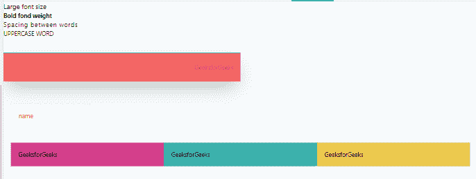

# 顺风 CSS 介绍

> 原文:[https://www.geeksforgeeks.org/introduction-to-tailwind-css/](https://www.geeksforgeeks.org/introduction-to-tailwind-css/)

顺风 CSS 可以用最快最简单的方式制作网站。

Tailwind CSS 基本上是一个实用程序优先的 CSS 框架，用于快速构建自定义用户界面。这是一个高度可定制的低级 CSS 框架，它为您提供了构建定制设计所需的所有构件，而没有任何令人讨厌的固执己见的风格，您必须努力克服这些风格。
这个叫顺风的东西的妙处在于它没有强加设计规范或者你的网站应该是什么样子，你只是把微小的组件放在一起，构建一个独特的用户界面。Tailwind 只是获取一个“原始”的 CSS 文件，在配置文件上处理这个 CSS 文件，并产生一个输出。
**为什么是顺风 CSS？**

*   更快的用户界面构建过程
*   这是一个实用优先的 CSS 框架，这意味着我们可以使用实用类来构建定制设计，而不用像传统方法那样编写 CSS。

**顺风 CSS 的优势:**

*   不再给 CSS 类和 Id 起愚蠢的名字。
*   CSS 文件中最少的代码行。
*   我们可以定制设计来制作组件。
*   使网站响应迅速。
*   以所需的方式进行更改。
    CSS 本质上是全局的，如果在文件中进行更改，属性会在所有链接到它的 HTML 文件中发生更改。但是在 Tailwind CSS 的帮助下，我们可以使用实用程序类并进行局部修改。

**安装:**
方法一:通过 npm 安装顺风

*   步骤 1:npm init -y
*   步骤 2:npm 安装 tailwindcss
*   步骤 3:使用@ tailwind 指令将 tailswind 的基础、组件和实用程序样式注入到你的 CSS 文件中。
    @顺风基；
    @顺风组件；
    @顺风公用事业；
*   第四步:npx tailwindcss init
    这是用来创建一个配置文件来定制设计。这是一个可选步骤。
*   第五步:npx tailwindcss build style . css-o output . css
    这个命令是用来编译 style 的，CSS 是要编译输出的文件，CSS 是要编译的文件。如果文件 output.css 不是早期创建的，那么它将自动创建。

方法 2:通过 CDN 使用顺风

## 超文本标记语言

```html
<!-- add it to the head section of the html file -->
<link href="https://unpkg.com/tailwindcss@^1.0/dist/tailwind.min.css"
      rel="stylesheet">
```

但是在使用 CDN 的时候有一些限制。其中一些是:

*   不能使用自定义顺风的默认主题
*   不能使用@apply、@variants 等指令
*   无法安装第三方插件

**示例:**

## 超文本标记语言

```html
<!-- Write HTML code here -->
<!DOCTYPE html>
<html lang="en" dir="ltr">
    <head>
        <meta charset="utf-8" />
        <meta name="viewport"
              content="width=device-width,
                       initial-scale=1.0" />
        <title>Tailwind CSS</title>
        <link rel="stylesheet"
              href="./style.css" />
    </head>
    <body>
        <!-- font size -->
        <h1 class="text-lg">Large font size</h1>
        <!-- font weight -->
        <h1 class="font-bold">Bold fond weight</h1>
        <!-- Typography -->
        <h1 class="tracking-widest">Spacing between words</h1>
        <!-- Transform -->
        <h1 class="uppercase">Uppercase word</h1>
        <!-- line height align color background
              width padding margin border opacity shadow-->
        <div class="leading-9 text-right
                    text-red-700
                    bg-red-500 w-1/2 h-1/3 p-5 my-10
                    border-t-2
                    border-solid
                    border-green-500
                    opacity-40
                    shadow-2xl">

<p>GeeksforGeeks</p>

        </div>
        <!-- focus pseudo class -->
        <input class="border focus:border-red-500
                      focus:outline-none p-5 m-5
                      placeholder-red-500"
               type="text"
               name=""
               value=""
               placeholder="name" />
        <!-- layout -->
        <div class="md:flex md:flex-wrap m-5">
            <div class="bg-blue-500
                        p-5 md:w-1/3
                        md:bg-pink-600">
              GeeksforGeeks
          </div>
            <div class="bg-teal-500 p-5 md:w-1/3">
              GeeksforGeeks
          </div>
            <div class="bg-yellow-500 p-5 md:w-1/3">
              GeeksforGeeks
          </div>
        </div>
    </body>
</html>
```

**输出:**



**支持的浏览器:**

*   谷歌 Chrome
*   微软边缘
*   火狐浏览器
*   旅行队