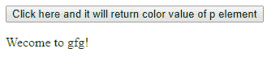
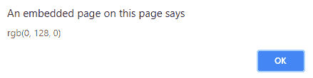
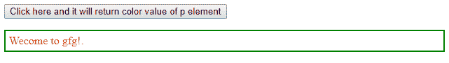
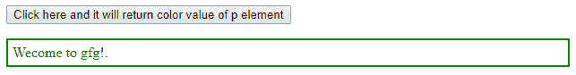
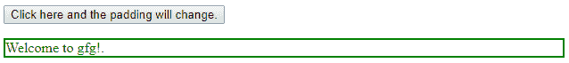
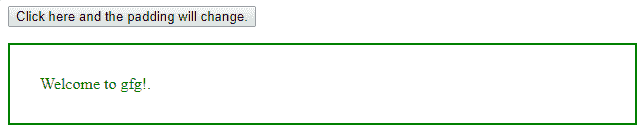
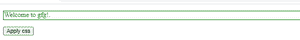

# jQuery | css()方法

> 原文:[https://www.geeksforgeeks.org/jquery-css-method/](https://www.geeksforgeeks.org/jquery-css-method/)

**JQuery** 库支持级联样式表(CSS)中包含的几乎所有选择器。 **JQuery** 中的 **css()** 方法用于更改所选元素的样式属性。JQuery 中的 **css()** 可以有不同的使用方式。
**css()方法可用于检查所选元素的属性值:**

**语法:**

```html
$(selector).css(property)
```

**返回值:**将返回所选元素的属性值。

**例 1:**

```html
Input: $("p").css("color");
Output: Output of the above input will return the 
rgb() value of the element.
```

**代码#1:**

## 超文本标记语言

```html
<!DOCTYPE html>

<head>
    <script src="https://ajax.googleapis.com/ajax/libs
                 /jquery/3.3.1/jquery.min.js">

        // this is the link of JQuery CDN direct from the
        // jquery website so that we can use all the
        //function of JQuery css()
    </script>
</head>

<body>
    <button>Click here and it will return the color value
            of p element</button>
    <p style="color:green">Wecome to gfg!</p>

</body>
<script>
    $(document).ready(function() {

        //here selecting button element
        $("button").click(function() {

            // here when the button is clicked css() method
            // will return the value using alert method
            alert($("p").css("color"));
        });
    });
</script>

</html>
```

**输出:**
点击按钮前-



点击按钮后-



**css()方法也用于添加或更改所选元素的属性。**

**语法:**

```html
$(selector).css(property, value)
```

**返回值:**这将改变所选元素的属性值。

**例 2:**

```html
Input: $("p").css("color", "red");
Output: Output of the "p" element becomes red 
whatever may be the color previously.
```

**代码#2:**

## 超文本标记语言

```html
<!DOCTYPE html>

<head>
    <script src="https://ajax.googleapis.com/ajax/libs
                 /jquery/3.3.1/jquery.min.js">

        // this is the link of JQuery CDN direct from
        // the jquery website so that we can use all
        // the function of JQuery css()
    </script>
</head>

<body>
    <button>Click here and it will return the color value
            of p element</button>
    <p style="border: 2px solid green;color:red;padding:5px">
              Wecome to gfg!.</p>

</body>
<script>
    $(document).ready(function() {

        // here selecting button element
        $("button").click(function() {

            // here when the button is clicked css()
            // method will change the color of paragraph
            $("p").css("color", "green");
        });
    });
</script>

</html>
```

**输出:**
点击按钮前-



点击按钮后-



**css()方法可以使用函数来更改所选元素的 css 属性:**

**语法:**

```html
$(selector).css(property, function(index, currentvalue))
```

**返回值:**将返回选定属性的已更改值。

**例 3:**

```html
Input: $("p").css("padding", function(i){ return i+20;});
Output: Output will get is the paragraph with padding value
 increases to "25px" whatever be the initial value.
```

**代码#3:**

## 超文本标记语言

```html
<!DOCTYPE html>

<head>
    <script src="https://ajax.googleapis.com/ajax/libs
                 /jquery/3.3.1/jquery.min.js">

        //this is the link of JQuery CDN direct from
        //the jquery website so that we can use all
        //the function of JQuery css()
    </script>
</head>

<body>
    <button>Click here and the padding will change.</button>
    <p style="border: 2px solid green;color:green;padding=5px;">
              Welcome to gfg!.</p>

</body>
<script>
    $(document).ready(function() {
        $("button").click(function() {
            $("p").css("padding", function(h) {
                return h + 30;
            });
        });
    });
</script>

</html>
```

**输出:**
点击按钮前-



点击按钮后-



**我们也可以借助 css 方法在 JQuery 中一次应用多个属性。**

**注意:在这个方法中我们在 camelCase 中写属性名。**

**语法:**

```html
$(selector).css({property:value, property:value, ...})
```

**代码#4 :**

## 超文本标记语言

```html
<!DOCTYPE html>
<html>
<head>
  <title>Document</title>
</head>

<body> 
    <p style="border: 2px solid green;color:green;padding=5px;">
            Welcome to gfg!.</p>

  <button>Apply css</button>
  <script src=
"https://ajax.googleapis.com/ajax/libs/jquery/3.3.1/jquery.min.js">
   </script>
  <script>
    $("button").click(function(){
      //applying more than one property at a time
      //Note : property name written in camelCase
        $("p").css({"backgroundColor":"green",
                "color":"white","fontSize":"20px"});
    });

</script>
</body> 
</html>
```

**输出:**

在点击按钮之前-



点击按钮后-

