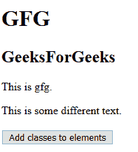
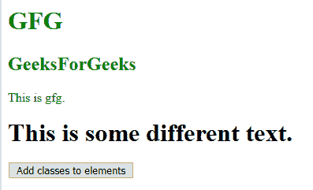
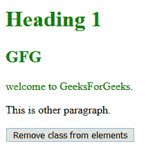
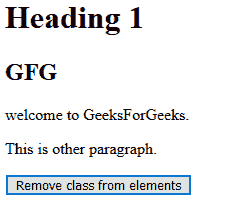
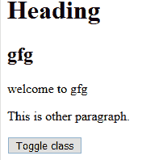
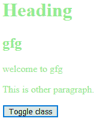
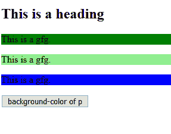
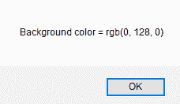

# jQuery |获取和设置 CSS 类

> 原文:[https://www . geesforgeks . org/jquery-get-and-set-CSS-class/](https://www.geeksforgeeks.org/jquery-get-and-set-css-classes/)

jQuery 有各种 CSS 操作方法，如下所示:

*   **添加类():**向所选元素添加一个或多个类
*   **移除类():**从所选元素中移除一个或多个类
*   **toggleClass():** 在添加或删除选定元素的类之间切换
*   **css():** 设置或返回样式属性

*   **jQuery addClass() Method:** The addClass is used to add more property to each selected element. It can also be used to change the property of the selected element.

    **语法:**

    ```css
    $(content).addClass(target)
    ```

    **示例:**

    ```css
    <!DOCTYPE html>
    <html>

    <head>
        <title>
            jQuery addClass() Method
        </title>

        <script src=
    "https://ajax.googleapis.com/ajax/libs/jquery/3.3.1/jquery.min.js">
        </script>

        <!-- Script to use addClass method -->
        <script>
        $(document).ready(function() {
            $("button").click(function() {
                $("h1, h2, p").addClass("green");
                $("div").addClass("abs");
            });
        });
        </script>

        <style>
            .abs {
                font-weight: bold;
                font-size: xx-large;
            }
            .green {
                color:green;
            }
        </style>
    </head>

    <body>
        <h1>GFG</h1>

        <h2>GeeksForGeeks</h2>

        <p>This is gfg.</p>

        <div>This is some different text.</div><br>

        <button>Add classes to elements</button>
    </body>
    </html>                    
    ```

    **输出:**

    *   **之前点击按钮:**
        
    *   **点击按钮后:**
        
*   **jQuery removeClass() Method:** This method is used to remove a specific class attribute from different elements.

    **语法:**

    ```css
    $(content).removeClass(target)
    ```

    **示例:**

    ```css
    <!DOCTYPE html>
    <html>

    <head>
        <script src=
    "https://ajax.googleapis.com/ajax/libs/jquery/3.3.1/jquery.min.js">
        </script>

        <!-- Script to use removeClass method -->
        <script>
            $(document).ready(function() {
                $("button").click(function() {
                    $("h1, h2, p").removeClass("green");
                });
            });
        </script>

        <style>
        .important {
        font-weight: bold;
        font-size: xx-large;
        }
        .green {
        color:green;
        }
        </style>
    </head>

    <body>
        <h1 class="green">Heading 1</h1>
        <h2 class="green">GFG</h2>

        <p class="green">welcome to GeeksForGeeks.</p>
        <p>This is other paragraph.</p>

        <button>Remove class from elements</button>
    </body>

    </html>                    
    ```

    **输出:**

    *   **之前点击按钮:**
        
    *   **点击按钮后:**
        
*   **jQuery toggleClass() Method:** This method toggles between adding or removing classes from selected elements.

    **语法:**

    ```css
    $(content).toggleClass(target)
    ```

    **示例:**

    ```css
    <!DOCTYPE html>
    <html>

    <head>
        <script src=
    "https://ajax.googleapis.com/ajax/libs/jquery/3.3.1/jquery.min.js">
        </script>

        <!-- Script to use toggleClass() method -->
        <script>
            $(document).ready(function() {
                $("button").click(function() {
                    $("h1, h2, p").toggleClass("green");
                });
            });
        </script>

        <style>
        .green {
            color:lightgreen;
        }
        </style>
    </head>

    <body>
        <h1>Heading</h1>
        <h2>gfg</h2>

        <p>welcome to gfg</p>
        <p>This is other paragraph.</p>

        <button>Toggle class</button>
    </body>

    </html>                    
    ```

    **输出:**

    *   **之前点击按钮:**
        
    *   **点击按钮后:**
        
*   **jQuery css() Method:** This method sets or returns one or more style properties for selected elements.
    **Syntax:**

    ```css
    $(content).css(target)
    ```

    **示例:**

    ```css
    <!DOCTYPE html>
    <html>

    <head>
        <script src=
    "https://ajax.googleapis.com/ajax/libs/jquery/3.3.1/jquery.min.js">
        </script>

        <!-- Script to use css() method -->
        <script>
            $(document).ready(function() {
                $("button").click(function() {
                    alert("Background color = " 
                        + $("p").css("background-color"));
                });
            });
        </script>
    </head>

    <body>
        <h2>This is a heading</h2>

        <p style="background-color:green;">This is a gfg.</p>
        <p style="background-color:lightgreen">This is a gfg.</p>
        <p style="background-color:blue">This is a gfg.</p>

        <button>background-color of p</button>
    </body>

    </html>                    
    ```

    **输出:**

    *   **之前点击按钮:**
        
    *   **点击按钮后:**
        