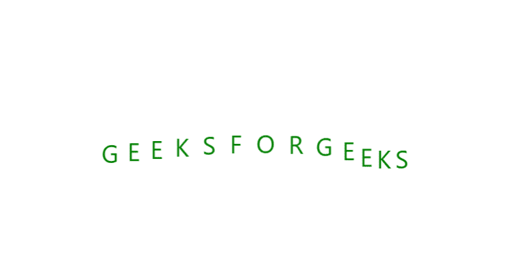
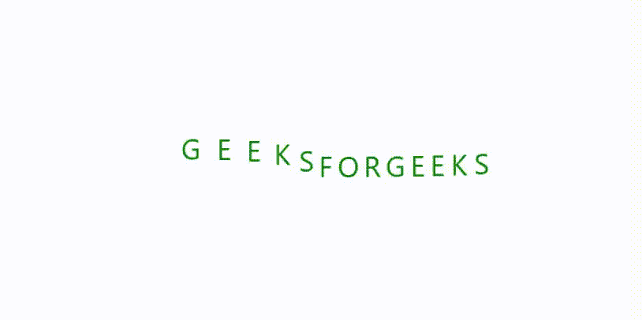

# 使用 CSS 加载文本动画效果

> 原文:[https://www . geesforgeks . org/loading-text-animation-effect-use-CSS/](https://www.geeksforgeeks.org/loading-text-animation-effect-using-css/)


CSS 中有很多可能的动画，今天我们就来看看加载文字动画。这个动画工作背后的基本思想是动画延迟的应用。每一个字母都被延迟了 0.1 秒，这样每一个字母都会稍微延迟一点动画，并给出加载动画。

**HTML 代码:**用于创建文本加载动画的基本结构。我们将使用< span >标签以线性方式显示所有字母。< span >标签被< div >标签包围。

```html
<!DOCTYPE html>
<html lang="en">
<head>
    <meta charset="UTF-8" />
    <meta name="viewport" content=
        "width=device-width, initial-scale=1.0" />

    <title>Loading Text Animation using CSS</title>
</head>

<body>
    <div class="geeks">
        <span>G</span>
        <span>E</span>
        <span>E</span>
        <span>K</span>
        <span>S</span>
        <span>F</span>
        <span>O</span>
        <span>R</span>
        <span>G</span>
        <span>E</span>
        <span>E</span>
        <span>K</span>
        <span>S</span>
    </div>
</body>

</html>
```

**CSS 代码:**CSS 属性用于应用动画效果。首先，我们将动画应用于所有字母，然后添加一些延迟。延迟的持续时间可以根据需要调整。您可以调整动画持续时间和关键帧，以使动画更快或更慢。

```html
<style>
    .geeks {
        height: 40px;
        position: absolute;
        top: 50%;
        left: 50%;
        transform: translateX(-50%) translateY(-50%);
    }

    .geeks span {
        font-family: -apple-system, BlinkMacSystemFont,
            "Segoe UI", Roboto,Oxygen, Ubuntu, Cantarell,
            "Open Sans", "Helvetica Neue", sans-serif;
        font-size: 24px;
        color: green;
        display: inline-block;
        transition: all 0.5s;
        animation: animate 2s infinite;
    }
    .geeks span:nth-child(1) {
        animation-delay: 0.1s;
    }
    .geeks span:nth-child(2) {
        animation-delay: 0.2s;
    }
    .geeks span:nth-child(3) {
        animation-delay: 0.3s;
    }
    .geeks span:nth-child(4) {
        animation-delay: 0.4s;
    }
    .geeks span:nth-child(5) {
        animation-delay: 0.5s;
    }
    .geeks span:nth-child(6) {
        animation-delay: 0.6s;
    }
    .geeks span:nth-child(7) {
        animation-delay: 0.7s;
    }
    .geeks span:nth-child(8) {
        animation-delay: 0.8s;
    }
    .geeks span:nth-child(9) {
        animation-delay: 0.9s;
    }
    .geeks span:nth-child(10) {
        animation-delay: 1s;
    }
    .geeks span:nth-child(11) {
        animation-delay: 1.1s;
    }
    .geeks span:nth-child(12) {
        animation-delay: 1.2s;
    }
    .geeks span:nth-child(13) {
        animation-delay: 1.3s;
    }

    @keyframes animate {
        0% {
            color: green;
            transform: translateY(0);
            margin-left: 0;
        }
        25% {
            color: green;
            transform: translateY(-15px);
            margin-left: 10px;
        }
        100% {
            color: green;
            transform: translateY(0);
            margin-left: 0;
        }
    }    
</style>
```

**完整代码:**在本节中，我们将结合 HTML 和 CSS 代码，使用 HTML 和 CSS 设计一个加载文本动画效果。

```html
<!DOCTYPE html>
<html lang="en">
<head>
    <meta charset="UTF-8" />
    <meta name="viewport" content=
        "width=device-width, initial-scale=1.0" />

    <title>Loading Text Animation using CSS</title>

    <style>
        .geeks {
            height: 40px;
            position: absolute;
            top: 50%;
            left: 50%;
            transform: translateX(-50%) translateY(-50%);
        }

        .geeks span {
            font-family: -apple-system, BlinkMacSystemFont,
                "Segoe UI", Roboto,Oxygen, Ubuntu, Cantarell,
                "Open Sans", "Helvetica Neue", sans-serif;
            font-size: 24px;
            color: green;
            display: inline-block;
            transition: all 0.5s;
            animation: animate 2s infinite;
        }
        .geeks span:nth-child(1) {
            animation-delay: 0.1s;
        }
        .geeks span:nth-child(2) {
            animation-delay: 0.2s;
        }
        .geeks span:nth-child(3) {
            animation-delay: 0.3s;
        }
        .geeks span:nth-child(4) {
            animation-delay: 0.4s;
        }
        .geeks span:nth-child(5) {
            animation-delay: 0.5s;
        }
        .geeks span:nth-child(6) {
            animation-delay: 0.6s;
        }
        .geeks span:nth-child(7) {
            animation-delay: 0.7s;
        }
        .geeks span:nth-child(8) {
            animation-delay: 0.8s;
        }
        .geeks span:nth-child(9) {
            animation-delay: 0.9s;
        }
        .geeks span:nth-child(10) {
            animation-delay: 1s;
        }
        .geeks span:nth-child(11) {
            animation-delay: 1.1s;
        }
        .geeks span:nth-child(12) {
            animation-delay: 1.2s;
        }
        .geeks span:nth-child(13) {
            animation-delay: 1.3s;
        }

        @keyframes animate {
            0% {
                color: green;
                transform: translateY(0);
                margin-left: 0;
            }
            25% {
                color: green;
                transform: translateY(-15px);
                margin-left: 10px;
            }
            100% {
                color: green;
                transform: translateY(0);
                margin-left: 0;
            }
        }    
    </style>
</head>

<body>
    <div class="geeks">
        <span>G</span>
        <span>E</span>
        <span>E</span>
        <span>K</span>
        <span>S</span>
        <span>F</span>
        <span>O</span>
        <span>R</span>
        <span>G</span>
        <span>E</span>
        <span>E</span>
        <span>K</span>
        <span>S</span>
    </div>
</body>

</html>
```

**输出:**
