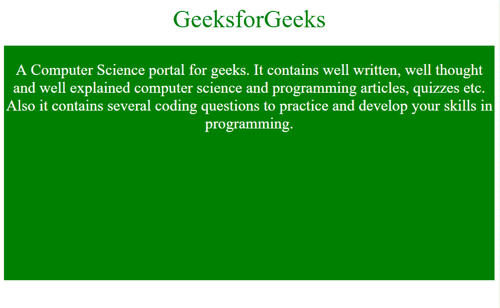

# 使用 CSS 保持一个 div 的长宽比

> 原文:[https://www . geeksforgeeks . org/用 css 保持宽高比/](https://www.geeksforgeeks.org/maintain-the-aspect-ratio-of-a-div-with-css/)

为了用 CSS 保持 div 的长宽比，创建灵活的元素来保持它们的长宽比(4:3，16:9 等)。)调整浏览器窗口大小时。
**什么是长宽比？**
元素的长宽比描述的是其宽度和高度的比例关系。两种常见的视频宽高比是 4:3 和 16:9。
要保持 div 的纵横比，请为填充顶部添加一个百分比值。不同的纵横比具有不同的百分比值。其中一些如下所示:

```html
aspect ratio  | padding-top value
--------------|----------------------
    1:1       |       100%
    16:9      |       56.25%
    4:3       |       75%
    3:2       |       66.66%
    8:5       |       62.5%
```

**语法:**

```html
element {
    padding-top: %value;
}
```

**例:**

## 超文本标记语言

```html
<!DOCTYPE html>
<html>
    <head>
        <meta name="viewport" content="width=device-width,
        initial-scale=1">
        <style>
            .container {
                background-color: green;
                position: relative;
                width: 100%;
                padding-top: 56.25%; /* 16:9 Aspect Ratio */
            }

            .text {
                position: absolute;
                top: 0;
                left: 0;
                bottom: 0;
                right: 0;
                text-align: center;
                font-size: 25px;
                color: white;
            }
            .example {
                background: white;
                color: green;
                font-weight:bold;
                font-size: 40px;
                padding-bottom: 20px;
            }
        </style>
        </head>
    <body>
        <div class="container">
            <div class="text">
                <div class = "example">GeeksforGeeks</div>

<p>A Computer Science portal for geeks. It
                contains well written, well thought and well
                explained computer science and programming
                articles, quizzes etc. Also it contains several
                coding questions to practice and develop your
                skills in programming.</p>

            </div>
        </div>
    </body>
</html>                               
```

**输出:**



上述示例的输出设置为 16:9 的纵横比。调整窗口大小以查看效果。还要更改纵横比的相应值，以在浏览器窗口中查看所需的更改。