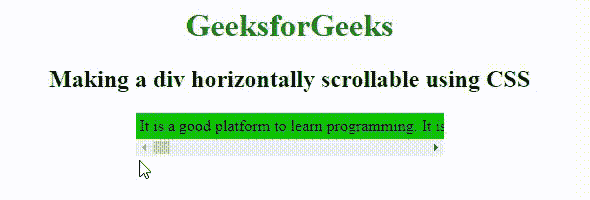

# 使用 CSS

使一个 div 可以水平滚动

> 原文:[https://www . geesforgeks . org/make-a-div-水平-可滚动-使用-css/](https://www.geeksforgeeks.org/make-a-div-horizontally-scrollable-using-css/)

在本文中，我们将知道如何使用 CSS 设计水平滚动的 div，并将通过示例看到它的实现。我们可以使用 [**CSS 溢出属性**](https://www.geeksforgeeks.org/css-overflow/) 使一个 div 可以水平滚动。溢出属性中有不同的值。例如，**溢出:自动；**用于在需要时自动添加滚动条，轴隐藏程序如**overflow-x:auto；**仅用于制作水平滚动栏。
对于水平滚动条，使用 x 轴和 y 轴。设置 [**溢出-y:隐藏；**](https://www.geeksforgeeks.org/css-overflow-y-property/)[**溢出-x:自动；**](https://www.geeksforgeeks.org/css-overflow-x-property/) 自动隐藏垂直滚动条，只显示水平滚动条。 [**空格:nowrap**](https://www.geeksforgeeks.org/css-white-space-property/) 属性用于将文本换行。在这里，滚动 div 可以水平滚动。

**例 1:** 在这个例子中，我们使用了 overflow-y:hidden；和 overflow-x:auto；使 div 可水平滚动。

## 超文本标记语言

```html
<!DOCTYPE html>
<html>

<head>
    <title>
        Making a div horizontally
        scrollable using CSS
    </title>
    <style>
    h1 {
        color: Green;
    }

    div.scroll {
        margin: 4px, 4px;
        padding: 4px;
        background-color: #08c708;
        width: 300px;
        overflow-x: auto;
        overflow-y: hidden;
        white-space: nowrap;
    }
    </style>
</head>

<body>
    <center>
        <h1>GeeksforGeeks</h1>
        <h2>
        Making a div horizontally
        scrollable using CSS
      </h2>
        <div class="scroll">
             It is a good platform to learn programming.
             It is an educational website. Prepare for the
             Recruitment drive of product based companies
             like Microsoft, Amazon, Adobe etc with a free
             online placement preparation course. The course
             focuses on various MCQ's & Coding question likely
             to be asked in the interviews & make your upcoming
             placement season efficient and successful. Also,
             any geeks can help other geeks by writing articles
             on the GeeksforGeeks, publishing articles follow few
             steps that are Articles that need little modification
             or improvement from reviewers are published first.
             To quickly get your articles reviewed, please refer
             existing articles, their formatting style, coding style,
             and try to make you are close to them. In case you are a
             beginner, you may refer Guidelines to write an Article
        </div>
    </center>
</body>

</html>
```

**输出:**



使用 overflow-y:隐藏；& overflow-x:auto；

**例 2:** 在这个例子中，我们用 auto 代替了 overflow-y:hidden；和 overflow-x:auto；使 div 可水平滚动。

## 超文本标记语言

```html
<!DOCTYPE html>
<html>

<head>
    <title>
         Making a div horizontally
         scrollable using CSS 
    </title>
    <style>
    h1 {
        color: Green;
    }

    div.scroll {
        margin: 4px, 4px;
        padding: 4px;
        background-color: #08c708;
        width: 300px;
        overflow: auto;
        white-space: nowrap;
    }
    </style>
</head>

<body>
    <center>
        <h1>GeeksforGeeks</h1>
        <h2>
        Making a div horizontally
        scrollable using CSS
      </h2>
        <div class="scroll">
          It is a good platform to learn programming.
          It is an educational website. Prepare for
          the Recruitment drive of product based companies
          like Microsoft, Amazon, Adobe etc with a free
          online placement preparation course. The
          course focuses on various MCQ's & Coding question
          likely to be asked in the interviews & make your
          upcoming placement season efficient and successful.
          Also, any geeks can help other geeks by writing
          articles on the GeeksforGeeks, publishing articles
          follow few steps that are Articles that need little
          modification or improvement from reviewers are
          published first.
          To quickly get your articles reviewed, please refer
          existing articles, their
          formatting style, coding style, and try to make you
          are close to them. In case you are a beginner, you
          may refer Guidelines to write an Article
        </div>
    </center>
</body>

</html>
```

**输出:**


使用溢出:自动；

HTML 是网页的基础，通过构建网站和网络应用程序用于网页开发。您可以通过以下 [HTML 教程](https://www.geeksforgeeks.org/html-tutorials/)和 [HTML 示例](https://www.geeksforgeeks.org/html-examples/)从头开始学习 HTML。

CSS 是网页的基础，通过设计网站和网络应用程序用于网页开发。你可以通过以下 [CSS 教程](https://www.geeksforgeeks.org/css-tutorials/)和 [CSS 示例](https://www.geeksforgeeks.org/css-examples/)从头开始学习 CSS。