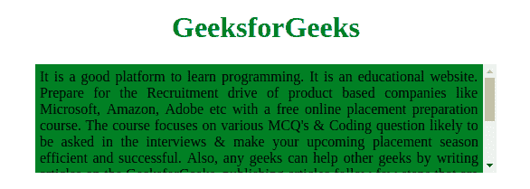

# 使用 CSS 使一个 div 垂直滚动

> 原文:[https://www . geesforgeks . org/making-a-div-垂直-可滚动-使用-css/](https://www.geeksforgeeks.org/making-a-div-vertically-scrollable-using-css/)

通过使用 CSS 溢出属性，使一个 div 可以垂直滚动是很容易的。溢出属性中有不同的值。例如:溢出:自动；以及像 overflow-x:hidden 这样的轴隐藏程序；和 overflow-y:auto；。它将使垂直和水平滚动条和自动将只使垂直滚动条。
对于垂直可滚动栏，使用 x 轴和 y 轴。设置溢出-x:隐藏；和 overflow-y:auto；这将自动隐藏水平滚动条，只显示垂直滚动条。在这里，滚动 div 可以垂直滚动。

**例 1:**

```css
<!DOCTYPE html>
<html>
    <head>
        <style>
            h1 {
                color:Green;
            }
            div.scroll {
                margin:4px, 4px;
                padding:4px;
                background-color: green;
                width: 500px;
                height: 110px;
                overflow-x: hidden;
                overflow-y: auto;
                text-align:justify;
            }
        </style>
    </head>
    <body>
        <center>
        <h1>GeeksforGeeks</h1>
        <div class="scroll">It is a good platform to learn programming. 
        It is an educational website. Prepare for the Recruitment drive
        of product based companies like Microsoft, Amazon, Adobe etc with
        a free online placement preparation course. The course focuses 
        on various MCQ's & Coding question likely to be asked in the 
        interviews & make your upcoming placement season efficient and 
        successful. Also, any geeks can help other geeks by writing 
        articles on the GeeksforGeeks, publishing articles follow few 
        steps that are Articles that need little modification/improvement
        from reviewers are published first. To quickly get your articles
        reviewed, please refer existing articles, their formatting style,
        coding style, and try to make you are close to them. In case you
        are a beginner, you may refer Guidelines to write an Article
        </div>
        </center>
    </body>
</html>                    
```

**输出:**


**示例 2:** 在此示例中，使用 auto 代替 overflow-x:hidden；和 overflow-y:auto；使 div 垂直滚动。

```css
<!DOCTYPE html>
<html>
    <head>
        <style>
            h1 {
                color:Green;
            }
            div.gfg {
                margin:5px;
                padding:5px;
                background-color: green;
                width: 500px;
                height: 110px;
                overflow: auto;
                text-align:justify;
            }
        </style>
    </head>
    <body>
        <center>
        <h1>GeeksforGeeks</h1>
        <div class="gfg">It is a good platform to learn programming. 
        It is an educational website. Prepare for the Recruitment drive
        of product based companies like Microsoft, Amazon, Adobe etc with
        a free online placement preparation course. The course focuses 
        on various MCQ's & Coding question likely to be asked in the 
        interviews & make your upcoming placement season efficient and 
        successful. Also, any geeks can help other geeks by writing 
        articles on the GeeksforGeeks, publishing articles follow few 
        steps that are Articles that need little modification/improvement
        from reviewers are published first. To quickly get your articles
        reviewed, please refer existing articles, their formatting style,
        coding style, and try to make you are close to them. In case you
        are a beginner, you may refer Guidelines to write an Article
        </div>
        </center>
    </body>
</html>                    
```

**输出:**


HTML 是网页的基础，通过构建网站和网络应用程序用于网页开发。您可以通过以下 [HTML 教程](https://www.geeksforgeeks.org/html-tutorials/)和 [HTML 示例](https://www.geeksforgeeks.org/html-examples/)从头开始学习 HTML。

CSS 是网页的基础，通过设计网站和网络应用程序用于网页开发。你可以通过以下 [CSS 教程](https://www.geeksforgeeks.org/css-tutorials/)和 [CSS 示例](https://www.geeksforgeeks.org/css-examples/)从头开始学习 CSS。