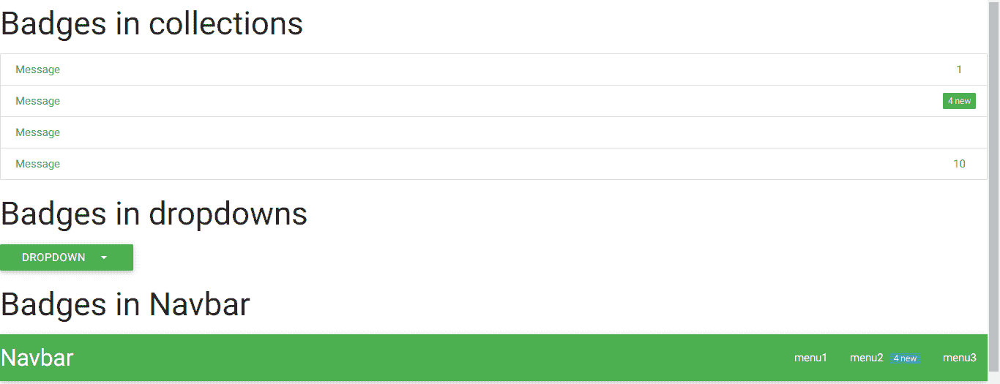

# 物化 CSS |徽章

> 原文:[https://www.geeksforgeeks.org/materialize-css-badges/](https://www.geeksforgeeks.org/materialize-css-badges/)

物化徽章是一个组件，用于通知，如果有新的或未读的消息或通知显示。在徽章组件中添加一个 **新**类会给它一个背景。

徽章组件有不同的使用方式:

*   **系列徽章:**

> < a href="#！"class = " collection-item "><span class = "徽章"> 1 < /span >消息< /a >
> < a href="#！"class = " collection-item ">T16】span class = " new badge ">5</span>Message</a>
> <a href = " #！"class="collection-item" >消息< /a >
> < a href="#！"class = " collection-item "><span class = " badge ">10</span>消息< /a >
> < /div >

*   **下拉菜单中的徽章:**

*   **纳夫巴的徽章:**

> <nav>
> <div class = " nav-wrapper ">
> <a href = " class = " brand-logo ">nav bar</a>
> <ul id = " nav-mobile " class = " right hide-on-med-and-down ">
> <Li>T21】a href = ">menu 1</a></Li></nav>

**例:**

## 超文本标记语言

```
<!DOCTYPE html>
<html>
    <head>
        <!--Import Google Icon Font-->
        <link href=
"https://fonts.googleapis.com/icon?family=Material+Icons"
              rel="stylesheet" />

        <!-- Compiled and minified CSS -->
        <link rel="stylesheet"
              href=
"https://cdnjs.cloudflare.com/ajax/libs/materialize/0.97.5/css/materialize.min.css" />

        <script type="text/javascript"
                src="https://code.jquery.com/jquery-2.1.1.min.js">
      </script>
        <!--Let browser know website is optimized for mobile-->
        <meta name="viewport"
              content="width=device-width, initial-scale=1.0" />
    </head>

    <body>
        <h3>Badges in collections</h3>
        <div class="collection">
            <a href="#!"
               class="collection-item green-text">
              <span class="badge green-text">1</span>Message</a>

            <a href="#!"
               class="collection-item green-text">
              <span class="new badge green">4</span>Message</a>

            <a href="#!"
               class="collection-item green-text">Message</a>

            <a href="#!"
               class="collection-item green-text">
              <span class="badge green-text">10</span>Message</a>
        </div>
        <h3>Badges in dropdowns</h3>
        <ul id="dropdown" class="dropdown-content">
            <li>
                <a href="#"
                   class="green-text">Inbox
                  <span class="badge green-text">22</span></a>
            </li>
            <li>
                <a href="#!"
                   class="green-text">Unread
                  <span class="new badge green">14</span></a>
            </li>
            <li><a href="#" class="green-text">Sent</a></li>
            <li>
                <a href="#"
                   class="green-text">Outbox
                  <span class="badge green-text">10</span></a>
            </li>
        </ul>
        <a class="btn dropdown-button green"
           href="#"
           data-activates="dropdown"> Dropdown
          <i class="mdi-navigation-arrow-drop-down right"></i></a>
        <div>
            <h3>Badges in Navbar</h3>
            <nav>
                <div class="nav-wrapper green">
                    <a href="" class="brand-logo">Navbar</a>
                    <ul id="nav-mobile"
                        class="right hide-on-med-and-down">
                        <li><a href="">menu1</a></li>
                        <li>
                            <a href="">menu2
                              <span class="new badge">4</span></a>
                        </li>
                        <li><a href="">menu3</a></li>
                    </ul>
                </div>
            </nav>
        </div>
        <div>
            <h3>Badges in Collapsible</h3>
            <ul class="collapsible">
                <li>
                    <div class="collapsible-header">
                        <i class="material-icons">add</i>
                        First
                        <span class="new badge green">4</span>
                    </div>
                    <div class="collapsible-body">

<p>Lorem ipsum dolor sit amet.</p>

</div>
                </li>
                <li>
                    <div class="collapsible-header">
                        <i class="material-icons">arrow_forward</i>
                        Second
                        <span class="badge green-text">1</span>
                    </div>
                    <div class="collapsible-body">

<p>Lorem ipsum dolor sit amet.</p>

</div>
                </li>
            </ul>
        </div>

        <!-- Compiled and minified JavaScript -->
        <script src=
"https://cdnjs.cloudflare.com/ajax/libs/materialize/0.97.5/js/materialize.min.js">
      </script>
    </body>
</html>
```

**输出:**



### 可折叠的徽章

我们还可以在可折叠的中添加徽章。下面给出了将徽章添加到可折叠中的语法:

```
 <h2>Badges in Collapsibles</h2>
    <ul class="collapsible">
        <li>
            <div class="collapsible-header">
                <i class="material-icons">filter_drama</i>
                First
                <span class="new badge">4</span>
            </div>
            <div class="collapsible-body">
                <p>Lorem ipsum dolor sit amet.</p>
            </div>
        </li>
        <li>
            <div class="collapsible-header">
                <i class="material-icons">place</i>
                Second
                <span class="badge">1</span>
            </div>
            <div class="collapsible-body">
                <p>Lorem ipsum dolor sit amet.</p>
            </div>
        </li>
    </ul>
```

#### 完整代码:

## 超文本标记语言

```
<!DOCTYPE html>
<html lang="en">

<head>
    <meta charset="UTF-8">
    <meta http-equiv="X-UA-Compatible" content="IE=edge">
    <meta name="viewport" content="width=device-width, initial-scale=1.0">
    <!-- Compiled and minified CSS -->
    <link rel="stylesheet" href="https://cdnjs.cloudflare.com/ajax/libs/materialize/1.0.0/css/materialize.min.css">
    <link href="https://fonts.googleapis.com/icon?family=Material+Icons" rel="stylesheet">
    <!-- Compiled and minified JavaScript -->
    <script src="https://cdnjs.cloudflare.com/ajax/libs/materialize/1.0.0/js/materialize.min.js"></script>

    <title>Document</title>
</head>

<body>
    <h2>Badges in Collapsibles</h2>
    <ul class="collapsible">
        <li>
            <div class="collapsible-header">
                <i class="material-icons">filter_drama</i>
                First
                <span class="new badge">4</span>
            </div>
            <div class="collapsible-body">

<p>Lorem ipsum dolor sit amet.</p>

            </div>
        </li>
        <li>
            <div class="collapsible-header">
                <i class="material-icons">place</i>
                Second
                <span class="badge">1</span>
            </div>
            <div class="collapsible-body">

<p>Lorem ipsum dolor sit amet.</p>

            </div>
        </li>
    </ul>

    <!-- Compiled and minified JavaScript -->
    <script src="https://cdnjs.cloudflare.com/ajax/libs/materialize/1.0.0/js/materialize.min.js"></script>
</body>

</html>
```

#### 输出:


### 自定义标题

我们可以使用“数据-徽章-标题”属性为徽章添加自定义标题，而不仅仅是一个数字或新的。

#### 语法:

```
 <span class="new badge" data-badge-caption="...">4</span>
```

在“数据-徽章-标题”属性中，我们可以添加自己的标题，如消息、喜欢等。

#### 完整的代码示例:

## 超文本标记语言

```
<!DOCTYPE html>
<html lang="en">

<head>
    <meta charset="UTF-8">
    <meta http-equiv="X-UA-Compatible" content="IE=edge">
    <meta name="viewport" content="width=device-width, initial-scale=1.0">
    <!-- Compiled and minified CSS -->
    <link rel="stylesheet" href="https://cdnjs.cloudflare.com/ajax/libs/materialize/1.0.0/css/materialize.min.css">
    <link href="https://fonts.googleapis.com/icon?family=Material+Icons" rel="stylesheet">
    <!-- Compiled and minified JavaScript -->
    <script src="https://cdnjs.cloudflare.com/ajax/libs/materialize/1.0.0/js/materialize.min.js"></script>

    <title>Document</title>
</head>

<body>
    <h2>Badges Custom Captions</h2>
    <div class="collection">
        <a href="#!" class="collection-item"><span class=" new badge" data-badge-caption="Messages">1</span>Facebook</a>
        <a href="#!" class="collection-item"><span class="  new badge" data-badge-caption="Messages">4</span>Instagram</a>

    </div>

    <!-- Compiled and minified JavaScript -->
    <script src="https://cdnjs.cloudflare.com/ajax/libs/materialize/1.0.0/js/materialize.min.js"></script>
</body>

</html>
```

#### 输出:


### 颜色；色彩；色调

我们可以通过在课堂上和“卡片”课一起提到它们来制作不同颜色的徽章。

#### 语法:

```
 <span class="new badge red">...</span>
```

#### 完整的代码示例:

## 超文本标记语言

```
<!DOCTYPE html>
<html lang="en">

<head>
    <meta charset="UTF-8">
    <meta http-equiv="X-UA-Compatible" content="IE=edge">
    <meta name="viewport" content="width=device-width, initial-scale=1.0">
    <!-- Compiled and minified CSS -->
    <link rel="stylesheet" href="https://cdnjs.cloudflare.com/ajax/libs/materialize/1.0.0/css/materialize.min.css">
    <link href="https://fonts.googleapis.com/icon?family=Material+Icons" rel="stylesheet">
    <!-- Compiled and minified JavaScript -->
    <script src="https://cdnjs.cloudflare.com/ajax/libs/materialize/1.0.0/js/materialize.min.js"></script>

    <title>Document</title>
</head>

<body>
    <h2>Badges of Different Colors</h2>
    <div class="collection">
        <a href="#!" class="collection-item"><span class=" new badge red" >1</span>Facebook</a>
        <a href="#!" class="collection-item"><span class="  new badge blue" >4</span>Instagram</a>

    </div>

    <!-- Compiled and minified JavaScript -->
    <script src="https://cdnjs.cloudflare.com/ajax/libs/materialize/1.0.0/js/materialize.min.js"></script>
</body>

</html>
```

#### 输出:


### 支持的浏览器

*   谷歌 Chrome
*   微软边缘
*   勇敢的浏览器
*   Mozilla Firefox
*   旅行队
*   歌剧