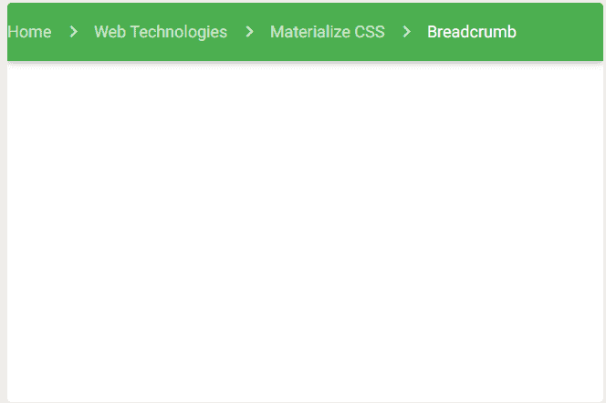

# 物化 CSS |面包屑

> 原文:[https://www.geeksforgeeks.org/materialize-css-breadcrumbs/](https://www.geeksforgeeks.org/materialize-css-breadcrumbs/)

物化 CSS 中的面包屑在您有多层内容来显示您的当前位置时使用。物化 CSS 提供了各种 CSS 类，以一种简单的方式创建一个漂亮的面包屑。它使用两个类，即**导航包装**和**面包屑**。

**导航包装**用于将导航组件设置为面包屑/导航条包装。

**面包屑**用于将锚点元素设置为面包屑。最后一个锚点元素处于活动状态，而其余元素显示为灰色。

```css
<nav>
    <div class="nav-wrapper">
      <div class="col s12">
        <a href="#!" class="breadcrumb">First</a>
        <a href="#!" class="breadcrumb">Second</a>
        <a href="#!" class="breadcrumb">Third</a>
      </div>
    </div>
  </nav>

```

**示例:**

```css
<!DOCTYPE html>
<html>

<head>
    <!--Import Google Icon Font-->
    <link href=
"https://fonts.googleapis.com/icon?family=Material+Icons"
        rel="stylesheet" />

    <!-- Compiled and minified CSS -->
    <link rel="stylesheet" href=
"https://cdnjs.cloudflare.com/ajax/libs/materialize/0.97.5/css/materialize.min.css" />

    <!--Let browser know website
        is optimized for mobile-->
    <meta name="viewport" content=
        "width=device-width, initial-scale=1.0" />
</head>

<body>
    <nav>
        <div class="nav-wrapper green">
            <div class="col s12">
                <a href="#" class="breadcrumb">
                    Home
                </a>
                <a href="#" class="breadcrumb">
                    Web Technologies
                </a>
                <a href="#" class="breadcrumb">
                    Materialize CSS
                </a>
                <a href="#" class="breadcrumb">
                    Breadcrumb
                </a>
            </div>
        </div>
    </nav>

    <!-- Compiled and minified JavaScript -->
    <script src=
"https://cdnjs.cloudflare.com/ajax/libs/materialize/0.97.5/js/materialize.min.js">
    </script>
</body>

</html>
```

**输出:**

