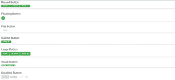

# 物化 CSS |按钮

> 原文:[https://www.geeksforgeeks.org/materialize-css-buttons/](https://www.geeksforgeeks.org/materialize-css-buttons/)

**按钮**组件以及其中的链接可能是允许用户与网页交互、执行各种功能以及从一个网页移动到另一个网页的最重要的功能之一。以下是定义的各种按钮类别及其效果:

*   **凸起:**用于设置涟漪点击效果，也可以和其他各种职业组合使用。

    ```css
    <a class="waves-effect waves-light btn">button</a>
    <a class="waves-effect waves-light btn"><i class="material-icons left">list</i>button</a>
    <a class="waves-effect waves-light btn"><i class="material-icons right">list</i>button</a>

    ```

*   **浮动:**用于创建圆形按钮。

    ```css
    <a class="btn-floating btn-large waves-effect waves-light red"><i class="material-icons">edit</i></a>
    ```

*   **平板:**用于给按钮设置平板显示效果，减少过度层次感。例如，平面按钮通常用于卡片内的动作，这样就不会有太多重叠的阴影。

    ```css
     <a class="waves-effect waves-teal btn-flat">Button</a>
    ```

*   **提交按钮:**用于表示为主按钮。使用 button 提交表单时，可以使用 submit 类型的 button 标记，而不是使用 input 标记。

    ```css
    <button class="btn waves-effect waves-light" type="submit" name="action">Submit
        <i class="material-icons right">send</i>
      </button>
    ```

*   **大号:**用于需要更多关注的按钮。

    ```css
    <a class="waves-effect waves-light btn-large">Button</a>
    <a class="waves-effect waves-light btn-large"><i class="material-icons left">list</i>button</a>
    <a class="waves-effect waves-light btn-large"><i class="material-icons right">list</i>button</a>

    ```

*   **小:**当鼠标和键盘是主要输入方式时使用，此按钮用于更密集的 UI 布局。

```css
<a class="waves-effect waves-light btn-small">Button</a>
<a class="waves-effect waves-light btn-small"><i class="material-icons left">list</i>button</a>
<a class="waves-effect waves-light btn-small"><i class="material-icons right">list</i>button</a>

```

*   **禁用:**用于创建禁用按钮。

```css
<a class="btn-large disabled">Button</a>
<a class="btn disabled">Button</a>
<a class="btn-flat disabled">Button</a>
<a class="btn-floating disabled"><i class="material-icons">edit</i></a>

```

**示例:**

## 超文本标记语言

```css
<!DOCTYPE html>
<html>

<head>
  <!--Import Google Icon Font-->
  <link href=
"https://fonts.googleapis.com/icon?family=Material+Icons"
    rel="stylesheet">

  <!-- Compiled and minified CSS -->
  <link rel="stylesheet" href=
"https://cdnjs.cloudflare.com/ajax/libs/materialize/0.97.5/css/materialize.min.css">

  <script type="text/javascript" src=
    "https://code.jquery.com/jquery-2.1.1.min.js">
  </script>

  <!--Let browser know website is
      optimized for mobile-->
  <meta name="viewport" content
    ="width=device-width, initial-scale=1.0" />
</head>

<body>

  <div class="card-panel">
    <h3>Raised Button</h3>
    <a class="waves-effect waves-light 
        btn green">button</a>
    <a class="waves-effect waves-light 
        btn green"><i class="material-icons 
        left">list</i>button</a>
    <a class="waves-effect waves-light 
      btn green"><i class="material-icons
      right">list</i>button</a>
  </div>

  <div class="card-panel">
    <h3>Floating Button</h3>
    <a class="btn-floating btn-large 
      waves-effect waves-light teal">
      <i class="material-icons">edit</i>
    </a>

  </div>
  <div class="card-panel">
    <h3>Flat Button</h3>
    <a class="waves-effect waves-green 
      btn-flat">Button</a>

  </div>
  <div class="card-panel">
    <h3>Submit Button</h3>
    <button class="btn green waves-effect 
      waves-light" type="submit" 
      name="action">Submit
      <i class="material-icons right">send</i>
    </button>
  </div>
  <div class="card-panel">
    <h3>Large Button</h3>
    <a class="waves-effect waves-light 
        btn-large green">Button</a>
    <a class="waves-effect waves-light 
        btn-large green"><i class=
        "material-icons left">list</i>
        button
    </a>
    <a class="waves-effect waves-light 
      btn-large green"><i class="material-icons 
      right">list</i>button</a>

  </div>
  <div class="card-panel">
    <h3>Small Button</h3>
    <a class="waves-effect waves-light 
      btn-small green white-text">Button</a>
    <a class="waves-effect waves-light 
      btn-small green white-text"><i class=
      "material-icons left">list</i>button</a>
    <a class="waves-effect waves-light 
      btn-small green white-text"><i class=
      "material-icons right">list</i>button</a>

  </div>
  <div class="card-panel">
    <h3>Disabled Button</h3>
    <a class="btn-large disabled">Button</a>
    <a class="btn disabled">Button</a>
    <a class="btn-flat disabled">Button</a>
    <a class="btn-floating disabled">
      <i class="material-icons">edit</i></a>

  </div>
  <!-- Compiled and minified JavaScript -->
  <script src=
"https://cdnjs.cloudflare.com/ajax/libs/materialize/0.97.5/js/materialize.min.js"></script>
</body>

</html>
```

**输出:**

