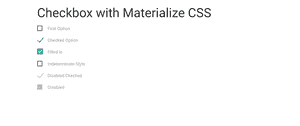

# 物化 CSS 复选框

> 原文:[https://www.geeksforgeeks.org/materialize-css-checkbox/](https://www.geeksforgeeks.org/materialize-css-checkbox/)

物化提供了一个复选框功能，为网站创建样式化的复选框。标准的 HTML 复选框是普通的，在未选中状态下有一个简单的黑色边框，在选中状态下有一个勾号，但是物化边框样式可以随着勾号一起改变。

创建默认样式的复选框时，使用 **<输入类型=“复选框”>** 。属性的**是将自定义复选框与输入绑定所必需的。这是通过将输入的 id 添加为标签属性的值来实现的。下面的示例显示了物化表单中使用的所有不同类型的复选框。**

**示例:**

```html
<!DOCTYPE html>
<html>
    <head>
        <!--Import Google Icon Font-->
        <link href=
"https://fonts.googleapis.com/icon?family=Material+Icons"
              rel="stylesheet" />

        <!-- Compiled and minified CSS -->
        <link rel="stylesheet" 
              href=
"https://cdnjs.cloudflare.com/ajax/libs/materialize/0.97.5/css/materialize.min.css" />
        <script type="text/javascript" 
                src=
"https://code.jquery.com/jquery-2.1.1.min.js"></script>
        <script src=
"https://cdnjs.cloudflare.com/ajax/libs/materialize/0.97.3/js/materialize.min.js">
      </script>

        <!--Let browser know website 
          is optimized for mobile-->
        <meta name="viewport" 
              content="width=device-width,
                       initial-scale=1.0" />
    </head>

    <body class="container">
        <div class="intro-text">
            <h3>Checkbox with Materialize CSS</h3>

            <form action="#">
                <p>
                    <input type="checkbox"
                           id="test1" />
                    <label for="test1">First Option</label>
                </p>
                <p>
                    <input type="checkbox" 
                           id="test2" 
                           checked="checked" />
                    <label for="test2">Checked Option</label>
                </p>
                <p>
                    <input type="checkbox"
                           class="filled-in"
                           id="filled-in-box"
                           checked="checked" />
                    <label for="filled-in-box">
                      Filled in</label>
                </p>
                <p>
                    <input id="indeterminate-checkbox"
                           type="checkbox" />
                    <label for="indeterminate-checkbox">
                      Indeterminate Style</label>
                </p>

                <p>
                    <input type="checkbox"
                           id="test3" 
                           checked="checked" 
                           disabled="disabled" />
                    <label for="test3">
                      Disabled Ckeched</label>
                </p>
                <p>
                    <input type="checkbox"
                           id="test4"
                           disabled="disabled" />
                    <label for="test4">Disabled</label>
                </p>
            </form>
        </div>
        <!-- Compiled and minified JavaScript -->
        <script src=
"https://cdnjs.cloudflare.com/ajax/libs/materialize/0.97.5/js/materialize.min.js">
      </script>
    </body>
</html>
```

**输出:**

