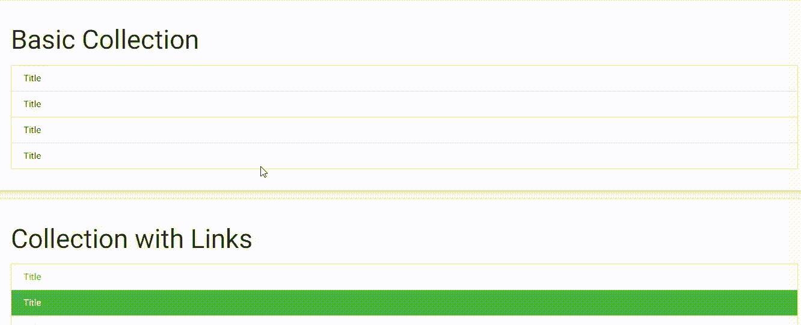

# 物化 CSS |集合

> 原文:[https://www.geeksforgeeks.org/materialize-css-collections/](https://www.geeksforgeeks.org/materialize-css-collections/)

集合允许您将列表对象分组在一起。它代表各种类型的集合，即一组相关信息。

以下是用于创建各种类型集合的各种集合类:

*   **基本:**在本例中，**区**或 **ul** 集装箱为一个集合，而 **a** 或 **li** 物品为一个集合物品。

```
    <ul class="collection">
            <li class="collection-item">Title</li>
            <li class="collection-item">Title</li>
            <li class="collection-item">Title</li>
            <li class="collection-item">Title</li>
      </ul>
```

*   **链接:**用于将**一**或**里**项显示为活动收藏项。

```
    <div class="collection">
            <a href="#!" class="collection-item">Title</a>
            <a href="#!" class="collection-item active green">Title</a>
            <a href="#!" class="collection-item">Title</a>
            <a href="#!" class="collection-item active green">Title</a>
        </div>
```

*   **表头:**是用来让集合有一个表头。

```
    <ul class="collection with-header">
            <li class="collection-header">
                <h4>First Names</h4></li>
            <li class="collection-item">Title</li>
            <li class="collection-item">Title</li>
            <li class="collection-item">Title</li>
            <li class="collection-item">Title</li>
        </ul>
```

*   **次要内容:**用于将 **a** 或 **li** 项设置为收藏表头。

```
    <ul class="collection with-header">
            <li class="collection-header"><h4>First Names</h4></li>
            <li class="collection-item"><div>Title
            <a href="#!" 
                  class="secondary-content"><i 
                  class="material-icons">edit</i></a></div></li>
            <li class="collection-item"><div>Title
            <a href="#!" 
                  class="secondary-content"><i 
                  class="material-icons">edit</i></a></div></li>
            <li class="collection-item"><div>Title
            <a href="#!" 
                  class="secondary-content"><i
                  class="material-icons">edit</i></a></div></li>
            <li class="collection-item"><div>Title
            <a href="#!" 
                  class="secondary-content"><i 
                  class="material-icons">edit</i></a></div></li>
        </ul>
```

*   **头像内容:**用于将 **a** 或 **li** 项目设置为头像项目。

```
    <ul class="collection">
          <li class="collection-item avatar">
            
            <span class="title">Title</span>
            <p>First Line <br>
               Second Line
            </p>
            <a href="#!" 
                  class="secondary-content"><i 
                  class="material-icons">grade</i></a>
          </li>
          <li class="collection-item avatar">
            <i class="material-icons circle">autorenew</i>
            <span class="title">Title</span>
            <p>First Line <br>
               Second Line
            </p>
            <a href="#!" 
                  class="secondary-content"><i 
        class="material-icons">grade</i></a>
          </li>
          <li class="collection-item avatar">
            <i class="material-icons circle green">build</i>
            <span class="title">Title</span>
            <p>First Line <br>
               Second Line
            </p>
            <a href="#!" 
                  class="secondary-content"><i
                  class="material-icons">grade</i></a>
          </li>
          <li class="collection-item avatar">
            <i class="material-icons circle red">cloud</i>
            <span class="title">Title</span>
            <p>First Line <br>
               Second Line
            </p>
            <a href="#!" 
                  class="secondary-content"><i 
                  class="material-icons">grade</i></a>
          </li>
        </ul>
```

*   **可剔除内容:**用于将收藏物品剔除。它仅用于触摸屏设备。

```
    <ul class = "collection">  
           <li class = "collection-item dismissable">Title</li>  
           <li class = "collection-item dismissable">Title</li>  
           <li class = "collection-item dismissable">Title</li>  
           <li class = "collection-item dismissable">Title</li>  
        </ul>
```

**例:**

```
<!DOCTYPE html>
<html>
    <head>
        <!--Import Google Icon Font-->
        <link href=
"https://fonts.googleapis.com/icon?family=Material+Icons" 
              rel="stylesheet" />

        <!-- Compiled and minified CSS -->
        <link rel="stylesheet" 
              href=
"https://cdnjs.cloudflare.com/ajax/libs/materialize/0.97.5/css/materialize.min.css" />

        <script type="text/javascript"
                src=
"https://code.jquery.com/jquery-2.1.1.min.js">
      </script>
        <!--Let browser know website
            is optimized for mobile-->
        <meta name="viewport" 
              content="width=device-width, 
                       initial-scale=1.0" />
    </head>

    <body>
        <div class="card-panel">
            <h3>Basic Collection</h3>
            <ul class="collection">
                <li class="collection-item">Title</li>
                <li class="collection-item">Title</li>
                <li class="collection-item">Title</li>
                <li class="collection-item">Title</li>
            </ul>
        </div>
        <div class="card-panel">
            <h3>Collection with Links</h3>
            <div class="collection">
                <a href="#!" class="collection-item">Title</a>
                <a href="#!" 
                   class="collection-item active green">
                  Title</a>
                <a href="#!" class="collection-item">Title</a>
                <a href="#!"
                   class="collection-item active green">
                  Title</a>
            </div>
        </div>
        <div class="card-panel">
            <h3>Collection with Hearder</h3>
            <ul class="collection with-header">
                <li class="collection-header">
                    <h4>First Names</h4>
                </li>
                <li class="collection-item">Title</li>
                <li class="collection-item">Title</li>
                <li class="collection-item">Title</li>
                <li class="collection-item">Title</li>
            </ul>
        </div>
        <div class="card-panel">
            <h3>Collection with Secondary Content</h3>
            <ul class="collection with-header">
                <li class="collection-header">
                  <h4>First Names</h4></li>
                <li class="collection-item">
                    <div>
                        Title<a href="#!" 
                           class="secondary-content green-text">
                      <i class="material-icons">send</i></a>
                    </div>
                </li>
                <li class="collection-item">
                    <div>
                        Title<a href="#!"
                            class="secondary-content green-text">
                      <i class="material-icons">send</i></a>
                    </div>
                </li>
                <li class="collection-item">
                    <div>
                        Title<a href="#!"
                            class="secondary-content green-text">
                      <i class="material-icons">send</i></a>
                    </div>
                </li>
                <li class="collection-item">
                    <div>
                        Title<a href="#!" 
                           class="secondary-content green-text">
                      <i class="material-icons">send</i></a>
                    </div>
                </li>
            </ul>
        </div>
        <div class="card-panel">
            <h3>Collection with Avatar Content</h3>
            <ul class="collection">
                <li class="collection-item avatar">
                    
                    <span class="title">Title</span>
                    <p>
                        First Line <br />
                        Second Line
                    </p>
                    <a href="#!" 
                       class="secondary-content green-text">
                      <i class="material-icons">grade</i></a>
                </li>
                <li class="collection-item avatar">
                    <i class="material-icons circle">autorenew</i>
                    <span class="title">Title</span>
                    <p>
                        First Line <br />
                        Second Line
                    </p>
                    <a href="#!" 
                       class="secondary-content green-text">
                      <i class="material-icons">grade</i></a>
                </li>
                <li class="collection-item avatar">
                    <i class="material-icons circle green">
                      build
                  </i>
                    <span class="title">Title</span>
                    <p>
                        First Line <br />
                        Second Line
                    </p>
                    <a href="#!"
                       class="secondary-content green-text">
                      <i class="material-icons">grade</i></a>
                </li>
                <li class="collection-item avatar">
                    <i class="material-icons circle red">
                      cloud
                  </i>
                    <span class="title">Title</span>
                    <p>
                        First Line <br />
                        Second Line
                    </p>
                    <a href="#!" 
                       class="secondary-content green-text">
                      <i class="material-icons">grade</i></a>
                </li>
            </ul>
        </div>
        <div class="card-panel">
            <h3>Collection with dismissible content</h3>
            <ul class="collection">
                <li class="collection-item dismissable">Title</li>
                <li class="collection-item dismissable">Title</li>
                <li class="collection-item dismissable">Title</li>
                <li class="collection-item dismissable">Title</li>
            </ul>
        </div>

        <!-- Compiled and minified JavaScript -->
        <script src=
"https://cdnjs.cloudflare.com/ajax/libs/materialize/0.97.5/js/materialize.min.js">
      </script>
    </body>
</html>
```

**输出:**

