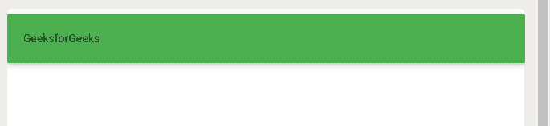
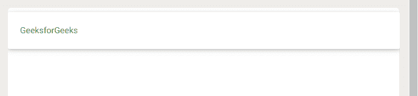

# 物化 CSS |颜色

> 原文:[https://www.geeksforgeeks.org/materialize-css-colors/](https://www.geeksforgeeks.org/materialize-css-colors/)

它是用 HTML、CSS 和 JavaScript 创建的，由谷歌设计。材料设计是一种将成功设计的经典原则与创新和技术相结合的设计语言。

**颜色:**这里是基于材质设计基础色的调色板。这些颜色中的每一种都由一个基本颜色类和一个可选的变亮或变暗类定义。

*   To **apply background color** simply add the color name and light/darkness as a class to the element.

    ```
    <!DOCTYPE html>
    <html>

    <head>
        <!--Import Google Icon Font-->
        <link href=
    "https://fonts.googleapis.com/icon?family=Material+Icons"
            rel="stylesheet">

        <!-- Compiled and minified CSS -->
        <link rel="stylesheet" href=
    "https://cdnjs.cloudflare.com/ajax/libs/materialize/0.97.5/css/materialize.min.css">

        <!--Let browser know website is 
            optimized for mobile-->
        <meta name="viewport" content=
            "width=device-width,initial-scale=1.0" />
    </head>

    <body>

        <div class="card-panel green">
            GeeksforGeeks
        </div>

        <!-- Compiled and minified JavaScript -->
        <script src=
    "https://cdnjs.cloudflare.com/ajax/libs/materialize/0.97.5/js/materialize.min.js">
        </script>
    </body>

    </html>
    ```

    **输出:**
    [](https://media.geeksforgeeks.org/wp-content/uploads/20200519114502/Screenshot-3392.png)

*   To **apply a text color** simply append -text to the color class just like done before.

    ```
    <!DOCTYPE html>
    <html>

    <head>
        <!--Import Google Icon Font-->
        <link href=
    "https://fonts.googleapis.com/icon?family=Material+Icons"
            rel="stylesheet">

        <!-- Compiled and minified CSS -->
        <link rel="stylesheet" href=
    "https://cdnjs.cloudflare.com/ajax/libs/materialize/0.97.5/css/materialize.min.css">

        <!--Let browser know website is 
            optimized for mobile-->
        <meta name="viewport" content=
                    "width=device-width, 
                    initial-scale=1.0" />
    </head>

    <body>
        <div class="card-panel">
            <span class="green-text text-darken-2">
                GeeksforGeeks
            </span>
        </div>

        <!-- Compiled and minified JavaScript -->
        <script src=
    "https://cdnjs.cloudflare.com/ajax/libs/materialize/0.97.5/js/materialize.min.js">
        </script>
    </body>

    </html>
    ```

    **输出:**
    [](https://media.geeksforgeeks.org/wp-content/uploads/20200519114609/Screenshot-3382.png)

**下面是一些彩色腭的列表:**

| 名字 | 十六进制 | 颜色 |
| --- | --- | --- |
| 红色亮色-2 | #e57373 |  |
| 红色变暗-4 | #b71c1c |  |
| 粉色亮色-3 | #f48fb1 |  |
| 粉色变暗-4 | #880e4f |  |
| 紫色亮色-3 | #ce93d8 |  |
| 紫色重音-2 | #e040fb |  |
| 深紫色 | #673ab7 |  |
| 靛蓝 | #3f51b5 |  |
| 蓝色重音-1 | #82b1ff |  |
| 青色变暗-3 | #00695c |  |
| 绿色的 | #4caf50 |  |
| 浅绿色 | #8bc34a |  |
| 浅绿色变暗-4 | #33691e |  |
| 黄色变暗-4 | #f57f17 |  |
| 棕色变暗-1 | #6d4c41 |  |

不同的调色板可以参考*https://materializecss.com/color.html*。