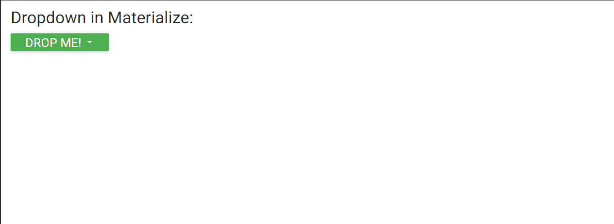
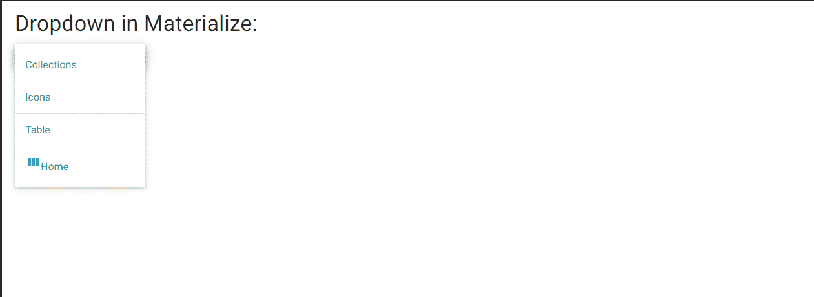

# 物化 CSS 下拉菜单

> 原文:[https://www.geeksforgeeks.org/materialize-css-dropdown/](https://www.geeksforgeeks.org/materialize-css-dropdown/)

物化 CSS 提供了一个下拉工具，允许用户从列表中的一组给定值中选择一个值。要向任何按钮添加下拉列表，必须确保数据目标属性与< ul >标签中的 **id** 匹配。

下拉菜单中使用的主要类别和属性为:

1.  **下拉内容**类用于标识哪个< ul >标签应该成为物化下拉组件。
2.  **数据激活**属性用于指定下拉< ul >元素**的 id。**

**语法:**

## 超文本标记语言

```html
<!-- Dropdown Trigger -->
<h5>
  <a class='dropdown-button btn green' 
     href='#'
     data-activates='dropdown1'>
    Drop Me!
    <i class="large material-icons">
      arrow_drop_down
    </i>
  </a>
</h5>
```

在下拉列表中，可以添加以下元素:

*   使用**除法器**类添加除法器。它可以添加到空的< li >标签中，以显示一个分隔线。
*   通过使用< i >标签使用**材质图标**类添加图标。可以指定要使用的图标，它将显示在列表项的文本旁边。

**示例:**

## 超文本标记语言

```html
<!DOCTYPE html>
<html>

<head>
    <!--Import Google Icon Font-->
    <link rel="stylesheet" href=
"https://fonts.googleapis.com/icon?family=Material+Icons">

    <!-- Compiled and minified CSS -->
    <link rel="stylesheet" href=
"https://cdnjs.cloudflare.com/ajax/libs/materialize/0.97.5/css/materialize.min.css">

    <script type="text/javascript" src=
        "https://code.jquery.com/jquery-2.1.1.min.js">
    </script>

    <!-- Let the browser know that the
  website is optimized for mobile -->
    <meta name="viewport" content=
        "width=device-width, initial-scale=1.0" />
</head>

<body>
    <h4>Dropdown in Materialize:</h4>
    <!-- Dropdown Trigger -->
    <h5><a class='dropdown-button btn green'
            href='#' data-activates='dropdown1'>
            Drop Me!
            <i class="large material-icons">
                arrow_drop_down
            </i>
        </a>
    </h5>

    <!-- Dropdown Structure -->
    <ul id='dropdown1' class='dropdown-content'>

        <!-- Define the links in the dropdown -->
        <li>
            <a href=
"https://www.geeksforgeeks.org/materialize-css-collections/?ref=rp">
                Collections
            </a>
        </li>
        <li>
            <a href=
"https://www.geeksforgeeks.org/materialize-css-icons/?ref=rp">
                Icons
            </a>
        </li>

        <!-- Define a divider -->
        <li class="divider"></li>
        <li><a href="#!">Table</a></li>

        <!-- Define a list item with an icon -->
        <li>
            <a href="#!">
                <i class="material-icons">
                    view_module
                </i>
                Home
            </a>
        </li>
    </ul>

    <!-- Compiled and minified JavaScript -->
    <script src=
"https://cdnjs.cloudflare.com/ajax/libs/materialize/0.97.5/js/materialize.min.js">
    </script>
</body>

</html>
```

**输出:**


