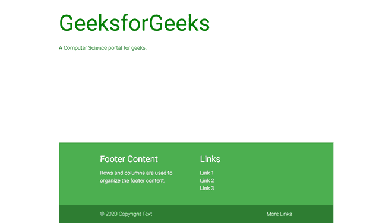

# 物化 CSS |页脚

> 原文:[https://www.geeksforgeeks.org/materialize-css-footer/](https://www.geeksforgeeks.org/materialize-css-footer/)

页脚是一种有效的方式来组织大量的网站导航和信息在一个页面的末尾。这是用户在完成当前页面的滚动或正在寻找关于网站的附加信息时会查看的地方。

Flexbox 用于构造 html，以便页脚始终位于页面底部。重要的是将页面的结构保持在三个 HTML5 标签 **<页眉><主>** 和**T8】页脚>** 内，如下图所示。

```css
<body>
    <header></header>
    <main></main>
    <footer></footer>
</body>
```

**示例:**

## 超文本标记语言

```css
<!DOCTYPE html>
<html>

<head>
  <title>
    The Materialize Footer Example
  </title>
  <meta name="viewport" content=
    "width=device-width, initial-scale=1">
  <link rel="stylesheet" href=
"https://cdnjs.cloudflare.com/ajax/libs/materialize/1.0.0/css/materialize.min.css">
  <script src=
"https://cdnjs.cloudflare.com/ajax/libs/materialize/1.0.0/js/materialize.min.js">
  </script>
</head>

<body class="container">

  <!-- Define the footer -->
  <footer class="page-footer green">
    <div class="container ">
      <div class="row">
        <div class="col l6 s12">
          <h5 class="white-text">
            Footer Content
          </h5>
          <p class="grey-text text-lighten-4">
            Rows and columns are
            used to organize the footer content.
          </p>

        </div>
        <div class="col l4 offset-l2 s12">
          <h5 class="white-text">Links</h5>
          <ul>
            <li>
              <a class="grey-text text-lighten-3" href="#!">
                Link 1
              </a>
            </li>
            <li>
              <a class="grey-text text-lighten-3" href="#!">
                Link 2
              </a>
            </li>
            <li>
              <a class="grey-text text-lighten-3" href="#!">
                Link 3
              </a>
            </li>
          </ul>
        </div>
      </div>
    </div>
    <div class="footer-copyright green darken-3">
      <div class="container ">
        © 2020 Copyright Text
        <a class="grey-text text-lighten-4 right" href="#!">
          More Links
        </a>
      </div>
    </div>
  </footer>
</body>

</html>
```

**输出:**


**粘性页脚:** A **粘性页脚**总是停留在页面底部，不管页面上的内容有多少。但是这个页脚如果内容多就会被下推，所以和固定页脚不一样。将以下代码添加到您的 CSS 文件中。

```css
  body {
    display: flex;
    min-height: 100vh;
    flex-direction: column;
  }

  main {
    flex: 1 0 auto;
  }
```

**示例:**

## 超文本标记语言

```css
<!DOCTYPE html>
<html>

<head>
  <title>
    The Materialize Footer Example
  </title>
  <meta name="viewport" content=
    "width=device-width, initial-scale=1">

  <link rel="stylesheet" href=
"https://cdnjs.cloudflare.com/ajax/libs/materialize/1.0.0/css/materialize.min.css">
  <script src=
"https://cdnjs.cloudflare.com/ajax/libs/materialize/1.0.0/js/materialize.min.js">
  </script>

  <style>
    /* Add CSS for making the
    footer sticky */
    body {
      display: flex;
      min-height: 100vh;
      flex-direction: column;
    }

    main {
      flex: 1 0 auto;
    }
  </style>
</head>

<body class="container">

  <!-- Use the <main> tag for displaying
       the contents of the page -->
  <main>
    <h1 style="color: green;">
      GeeksforGeeks
    </h1>

    <p>
      A Computer Science portal for geeks.
    </p>

  </main>

  <!-- Define the footer -->
  <footer class="page-footer green">
    <div class="container ">
      <div class="row">
        <div class="col l6 s12">
          <h5 class="white-text">
            Footer Content
          </h5>
          <p class="grey-text text-lighten-4">
            Rows and columns are
            used to organize the footer content.
          </p>

        </div>
        <div class="col l4 offset-l2 s12">
          <h5 class="white-text">Links</h5>
          <ul>
            <li>
              <a class="grey-text 
                text-lighten-3" href="#!">
                Link 1
              </a>
            </li>
            <li>
              <a class="grey-text 
                text-lighten-3" href="#!">
                Link 2
              </a>
            </li>
            <li>
              <a class="grey-text 
                text-lighten-3" href="#!">
                Link 3
              </a>
            </li>
          </ul>
        </div>
      </div>
    </div>
    <div class="footer-copyright green darken-3">
      <div class="container ">
        © 2020 Copyright Text
        <a class="grey-text 
          text-lighten-4 right" href="#!">
          More Links
        </a>
      </div>
    </div>
  </footer>
</body>

</html>
```

**输出:**

