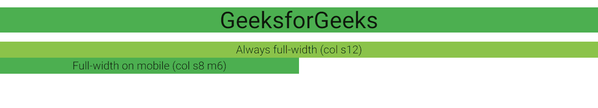

# 物化 CSS |网格

> 原文:[https://www.geeksforgeeks.org/materialize-css-grids/](https://www.geeksforgeeks.org/materialize-css-grids/)

有 12 个标准列流体响应网格系统，帮助您以有序和简单的方式布局页面。 使用行和列样式类分别定义行和列。**行**用于指定用于响应列的无填充容器，**列**用于指定具有子类的列。

有一个**容器**类用于将页面内容居中。集装箱等级设置为窗宽的~70%。要添加**容器**，只需将您的内容放入带有容器类的< div > 标签中。下面是语法:

```css
 <body>
      <div class="container">
        <!-- Page Content goes here -->
      </div>
 </body>

```

现在我们来了解一下网格系统是如何工作的:

标准网格有 12 列。无论浏览器的大小如何，这些列中的每一列都将始终具有相等的宽度。创建布局时，请记住所有列必须包含在一行中，并且您必须将列类添加到您的内部< div >中，以使它们成为列。您可以通过 **推拉** 轻松更改您的列顺序。只需将推-s2 或拉-s2 添加到类中，其中 s 是屏幕类前缀(s =小，m =中，l =大)，后面的数字是您想要推或拉的列数。

**例:**

```css
<!DOCTYPE html>
<html>

<head>
    <!--Import Google Icon Font-->
    <link href=
"https://fonts.googleapis.com/icon?family=Material+Icons"
        rel="stylesheet">

    <!-- Compiled and minified CSS -->
    <link rel="stylesheet" href=
"https://cdnjs.cloudflare.com/ajax/libs/materialize/0.97.5/css/materialize.min.css">

    <!--Let browser know website is 
        optimized for mobile-->
    <meta name="viewport" content=
                    "width=device-width, 
                    initial-scale=1.0" />
</head>

<body>
    <div class="green center">
        <h2>GeeksforGeeks</h2>
    </div>

    <div class="row">
        <div class="col s1 green center">1</div>
        <div class="col s1 green darken-3 center">2</div>
        <div class="col s1 green center">3</div>
        <div class="col s1 green darken-3 center">4</div>
        <div class="col s1 green center">5</div>
        <div class="col s1 green darken-3 center">6</div>
        <div class="col s1 green  center">7</div>
        <div class="col s1 green darken-3 center">8</div>
        <div class="col s1 green  center">9</div>
        <div class="col s1 green darken-3 center">10</div>
        <div class="col s1 green center">11</div>
        <div class="col s1 green darken-3 center">12</div>
    </div>

    <div class="row">
        <div class="col s7 push-s5 green darken-1">
            <span class="flow-text">
                This div is 7-columns wide on pushed
                to the right by 5-columns.
            </span>
        </div>

        <div class="col s5 pull-s7 light-green">
            <span class="flow-text">
                5-columns wide pulled to the left by
                7-columns.
            </span>
        </div>
    </div>
    <!-- Compiled and minified JavaScript -->
    <script src=
"https://cdnjs.cloudflare.com/ajax/libs/materialize/0.97.5/js/materialize.min.js">
    </script>
</body>

</html>
```

**网格类:** 物化网格系统有四个类:

*   。 S (for mobile devices)
*   。 M (tablet device)
*   。 L (desktop device)
*   。 Xl (large desktop device)

<figure class="table">

|  | 

移动设备

<= 600 px

 | 

平板设备

>600 px

 | 

桌面设备 s

 | 。m | 。l | 。特大号 |
| --- | --- | --- | --- | --- | --- | --- |
| **Container width** | 90% | 85% | 70% | 70% |
| --- | --- | --- | --- | --- |
| T126] Number of columns | Twelve | Twelve |
| --- | --- | --- |

</figure>

在前面的例子中，我们只使用“col S12”来定义小屏幕的尺寸。仅仅说 s12，我们实际上是在说“S12 M12 l12”上校。但是通过明确定义大小，我们可以使我们的网站更具响应性。

```css
<!DOCTYPE html>
<html>

<head>
    <!--Import Google Icon Font-->
    <link href=
"https://fonts.googleapis.com/icon?family=Material+Icons"
        rel="stylesheet">

    <!-- Compiled and minified CSS -->
    <link rel="stylesheet" href=
"https://cdnjs.cloudflare.com/ajax/libs/materialize/0.97.5/css/materialize.min.css">

    <!--Let browser know website is 
        optimized for mobile-->
    <meta name="viewport" content=
                    "width=device-width, 
                    initial-scale=1.0" />
</head>

<body>
    <div class="green center">
        <h2>GeeksforGeeks</h2>
    </div>

    <!--Responsive layout-->
    <div class="row">
        <div class="grid-example col 
            s12 light-green center">
            <span class="flow-text">
                Always full-width (col s12)
            </span>
        </div>

        <div class="grid-example col 
            s8 m6 green center">
            <span class="flow-text">
                Full-width on mobile (col s8 m6)
            </span>
        </div>
    </div>

    <!-- Compiled and minified JavaScript -->
    <script src=
"https://cdnjs.cloudflare.com/ajax/libs/materialize/0.97.5/js/materialize.min.js">
    </script>
</body>

</html>
```

**输出:**
