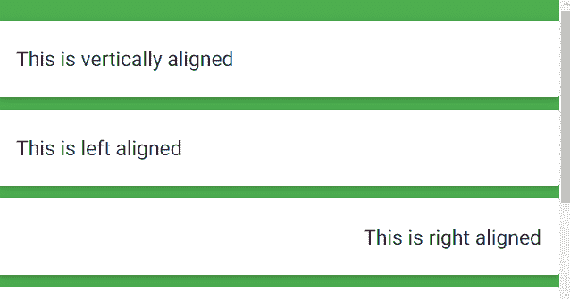

# 物化 CSS |助手

> 原文:[https://www.geeksforgeeks.org/materialize-css-helpers/](https://www.geeksforgeeks.org/materialize-css-helpers/)

物化 CSS 中有几个助手用于设计需求，例如:

*   对齐
*   隐藏/显示内容
*   格式化

**1。对齐:** 可以使用以下类别水平或垂直对齐内容:

*   **垂直对齐:**通过将类**包装器**添加到容纳您想要对齐的项目的容器中，可以轻松完成。

    ```
    <div class="valign-wrapper">
      <h5>This is vertically aligned</h5>
    </div>
    ```

*   **水平对齐:**这些类用于水平对齐内容:**左对齐、右对齐、居中对齐。**

    ```
     <div>
        <h5 class="left-align">This is left aligned</h5>
      </div>
      <div>
        <h5 class="right-align">This is right aligned</h5>
      </div>
      <div>
        <h5 class="center-align">This is center aligned</h5>
      </div>
    ```

*   **快速浮动:**还有其他用来对齐内容的类有**左**和**右**。

    ```
    <div class="left">...</div>
    <div class="right">...</div>
    ```

**2。隐藏/显示内容:** 为了在特定屏幕上隐藏/显示内容，物化提供了易于使用的类。

<figure class="table">T36 平板及以上

| **Class** | **Screen range** |
| --- | --- |
| hide | Hide from all devices |
| 隐藏仅限小型车 | 隐藏为仅移动 |
| 隐藏-只在医学上 |
| Hide only large size | Hide only the desktop |
| Only small size is displayed. | Only the moving dimension is displayed. |
|  |
| is displayed up and down in | indicates for the flat panel and below. |

</figure>

```
<div class="hide-on-small-only">
This will be hidden from mobile screen
</div>
```

**3。格式化:** 这些类有助于格式化各种内容。这些课程是–

*   **截断:**要截断省略号中的长文本行，**截断**类被添加到包含文本的标记中。

    ```
     <h4 class="truncate">
    This is an extremely long title that will be truncated
    </h4>
    ```

*   **悬停:****可悬停的**是用于为方块阴影添加动画的悬停类。

    ```
    <div class="card-panel hoverable">
     Hoverable Card Panel
    </div>
    ```

**这里有一个使用以上所有类的例子:**

```
<!DOCTYPE html>
<html>

<head>
    <!--Import Google Icon Font-->
    <link href=
"https://fonts.googleapis.com/icon?family=Material+Icons"
        rel="stylesheet">

    <!-- Compiled and minified CSS -->
    <link rel="stylesheet" href=
"https://cdnjs.cloudflare.com/ajax/libs/materialize/0.97.5/css/materialize.min.css">

    <!--Let browser know website is 
        optimized for mobile-->
    <meta name="viewport" content=
        "width=device-width, initial-scale=1.0" />
</head>

<body>
    <div class="class green">
        <br>
        <div class="card-panel ">
            <div class="valign-wrapper">
                <h5>This is vertically aligned</h5>
            </div>
        </div>
        <div class="card-panel">
            <h5 class="left-align">
                This is left aligned
            </h5>
        </div>

        <div class="card-panel">
            <h5 class="right-align">
                This is right aligned
            </h5>
        </div>

        <div class="card-panel">
            <h5 class="center-align">
                This is center aligned
            </h5>
        </div>
        <div class="card-panel">
            <div class="left">...</div>
        </div>
        <div class="card-panel">
            <div class="right">...</div>
        </div>

        <div class="hide-on-small-only">
            Hidden for mobile only</div>
        <div class="hide-on-med-only    ">
            Hidden for Tablet Only </div>
        <div class="hide-on-large-only">
            Hidden for Desktop Only</div>

        <div class="card-panel">
            <h4 class="truncate">
                This is an extremely long text 
                that will be truncated to show 
                the changes.
            </h4>
        </div>

        <div class="card-panel hoverable center">
            this is hoverable
        </div>
        <br><br>
    </div>

    <!-- Compiled and minified JavaScript -->
    <script src=
"https://cdnjs.cloudflare.com/ajax/libs/materialize/0.97.5/js/materialize.min.js">
    </script>
</body>

</html>
```

**输出:**
