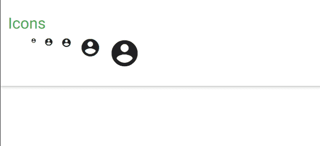

# 物化 CSS |图标

> 原文:[https://www.geeksforgeeks.org/materialize-css-icons/](https://www.geeksforgeeks.org/materialize-css-icons/)

物化 CSS 提供了丰富的谷歌材质图标，可以从[材质设计规范](https://material.io/resources/icons/?style=baseline)下载。物化 css 支持的图标库有**谷歌素材图标**、**字体牛逼图标**和**引导图标**。可以从 [<u>材质图标中选择不同的图标。</u>](https://material.io/resources/icons/?style=baseline)

**库和用法:** 要使用这些图标，在 HTML 代码的<头>部分添加了下面一行。

> <link href="”https://fonts.googleapis.com/icon?family=Material+Icons”" rel="”stylesheet”">

然后要使用图标，在 HTML 元素的*部分提供图标的名称。*

```css
<i class="material-icons">add</i>
```

**材质图标尺寸:** 物化 CSS 提供了四种尺寸的图标:**微小、小、中、大。**小、小、中、大的大小分别为 1 雷姆、2 雷姆、4 雷姆和 6 雷姆。

```css
<i class = "material-icons tiny">add</i>  
<i class = "material-icons small">add</i>  
<i class = "material-icons">add</i>  
<i class = "material-icons medium">add</i>  
<i class = "material-icons large">add</i>
```

**例:**

## 超文本标记语言

```css
<!DOCTYPE html>
<html>

<head>
    <!--Import Google Icon Font-->
    <link href=
"https://fonts.googleapis.com/icon?family=Material+Icons"
        rel="stylesheet">

    <!-- Compiled and minified CSS -->
    <link rel="stylesheet" href=
"https://cdnjs.cloudflare.com/ajax/libs/materialize/0.97.5/css/materialize.min.css">

    <script type="text/javascript" src=
"https://code.jquery.com/jquery-2.1.1.min.js">
    </script>

    <!--Let browser know website is 
        optimized for mobile-->
    <meta name="viewport" content=
    "width=device-width, initial-scale=1.0" />
</head>

<body>

    <div class="card-panel">
        <h3 class="green-text">Icons</h3>
        <div class="container">
            <div class="row">
                <div class="col">
                    <i class="material-icons 
                        tiny">account_circle</i>
                </div>
                <div class="col">
                    <i class="material-icons">
                        account_circle</i>
                </div>
                <div class="col">
                    <i class="material-icons 
                        small">account_circle</i>
                </div>
                <div class="col">
                    <i class="material-icons 
                        medium">account_circle</i>
                </div>
                <div class="col">
                    <i class="material-icons 
                        large">account_circle</i>
                </div>
            </div>
        </div>
    </div>

    <!-- Compiled and minified JavaScript -->
    <script src=
"https://cdnjs.cloudflare.com/ajax/libs/materialize/0.97.5/js/materialize.min.js">
    </script>
</body>

</html>
```

**输出:**

