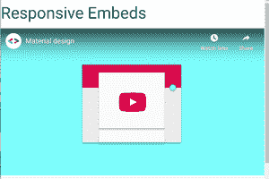

# 物化 CSS |媒体

> 原文:[https://www.geeksforgeeks.org/materialize-css-media/](https://www.geeksforgeeks.org/materialize-css-media/)

物化 CSS 提供了各种类来使媒体响应。

**图像:**图像可以通过以下方式设置样式:

**响应图像:**为使图像响应页面宽度，**响应-img** 类添加了图像标签。

```html
 

```

**圆形图像:**为了让图像看起来是圆形的，**圆形**类增加了图像标签。

```html
<div class="col s12 m8 offset-m2 l6 offset-l3">
  <div class="card-panel grey lighten-5 z-depth-1">
    <div class="row valign-wrapper">
      <div class="col s2">
         
      </div>
      <div class="col s10">
        <span class="black-text">
          This is a square image, "circle"
          class is added to it to make it
          appear circular.
        </span>
      </div>
    </div>
  </div>
</div>

```

**示例:**

```html
<!DOCTYPE html>
<html>
  <head>
    <!--Import Google Icon Font-->
    <link href=
"https://fonts.googleapis.com/icon?family=Material+Icons"
          rel="stylesheet">

    <!-- Compiled and minified CSS -->
    <link rel="stylesheet" href=
"https://cdnjs.cloudflare.com/ajax/libs/materialize/0.97.5/css/materialize.min.css">

    <script type = "text/javascript"  
         src = 
"https://code.jquery.com/jquery-2.1.1.min.js">
</script>  

    <!--Let browser know website is optimized for mobile-->
    <meta name="viewport" 
          content="width=device-width, initial-scale=1.0"/>
  </head>

  <body>
      <div>
          <h3>Responsive Image</h3>
        
      </div>

    <div class="col s12 m8 offset-m2 l6 offset-l3">
        <h3>Circular Image</h3>
        <div class="card-panel grey lighten-5 z-depth-1">
          <div class="row valign-wrapper">
            <div class="col s2">
               
               <!-- notice the "circle" class -->
            </div>
            <div class="col s10">
              <span class="black-text">
                This is a square image, 
                "circle" class is added
                to it to make it appear
                circular.
              </span>
            </div>
          </div>
        </div>
      </div>

     <!-- Compiled and minified JavaScript -->
     <script src=
"https://cdnjs.cloudflare.com/ajax/libs/materialize/0.97.5/js/materialize.min.js">
    </script>
  </body>
</html>
```

**输出:**


**视频:** 物化 CSS 为嵌入式视频提供了一个容器，可以相应地调整大小。

**响应嵌入:**要使嵌入响应，只需将它们包装在包含类视频容器的 div 中。

```html
<div class="video-container">
  <iframe width="853" height="480" 
    src="//www.youtube.com" 
    frameborder="0"
    allowfullscreen>
  </iframe>
</div>

```

**响应视频:**要使 HTML5 视频具有响应性，只需将类响应视频添加到视频标签中。

```html
<video class="responsive-video" controls>
    <source src="video.mp4" type="video/mp4">
</video>

```

**示例:**

```html
<!DOCTYPE html>
<html>

<head>
    <!--Import Google Icon Font-->
    <link href=
"https://fonts.googleapis.com/icon?family=Material+Icons"
        rel="stylesheet">

    <!-- Compiled and minified CSS -->
    <link rel="stylesheet" href=
"https://cdnjs.cloudflare.com/ajax/libs/materialize/0.97.5/css/materialize.min.css">

    <script type="text/javascript" 
src="https://code.jquery.com/jquery-2.1.1.min.js">
    </script>

    <!--Let browser know website 
        is optimized for mobile-->
    <meta name="viewport" content=
                    "width=device-width,
                    initial-scale=1.0" />
</head>

<body>
    <div>
        <h3>Responsive Embeds</h3>
        <div class="video-container">
            <iframe width="853" height="480" 
src="//www.youtube.com/embed/Q8TXgCzxEnw?rel=0"
                frameborder="0"
                allowfullscreen>
            </iframe>
        </div>
    </div>

    <div class="card-panel">
        <h3>responsive Videos</h3>
        <video class="responsive-video"
            controls>
            <source src=
"WhatsApp Video 2020-06-02 at 13.23.30.mp4"
            type="video/mp4">
        </video>
    </div>

    <!-- Compiled and minified JavaScript -->
    <script src=
"https://cdnjs.cloudflare.com/ajax/libs/materialize/0.97.5/js/materialize.min.js">
    </script>
</body>

</html>
```

**输出:**


