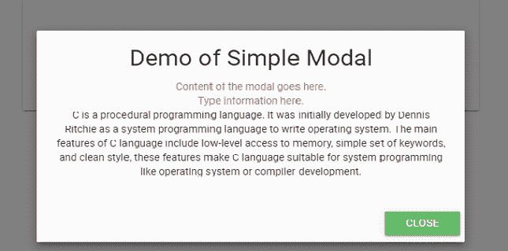
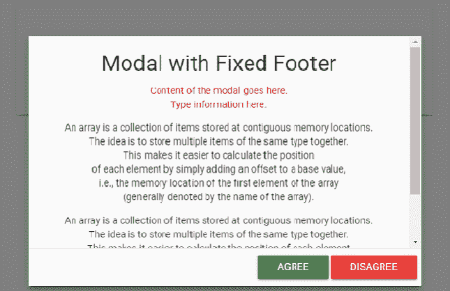
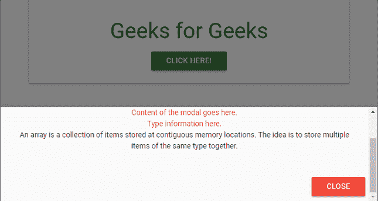

# 物化 CSS–模式

> 原文:[https://www.geeksforgeeks.org/materialize-css-modals/](https://www.geeksforgeeks.org/materialize-css-modals/)

物化 CSS 使用模态组件来创建对话框、确认消息或向查看者呈现重要内容，其中底层内容在模态窗口关闭之前变得不活动。

为了让模态工作，将*模态 Id* 添加到触发器的链接中，并在网页上包含引用**物化. min.js** 和 jQuery。要添加“关闭”按钮，将类*模式-关闭*添加到您的按钮。

**情态动词的类型:**

1.  **基本模态:**基本模态由**内容**和**页脚**组成。*模态内容*类被称为“主”div，而*模态页脚*类位于另一个“div”标签中，其中使用了“动作”按钮。

    **示例:**

    ## 超文本标记语言

    ```html
    <!DOCTYPE html>
    <html>

    <head>
        <link rel="stylesheet" href=
    "https://cdnjs.cloudflare.com/ajax/libs/materialize/0.100.2/css/materialize.min.css">

        <link href=
    "https://fonts.googleapis.com/icon?family=Material+Icons" rel="stylesheet">
        <script type="text/javascript" src=
            "https://code.jquery.com/jquery-2.1.1.min.js">
        </script>
        <script src=
    "https://cdnjs.cloudflare.com/ajax/libs/materialize/0.100.2/js/materialize.min.js">
        </script>
    </head>

    <body class="container ">
        <div class="card-panel center">
            <h3>Geeks for Geeks</h3>
            <!-- Modal Trigger -->
            <a class="waves-effect waves-light btn 
                green darken-1 modal-trigger" 
                href="#demo-modal">
                Click Here!
            </a>

            <!-- Modal Structure -->
            <div id="demo-modal" class="modal">
                <div class="modal-content">
                    <h4>Demo of Simple Modal</h4>
                    <p>
                    <div class="red-text">
                        Content of the modal goes here. <br>
                        Type information here. <br>
                    </div>
                    C is a procedural programming language.
                    It was initially developed by Dennis 
                    Ritchie as a system programming language 
                    to write operating system. The main 
                    features of C language include low-level
                    access to memory, simple set of keywords,
                    and clean style, these features make C 
                    language suitable for system programming 
                    like operating system or compiler development.
                    </p>
                </div>

                <div class="modal-footer">
                    <a href="#!" class="modal-action 
                        modal-close waves-effect waves-green 
                        btn green lighten-1">
                        Close
                    </a>
                </div>
            </div>
        </div>
        <script>
            $(document).ready(function () {
                $('.modal').modal();
            }
            )
        </script>
    </body>

    </html>
    ```

    **输出:**

    

2.  **带固定页脚的模态:**如果内容较大，则使用这种类型的模态。在这种情况下，我们可以创建固定的“动作”按钮。为此，*模态固定页脚*类与主容器元素中的模态类一起使用。

    **示例:**

    ## 超文本标记语言

    ```html
    <!DOCTYPE html>
    <html>

    <head>
        <link rel="stylesheet" href=
    "https://cdnjs.cloudflare.com/ajax/libs/materialize/0.100.2/css/materialize.min.css">

        <link href=
    "https://fonts.googleapis.com/icon?family=Material+Icons" rel="stylesheet">
        <script type="text/javascript" src=
            "https://code.jquery.com/jquery-2.1.1.min.js">
        </script>
        <script src=
    "https://cdnjs.cloudflare.com/ajax/libs/materialize/0.100.2/js/materialize.min.js">
        </script>
    </head>

    <body>
        <div class="container center">
            <div class="card-panel">
                <h3>Geeks for Geeks</h3>
                <!-- Modal Trigger -->
                <a class="waves-effect waves-light btn 
                    green darken-1 modal-trigger" 
                    href="#demo-modal-fixed-footer">
                    Click Here!
                </a>

                <!-- Modal Structure -->
                <div id="demo-modal-fixed-footer" 
                    class="modal modal-fixed-footer">
                    <div class="modal-content">
                        <h4>Modal with Fixed Footer</h4>
                        <div class="red-text">
                            Content of the modal goes here. <br>
                            Type information here. <br>
                        </div>
                        <p class="center">
                            An array is a collection of items 
                            stored at contiguous memory locations.<br>
                            The idea is to store multiple items of 
                            the same type together.<br> This makes 
                            it easier to calculate the position<br>
                            of each element by simply adding an 
                            offset to a base value,<br> i.e., the 
                            memory location of the first element of
                            the array <br>(generally denoted by the 
                            name of the array).<br>
                        </p>

                        <p class="center">
                            An array is a collection of items stored 
                            at contiguous memory locations.<br>
                            The idea is to store multiple items of 
                            the same type together.<br>
                            This makes it easier to calculate the 
                            position of each element <br>
                            by simply adding an offset to a base 
                            value, i.e., the memory location of <br>
                            the first element of the array (generally 
                            denoted by the name of the array).<br>
                        </p>
                    </div>
                    <div class="modal-footer">
                        <a href="#!" class="modal-action 
                            modal-close btn green darken-1">
                            Agree
                        </a>
                        <a href="#!" class="modal-action 
                            modal-close btn red darken-1">
                            Disagree
                        </a>
                    </div>
                </div>
            </div>
        </div>
        <script>
            $(document).ready(function () {
                $('.modal').modal();
            })
        </script>
    </body>

    </html>                   
    ```

    **输出:**

    

3.  **底稿模态:**模态可以显示在用户屏幕的底部，而不是中间。它就像普通模式一样，可以通过点击屏幕上的任何地方以及使用模式内的按钮来关闭。为此，*底层*类与< div >容器中的*模态*类一起使用。

    **示例:**

    ## 超文本标记语言

    ```html
    <!DOCTYPE html>
    <html>

    <head>
        <link rel="stylesheet" href=
    "https://cdnjs.cloudflare.com/ajax/libs/materialize/0.100.2/css/materialize.min.css">

        <link href=
    "https://fonts.googleapis.com/icon?family=Material+Icons" rel="stylesheet">
        <script type="text/javascript" 
            src="https://code.jquery.com/jquery-2.1.1.min.js">
        </script>
        <script src=
    "https://cdnjs.cloudflare.com/ajax/libs/materialize/0.100.2/js/materialize.min.js">
        </script>
    </head>

    <body class="container ">
        <div class="card-panel center">
            <h3>Geeks for Geeks</h3>
            <!-- Modal Trigger -->
            <a class="waves-effect waves-light 
                btn green darken-1 modal-trigger" 
                href="#demo-modal">
                Click Here!
            </a>
            <!-- Modal Structure -->
            <div id="demo-modal" class="modal bottom-sheet">
                <div class="modal-content">
                    <h4>Demo of Bottom sheet Modal</h4>
                    <p>
                    <div class="red-text">
                        Content of the modal goes here. <br>
                        Type information here. <br>
                    </div>
                    An array is a collection of items stored at
                    contiguous memory locations.
                    The idea is to store multiple items of the
                    same type together.
                    </p>
                </div>
                <div class="modal-footer">
                    <a href="#!" class=" modal-action 
                        modal-close waves-effect
                        waves-green btn red">
                        Close
                    </a>
                </div>
            </div>
        </div>
        <script>
            $(document).ready(function () {
                $('.modal').modal();
            })
        </script>
    </body>

    </html>        
    ```

    **输出:**

    