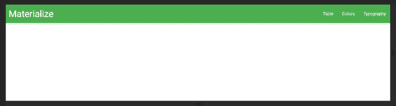
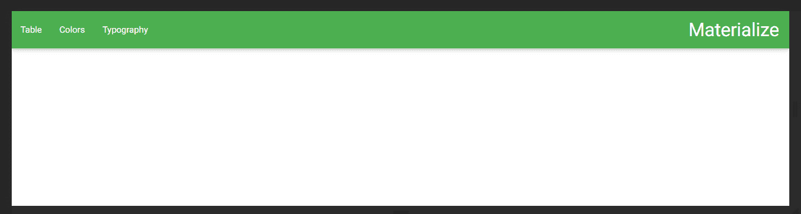
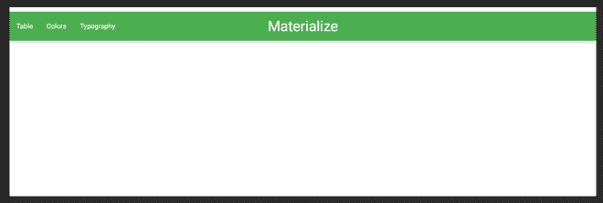
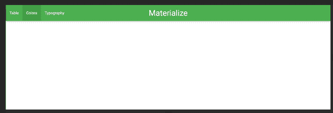
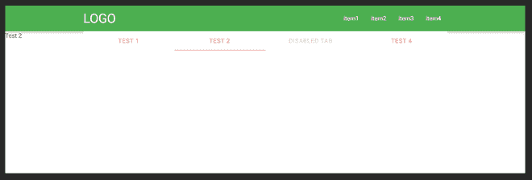
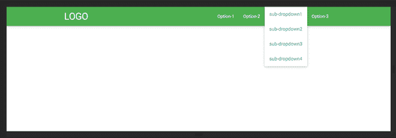
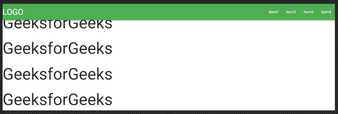
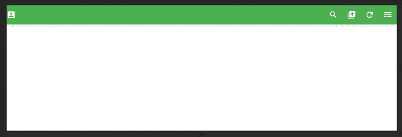

# 物化 CSS 导航条

> 原文:[https://www.geeksforgeeks.org/materialize-css-navbars/](https://www.geeksforgeeks.org/materialize-css-navbars/)

导航栏是网页中的用户界面元素，包含指向网站其他部分的链接。它显示为每页顶部的水平链接列表。它被放在页面的主要内容之前或标题之下。导航条包含在一个 HTML5 **<导航>** 中，后面是一个容器“div”，它包含了**导航条**的两个主要部分。一个**标志或品牌链接**，和**导航链接**。链接可以根据应用要求向左或向右对齐。

以下是使用 Navbars 的不同方法。

**1。右对齐:**为了右对齐导航条链接，**右** **类**被添加到< ul >元素中。

## 超文本标记语言

```
<!DOCTYPE html>
<html>

<head>
    <!--Import Google Icon Font-->
    <link href=
"https://fonts.googleapis.com/icon?family=Material+Icons"
        rel="stylesheet">

    <!-- Compiled and minified CSS -->
    <link rel="stylesheet" href=
"https://cdnjs.cloudflare.com/ajax/libs/materialize/0.97.5/css/materialize.min.css">

    <script type="text/javascript" src=
"https://code.jquery.com/jquery-2.1.1.min.js">
    </script>

    <!-- Let browser know website is
        optimized for mobile -->
    <meta name="viewport" content=
        "width=device-width, initial-scale=1.0" />
</head>

<body>
    <nav>
        <div class="nav-wrapper green">
            <a href="#" class="brand-logo">
                Materialize
            </a>

            <ul id="nav-mobile" class=
                "right hide-on-med-and-down">
                <li>
                    <a href=
"https://www.geeksforgeeks.org/materialize-css-tables/?ref=rp">
                        Table
                    </a>
                </li>

                <li>
                    <a href=
"https://www.geeksforgeeks.org/materialize-css-colors/?ref=rp">
                        Colors
                    </a>
                </li>

                <li><a href=
"https://www.geeksforgeeks.org/materialize-css-typography/?ref=rp">
                        Typography
                    </a>
                </li>
            </ul>
        </div>
    </nav>

    <!-- Compiled and minified JavaScript -->
    <script src=
"https://cdnjs.cloudflare.com/ajax/libs/materialize/0.97.5/js/materialize.min.js">
    </script>
</body>

</html>
```

**输出:**



**左对齐:**为了左对齐导航条链接，**左类**被添加到< ul >元素。

## 超文本标记语言

```
<!DOCTYPE html>
<html>

<head>
    <!--Import Google Icon Font-->
    <link href=
"https://fonts.googleapis.com/icon?family=Material+Icons"
        rel="stylesheet">

    <!-- Compiled and minified CSS -->
    <link rel="stylesheet" href=
"https://cdnjs.cloudflare.com/ajax/libs/materialize/0.97.5/css/materialize.min.css">

    <script type="text/javascript" src=
        "https://code.jquery.com/jquery-2.1.1.min.js">
    </script>

    <!-- Let browser know website is 
        optimized for mobile -->
    <meta name="viewport" content=
        "width=device-width, initial-scale=1.0" />
</head>

<body>
    <nav>
        <div class="nav-wrapper green">
            <a href="#" class="brand-logo 
                right">Materialize
            </a>

            <ul id="nav-mobile" class=
                "left hide-on-med-and-down">

                <li>
                    <a href=
"https://www.geeksforgeeks.org/materialize-css-tables/?ref=rp">
                        Table
                    </a>
                </li>

                <li>
                    <a href=
"https://www.geeksforgeeks.org/materialize-css-colors/?ref=rp">
                        Colors
                    </a>
                </li>

                <li>
                    <a href=
"https://www.geeksforgeeks.org/materialize-css-typography/?ref=rp">
                        Typography
                    </a>
                </li>
            </ul>
        </div>
    </nav>

    <!-- Compiled and minified JavaScript -->
    <script src=
"https://cdnjs.cloudflare.com/ajax/libs/materialize/0.97.5/js/materialize.min.js">
    </script>
</body>

</html>
```

**输出:**



**中心标志:**为使标志居中对齐，在< a 类=“品牌标志”>中增加了**中心类**。尽管徽标会在中下方屏幕上居中显示。使用时，请确保链接不重叠。

## 超文本标记语言

```
<!DOCTYPE html>
<html>

<head>
    <!--Import Google Icon Font-->
    <link href=
"https://fonts.googleapis.com/icon?family=Material+Icons"
        rel="stylesheet">

    <!-- Compiled and minified CSS -->
    <link rel="stylesheet" href=
"https://cdnjs.cloudflare.com/ajax/libs/materialize/0.97.5/css/materialize.min.css">

    <script type="text/javascript" src=
"https://code.jquery.com/jquery-2.1.1.min.js">
    </script>

    <!-- Let browser know website is 
        optimized for mobile -->
    <meta name="viewport" content=
        "width=device-width, initial-scale=1.0" />
</head>

<body>
    <nav>
        <div class="nav-wrapper green">
            <a href="#" class="brand-logo 
                center">Materialize
            </a>

            <ul id="nav-mobile" class=
                "left hide-on-med-and-down">

                <li>
                    <a href=
"https://www.geeksforgeeks.org/materialize-css-tables/?ref=rp">
                        Table
                    </a>
                </li>

                <li><a href=
"https://www.geeksforgeeks.org/materialize-css-colors/?ref=rp">
                        Colors
                    </a>
                </li>

                <li><a href=
"https://www.geeksforgeeks.org/materialize-css-typography/?ref=rp">
                        Typography
                    </a>
                </li>
            </ul>
        </div>
    </nav>

    <!-- Compiled and minified JavaScript -->
    <script src=
"https://cdnjs.cloudflare.com/ajax/libs/materialize/0.97.5/js/materialize.min.js">
    </script>
</body>

</html>
```

**输出:**



**活动项:**用于表示当前活动页面，为此**活动**类添加到“li”标签中。

## 超文本标记语言

```
<!DOCTYPE html>
<html>

<head>
    <!--Import Google Icon Font-->
    <link href=
"https://fonts.googleapis.com/icon?family=Material+Icons"
        rel="stylesheet">

    <!-- Compiled and minified CSS -->
    <link rel="stylesheet" href=
"https://cdnjs.cloudflare.com/ajax/libs/materialize/0.97.5/css/materialize.min.css">

    <script type="text/javascript" 
src="https://code.jquery.com/jquery-2.1.1.min.js">
    </script>

    <!-- Let browser know website is 
        optimized for mobile -->
    <meta name="viewport" content=
        "width=device-width, initial-scale=1.0" />
</head>

<body>

    <nav>
        <div class="nav-wrapper green">
            <a href="#" class="brand-logo 
                center">Materialize
            </a>

            <ul id="nav-mobile" class=
                "left hide-on-med-and-down">
                <li>
                    <a href=
"https://www.geeksforgeeks.org/materialize-css-tables/?ref=rp">
                        Table
                    </a>
                </li>

                <li class="active">
                    <a href=
"https://www.geeksforgeeks.org/materialize-css-colors/?ref=rp">
                        Colors
                    </a>
                </li>

                <li><a href=
"https://www.geeksforgeeks.org/materialize-css-typography/?ref=rp">
                        Typography
                    </a>
                </li>
            </ul>
        </div>
    </nav>

    <!-- Compiled and minified JavaScript -->
    <script src=
"https://cdnjs.cloudflare.com/ajax/libs/materialize/0.97.5/js/materialize.min.js">
    </script>
</body>

</html>
```

**输出:**



**带制表符的导航栏:**用于扩展导航栏的组件。为此，**导航扩展**类被添加到外部“导航”标签中。这将允许标签组件内的“导航包装”和“高度”是可变的。

## 超文本标记语言

```
<!DOCTYPE html>
<html>

<head>
    <!--Import Google Icon Font-->
    <link href=
"https://fonts.googleapis.com/icon?family=Material+Icons"
        rel="stylesheet">

    <!-- Compiled and minified CSS -->
    <link rel="stylesheet" href=
"https://cdnjs.cloudflare.com/ajax/libs/materialize/0.97.5/css/materialize.min.css">

    <script type="text/javascript" src=
"https://code.jquery.com/jquery-2.1.1.min.js">
    </script>

    <!-- Let browser know website 
        is optimized for mobile -->
    <meta name="viewport" content=
        "width=device-width, initial-scale=1.0" />
</head>

<body>

    <nav class="nav-extended green">
        <div class="nav-wrapper">
            <div class="container">
                <a href="#" class="brand-logo">
                    LOGO
                </a>

                <a href="#" data-activates="mobile-menu"
                    class="button-collapse">
                    <i class="material-icons">menu</i>
                </a>

                <ul class="right hide-on-med-and-down">
                    <li><a href="#">item1</a></li>
                    <li><a href="#">item2</a></li>
                    <li><a href="#">item3</a></li>
                    <li><a href="#">item4</a></li>
                </ul>
                <ul class="side-nav" id="mobile-menu">
                    <li><a href="#">item1</a></li>
                    <li><a href="#">item2</a></li>
                    <li><a href="#">item3</a></li>
                    <li><a href="#">item4</a></li>
                </ul>
                <!-- tabs items -->
                <ul class="tabs tabs-transparent">
                    <li class="tab"><a href="#test1">
                        Test 1
                    </a></li>

                    <li class="tab"><a class="active" 
                        href="#test2">Test 2</a></li>
                    <li class="tab disabled"><a href=
                        "#test3">Disabled Tab</a></li>
                    <li class="tab"><a href="#test4">
                        Test 4
                    </a></li>
                </ul>
            </div>
        </div>
    </nav>
    <!-- tabs content -->
    <div id="test1" class="col s12">Test 1</div>
    <div id="test2" class="col s12">Test 2</div>
    <div id="test3" class="col s12">Test 3</div>
    <div id="test4" class="col s12">Test 4</div>

    <!-- Compiled and minified JavaScript -->
    <script src=
"https://cdnjs.cloudflare.com/ajax/libs/materialize/0.97.5/js/materialize.min.js">
    </script>
</body>

</html>
```

**输出:**



**下拉菜单:**要添加导航栏下拉菜单，页面中会添加“ul”下拉结构。然后，添加一个元素来触发下拉菜单。下拉结构的“id”被提供给下拉的“数据目标”属性。

## 超文本标记语言

```
<!DOCTYPE html>
<html>

<head>
  <!--Import Google Icon Font-->
  <link href=
"https://fonts.googleapis.com/icon?family=Material+Icons" 
    rel="stylesheet">

  <!-- Compiled and minified CSS -->
  <link rel="stylesheet" href=
"https://cdnjs.cloudflare.com/ajax/libs/materialize/0.97.5/css/materialize.min.css">

  <script type="text/javascript" src=
"https://code.jquery.com/jquery-2.1.1.min.js">
  </script>

  <!-- Let browser know website 
    is optimized for mobile -->
  <meta name="viewport" content=
    "width=device-width, initial-scale=1.0" />
</head>

<body>
  <nav>
    <div class="nav-wrapper green">
      <div class="container">
        <a href="#" class="brand-logo">LOGO</a>
        <!-- mobile menu trigger -->
        <a href="#" data-activates="mobile-menu"
          class="button-collapse">
          <i class="material-icons">menu</i>
        </a>
        <!-- desktop menu content -->
        <ul class="right hide-on-med-and-down">
          <li><a href="#">Option-1</a></li>
          <li><a href="#">Option-2</a></li>
          <!-- desktop menu dropdown trigger -->
          <li><a class="dropdown-button" href="#!"
              data-activates="dropdown1">
              Dropdown
              <i class="material-icons right">
                arrow_drop_down
              </i>
            </a></li>
          <li><a href="#">Option-3</a></li>
          <!-- desktop menu dropdown content -->
          <ul id='dropdown1' class=
            'dropdown-content green-text'>
            <li><a href="#!">sub-dropdown1</a></li>
            <li><a href="#!">sub-dropdown2</a></li>
            <li><a href="#!">sub-dropdown3</a></li>
            <li><a href="#!">sub-dropdown4</a></li>
          </ul>
        </ul>
        <!-- mobile and tablet menu content -->
        <ul id="mobile-menu" class="side-nav">
          <li>
            <div class="userView">
              <div class="background">
                
              </div>
            </div>
          </li>
          <li><a href="#!">Option-1</a></li>
          <li><a href="#!">Option-2</a></li>
          <li class="no-padding">
            <ul class="collapsible collapsible-accordion">
              <li>
                <!-- Mobile and tablet menu dropdown trigger -->
                <a class="collapsible-header">Dropdown
                  <i class="material-icons right">
                    arrow_drop_down
                  </i>
                </a>
                <div class="collapsible-body">
                  <!-- Mobile and tablet dropdown content -->
                  <ul>
                    <li><a href="#!">sub-dropdown1</a></li>
                    <li><a href="#!">sub-dropdown2</a></li>
                    <li><a href="#!">sub-dropdown3</a></li>
                    <li><a href="#!">sub-dropdown4</a></li>
                  </ul>
                </div>
              </li>
            </ul>
          </li>
          <li><a href="#!">Option-3</a></li>
        </ul>
      </div>
    </div>
  </nav>

  <!-- Compiled and minified JavaScript -->
  <script src=
"https://cdnjs.cloudflare.com/ajax/libs/materialize/0.97.5/js/materialize.min.js">
  </script>
</body>

</html>
```

**输出:**



**固定 Navbar:** 为了固定 **navbar** ，增加了一个外包裹**nav bar-固定**类的“div”。这将抵消所有其他内容，同时使**导航条**固定。

## 超文本标记语言

```
<!DOCTYPE html>
<html>

<head>
  <!--Import Google Icon Font-->
  <link href=
"https://fonts.googleapis.com/icon?family=Material+Icons"
    rel="stylesheet">

  <!-- Compiled and minified CSS -->
  <link rel="stylesheet" href=
"https://cdnjs.cloudflare.com/ajax/libs/materialize/0.97.5/css/materialize.min.css">

  <script type="text/javascript" src=
"https://code.jquery.com/jquery-2.1.1.min.js">
  </script>

  <!-- Let browser know website 
      is optimized for mobile -->
  <meta name="viewport" content=
    "width=device-width, initial-scale=1.0" />
</head>

<body>
  <div class="navbar-fixed ">
    <nav>
      <div class="nav-wrapper green">
        <a href="#" class="brand-logo">LOGO</a>
        <a href="#" data-activates=
          "mobile-menu" class="button-collapse">
          <i class="material-icons">menu</i></a>
        <ul class="right hide-on-med-and-down">
          <li><a href="#">item1</a></li>
          <li><a href="#">item2</a></li>
          <li><a href="#">item3</a></li>
          <li><a href="#">item4</a></li>
        </ul>
        <ul class="side-nav" id="mobile-menu">
          <li><a href="#">item1</a></li>
          <li><a href="#">item2</a></li>
          <li><a href="#">item3</a></li>
          <li><a href="#">item4</a></li>
        </ul>
      </div>
    </nav>
  </div>
  <h1>GeeksforGeeks</h1>
  <h1>GeeksforGeeks</h1>
  <h1>GeeksforGeeks</h1>
  <h1>GeeksforGeeks</h1>
  <h1>GeeksforGeeks</h1>
  <h1>GeeksforGeeks</h1>
  <h1>GeeksforGeeks</h1>
  <h1>GeeksforGeeks</h1>

  <!-- Compiled and minified JavaScript -->
  <script src=
"https://cdnjs.cloudflare.com/ajax/libs/materialize/0.97.5/js/materialize.min.js">
  </script>
</body>

</html>
```

**输出:**



**图标链接:**图标可以添加到**导航栏**内的链接中。对于“图标”作为链接，没有必要添加额外的类只是使用 **i** 标签。

## 超文本标记语言

```
<!DOCTYPE html>
<html>

<head>
  <!--Import Google Icon Font-->
  <link href=
"https://fonts.googleapis.com/icon?family=Material+Icons"
    rel="stylesheet">

  <!-- Compiled and minified CSS -->
  <link rel="stylesheet" href=
"https://cdnjs.cloudflare.com/ajax/libs/materialize/0.97.5/css/materialize.min.css">

  <script type="text/javascript" src=
"https://code.jquery.com/jquery-2.1.1.min.js">
  </script>

  <!-- Let browser know website 
    is optimized for mobile -->
  <meta name="viewport" content=
    "width=device-width, initial-scale=1.0" />
</head>

<body>

  <nav>
    <div class="nav-wrapper green">
      <a href="#!" class="brand-logo">
        <i class="material-icons">
          account_box
        </i>Logo
      </a>

      <ul class="right hide-on-med-and-down">
        <li><a href="sass.html"><i class=
          "material-icons">search</i></a>
        </li>

        <li><a href="badges.html"><i class=
          "material-icons">add_to_photos</i></a>
        </li>
        <li><a href="collapsible.html">
          <i class="material-icons">refresh</i></a>
        </li>
        <li><a href="mobile.html"><i class=
          "material-icons">dehaze</i></a>
        </li>
      </ul>
    </div>
  </nav>

  <!-- Compiled and minified JavaScript -->
  <script src=
"https://cdnjs.cloudflare.com/ajax/libs/materialize/0.97.5/js/materialize.min.js">
  </script>

</body>

</html>
```

**输出:**

