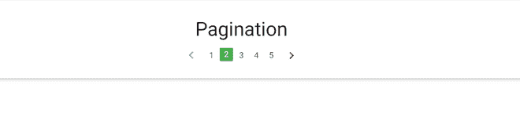

# 物化 CSS |分页

> 原文:[https://www.geeksforgeeks.org/materialize-css-pagination/](https://www.geeksforgeeks.org/materialize-css-pagination/)

分页用于将内容分成简短易懂的独立页面。物化 CSS 提供类来创建一个分页栏，保存到其他页面的链接。

**分页**类用于将< ul >列表元素设置为分页组件。必须显示的页面在该组件中定义为< li >项。左右箭头图标可用于显示移动到下一页或上一页的按钮。

**语法:**

```html
<ul class="pagination">
  <li class="disabled">
    <a href="#!">
      <i class="material-icons">
        chevron_left
      </i>
    </a>
  </li>
  <li class="active">
    <a href="#!">1</a>
  </li>
  <li class="waves-effect">
    <a href="#!">2</a>
  </li>
  <li class="waves-effect">
    <a href="#!">3</a>
  </li>
  <li class="waves-effect">
    <a href="#!">
      <i class="material-icons">
        chevron_right
      </i>
    </a>
  </li>
</ul>

```

**示例:**

## 超文本标记语言

```html
<html>

<head>
    <meta name="viewport" content=
    "width=device-width, initial-scale=1.0" />

    <!-- Import Material Icon Fonts -->
    <link rel="stylesheet" href=
"https://fonts.googleapis.com/icon?family=Material+Icons">

    <!-- Include Compiled and minified 
        Materialize CSS -->
    <link rel="stylesheet" href=
"https://cdnjs.cloudflare.com/ajax/libs/materialize/0.97.5/css/materialize.min.css">

    <!-- Include jQuery -->
    <script type="text/javascript" src=
"https://code.jquery.com/jquery-2.1.1.min.js">
    </script>

    <!-- Compiled and minified 
        Materialize JavaScript -->
    <script src=
"https://cdnjs.cloudflare.com/ajax/libs/materialize/0.97.5/js/materialize.min.js">
    </script>
</head>

<body>
    <div class="card-panel">
        <h3 class="center">
            Pagination
        </h3>

        <!-- Use the pagination class -->
        <ul class="pagination center-align">

            <!-- Use icon inside list item
                for the left arrow -->
            <li class="disabled">
                <a href="#!">
                    <i class="material-icons">
                        chevron_left
                    </i>
                </a>
            </li>

            <!-- Various classes that can be
                used with the page links -->
            <li class="waves-effect">
                <a href="#!">1</a>
            </li>
            <li class="active green">
                <a href="#!">2</a>
            </li>
            <li class="waves-effect">
                <a href="#!">3</a>
            </li>
            <li class="waves-effect">
                <a href="#!">4</a>
            </li>
            <li class="waves-effect">
                <a href="#!">5</a>
            </li>

            <!-- Use icon inside list item
                for the right arrow -->
            <li class="waves-effect">
                <a href="#!">
                    <i class="material-icons">
                        chevron_right
                    </i>
                </a>
            </li>
        </ul>
    </div>
</body>

</html>
```

**输出:**

