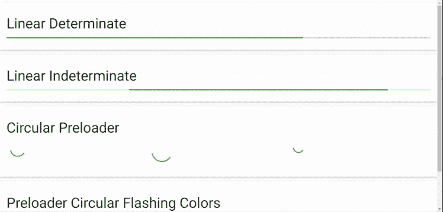

# 物化 CSS |预加载器

> 原文:[https://www.geeksforgeeks.org/materialize-css-preloader/](https://www.geeksforgeeks.org/materialize-css-preloader/)

**预加载器**用于提供符号消息，告知用户网站状态，如“加载”或“未崩溃”。物化提供 CSS 类来提供各种类型的预加载器。以下是**物化 CSS 提供的可用类。**

**Linear:** 它将一个元素标识为“div”元素所需的进度条类。有两种不同类型的线性进度条。

*   **确定:**为进度指标提供基本物化功能。

    ```html
    <div class="progress">
        <div class="determinate" style="width: 70%"></div>
    </div>

    ```

*   **Indeterminate:** It provides animation to progress indicator.

    ```html
    <div class="progress">
        <div class="indeterminate"></div>
    </div>

    ```

    **圆形:**圆形中有 4 种颜色，3 种尺寸。微调器应该嵌套在“div”**预加载器包装器中。**默认尺寸为**中**，但可增加**大**或**小班**相应调整尺寸。如果您想显示一种颜色，可以添加类别**仅红色微调器、仅蓝色微调器、仅黄色微调器**和**仅绿色微调器**。

    ```html
    <div class="preloader-wrapper big active">
        <div class="spinner-layer spinner-blue-only">
            <div class="circle-clipper left">
                <div class="circle"></div>
            </div>
            <div class="gap-patch">
                <div class="circle"></div>
            </div>
            <div class="circle-clipper right">
                <div class="circle"></div>
            </div>
        </div>
    </div>

    <div class="preloader-wrapper active">
        <div class="spinner-layer spinner-red-only">
            <div class="circle-clipper left">
                <div class="circle"></div>
            </div>
            <div class="gap-patch">
                <div class="circle"></div>
            </div>
            <div class="circle-clipper right">
                <div class="circle"></div>
            </div>
        </div>
    </div>

    <div class="preloader-wrapper small active">
        <div class="spinner-layer spinner-green-only">
            <div class="circle-clipper left">
                <div class="circle"></div>
            </div>
            <div class="gap-patch">
                <div class="circle"></div>
            </div>
            <div class="circle-clipper right">
                <div class="circle"></div>
            </div>
        </div>
    </div>

    ```

    **圆形闪烁颜色:**除了在显示时使用物化提供的所有四种颜色外，它们与圆形相同。

    ```html
    <div class="preloader-wrapper big active">
        <div class="spinner-layer spinner-blue">
            <div class="circle-clipper left">
                <div class="circle"></div>
            </div>
            <div class="gap-patch">
                <div class="circle"></div>
            </div>
            <div class="circle-clipper right">
                <div class="circle"></div>
            </div>
        </div>

        <div class="spinner-layer spinner-red">
            <div class="circle-clipper left">
                <div class="circle"></div>
            </div>
            <div class="gap-patch">
                <div class="circle"></div>
            </div>
            <div class="circle-clipper right">
                <div class="circle"></div>
            </div>
        </div>

        <div class="spinner-layer spinner-yellow">
            <div class="circle-clipper left">
                <div class="circle"></div>
            </div>
            <div class="gap-patch">
                <div class="circle"></div>
            </div>
            <div class="circle-clipper right">
                <div class="circle"></div>
            </div>
        </div>

        <div class="spinner-layer spinner-green">
            <div class="circle-clipper left">
                <div class="circle"></div>
            </div>
            <div class="gap-patch">
                <div class="circle"></div>
            </div>
            <div class="circle-clipper right">
                <div class="circle"></div>
            </div>
        </div>
    </div>

    ```

    **示例:**以下示例显示了上述所有预加载器类的使用。

    ## 超文本标记语言

    ```html
    <!DOCTYPE html>
    <html>

    <head>
      <!--Import Google Icon Font-->
      <link href=
    "https://fonts.googleapis.com/icon?family=Material+Icons"
        rel="stylesheet">

      <!-- Compiled and minified CSS -->
      <link rel="stylesheet" href=
    "https://cdnjs.cloudflare.com/ajax/libs/materialize/0.97.5/css/materialize.min.css">

      <script type="text/javascript" src=
        "https://code.jquery.com/jquery-2.1.1.min.js">
      </script>

      <!-- Compiled and minified JavaScript -->
      <script src=
    "https://cdnjs.cloudflare.com/ajax/libs/materialize/0.97.5/js/materialize.min.js">
      </script>

      <!--Let browser know website is
          optimized for mobile-->
      <meta name="viewport" content=
        "width=device-width, initial-scale=1.0" />
    </head>

    <body>
      <!-- Preloader determinate -->
      <div class="card-panel">
        <h3>Linear Determinate</h3>
        <div class="progress blue lighten-4">
          <div class="determinate green" style="width: 70%"></div>
        </div>
      </div>
      <!-- Preloader Indeterminate -->
      <div class="card-panel">
        <h3>Linear Indeterminate</h3>
        <div class="progress yellow lighten-3">
          <div class="indeterminate green" style="width: 70%"></div>
        </div>
      </div>
      <!-- Preloader Circular -->
      <div class="card-panel">
        <h3>Circular Preloader</h3>
        <div class="row">
          <div class="col s4">
            <div class="preloader-wrapper active">
              <div class="spinner-layer spinner-green-only">
                <div class="circle-clipper left">
                  <div class="circle"></div>
                </div>
                <div class="gap-patch">
                  <div class="circle"></div>
                </div>
                <div class="circle-clipper right">
                  <div class="circle"></div>
                </div>
              </div>
            </div>
          </div>
          <div class="col s4">
            <div class="preloader-wrapper big active">
              <div class="spinner-layer spinner-green-only">
                <div class="circle-clipper left">
                  <div class="circle"></div>
                </div>
                <div class="gap-patch">
                  <div class="circle"></div>
                </div>
                <div class="circle-clipper right">
                  <div class="circle"></div>
                </div>
              </div>
            </div>
          </div>
          <div class="col s4">
            <div class="preloader-wrapper small active">
              <div class="spinner-layer spinner-green-only">
                <div class="circle-clipper left">
                  <div class="circle"></div>
                </div>
                <div class="gap-patch">
                  <div class="circle"></div>
                </div>
                <div class="circle-clipper right">
                  <div class="circle"></div>
                </div>
              </div>
            </div>
          </div>
        </div>
      </div>
      <!-- Preloader circular Flashing colors -->

      <div class="card-panel">
        <h3>Preloader Circular Flashing Colors</h3>
        <div class="row">
          <div class="col s4">
            <div class="preloader-wrapper active">
              <!-- spinner-blue -->
              <div class="spinner-layer spinner-blue">
                <div class="circle-clipper left">
                  <div class="circle"></div>
                </div>
                <div class="gap-patch">
                  <div class="circle"></div>
                </div>
                <div class="circle-clipper right">
                  <div class="circle"></div>
                </div>
              </div>
              <!-- spinner-red -->
              <div class="spinner-layer spinner-red">
                <div class="circle-clipper left">
                  <div class="circle"></div>
                </div>
                <div class="gap-patch">
                  <div class="circle"></div>
                </div>
                <div class="circle-clipper right">
                  <div class="circle"></div>
                </div>
              </div>
              <!-- spinner-yellow -->
              <div class="spinner-layer spinner-yellow">
                <div class="circle-clipper left">
                  <div class="circle"></div>
                </div>
                <div class="gap-patch">
                  <div class="circle"></div>
                </div>
                <div class="circle-clipper right">
                  <div class="circle"></div>
                </div>
              </div>
              <!-- spinner-green -->
              <div class="spinner-layer spinner-green">
                <div class="circle-clipper left">
                  <div class="circle"></div>
                </div>
                <div class="gap-patch">
                  <div class="circle"></div>
                </div>
                <div class="circle-clipper right">
                  <div class="circle"></div>
                </div>
              </div>
            </div>
          </div>
          <div class="col s4">
            <div class="preloader-wrapper big active">
              <!-- spinner-blue -->
              <div class="spinner-layer spinner-blue">
                <div class="circle-clipper left">
                  <div class="circle"></div>
                </div>
                <div class="gap-patch">
                  <div class="circle"></div>
                </div>
                <div class="circle-clipper right">
                  <div class="circle"></div>
                </div>
              </div>
              <!-- spinner-red -->
              <div class="spinner-layer spinner-red">
                <div class="circle-clipper left">
                  <div class="circle"></div>
                </div>
                <div class="gap-patch">
                  <div class="circle"></div>
                </div>
                <div class="circle-clipper right">
                  <div class="circle"></div>
                </div>
              </div>
              <!-- spinner-yellow -->
              <div class="spinner-layer spinner-yellow">
                <div class="circle-clipper left">
                  <div class="circle"></div>
                </div>
                <div class="gap-patch">
                  <div class="circle"></div>
                </div>
                <div class="circle-clipper right">
                  <div class="circle"></div>
                </div>
              </div>
              <!-- spinner-green -->
              <div class="spinner-layer spinner-green">
                <div class="circle-clipper left">
                  <div class="circle"></div>
                </div>
                <div class="gap-patch">
                  <div class="circle"></div>
                </div>
                <div class="circle-clipper right">
                  <div class="circle"></div>
                </div>
              </div>
            </div>
          </div>
          <div class="col s4">
            <div class="preloader-wrapper small active">
              <!-- spinner-blue -->
              <div class="spinner-layer spinner-blue">
                <div class="circle-clipper left">
                  <div class="circle"></div>
                </div>
                <div class="gap-patch">
                  <div class="circle"></div>
                </div>
                <div class="circle-clipper right">
                  <div class="circle"></div>
                </div>
              </div>
              <!-- spinner-red -->
              <div class="spinner-layer spinner-red">
                <div class="circle-clipper left">
                  <div class="circle"></div>
                </div>
                <div class="gap-patch">
                  <div class="circle"></div>
                </div>
                <div class="circle-clipper right">
                  <div class="circle"></div>
                </div>
              </div>
              <!-- spinner-yellow -->
              <div class="spinner-layer spinner-yellow">
                <div class="circle-clipper left">
                  <div class="circle"></div>
                </div>
                <div class="gap-patch">
                  <div class="circle"></div>
                </div>
                <div class="circle-clipper right">
                  <div class="circle"></div>
                </div>
              </div>
              <!-- spinner-green -->
              <div class="spinner-layer spinner-green">
                <div class="circle-clipper left">
                  <div class="circle"></div>
                </div>
                <div class="gap-patch">
                  <div class="circle"></div>
                </div>
                <div class="circle-clipper right">
                  <div class="circle"></div>
                </div>
              </div>
            </div>
          </div>
        </div>
      </div>
    </body>

    </html>
    ```

    **输出:**
    