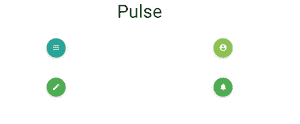
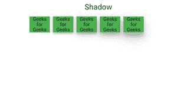

# 物化 CSS–脉冲和阴影

> 原文:[https://www . geesforgeks . org/物化-CSS-脉影/](https://www.geeksforgeeks.org/materialize-css-pulse-and-shadow/)

**脉搏:** 用于将注意力引向按钮，具有这种微妙但迷人的效果。只需要给按钮添加脉冲类。

**注意:**这仅用于浮动按钮，因为它不会与其他组件一起工作。

> <a class = " BTN-浮动 BTN-大脉"><I class = " material-icons ">arrow _ down</I></a>
> T14】a class = " BTN-浮动 BTN-大脉青色"><I class = " material-icons ">编辑< /i > < /a

**示例:**

## 超文本标记语言

```css
<!DOCTYPE html>
<html>

<head>
    <!--Import Google Icon Font-->
    <link href=
"https://fonts.googleapis.com/icon?family=Material+Icons"
        rel="stylesheet">

    <!-- Compiled and minified CSS -->
    <link rel="stylesheet" href=
"https://cdnjs.cloudflare.com/ajax/libs/materialize/0.97.5/css/materialize.min.css">

    <style>
        .margin {
            margin: 30px 0px;
        }
    </style>

    <!--Let browser know website is 
        optimized for mobile-->
    <meta name="viewport" content=
        "width=device-width, initial-scale=1.0" />
</head>

<body class="container">
    <div class="row center-align">
        <h2>Pulse</h2>
        <div class="col s6 margin ">
            <a class="btn btn-floating 
                btn-large pulse">
                <i class="material-icons">
                    menu
                </i>
            </a>
        </div>
        <div class="col s6 margin">
            <a class="btn btn-floating 
                btn-large light-green pulse">
                <i class="material-icons">
                    account_circle
                </i>
            </a>
        </div>
        <div class="col s6 margin">
            <a class="btn btn-floating 
                btn-large green pulse">
                <i class="material-icons">
                    edit
                </i>
            </a>
        </div>
        <div class="col s6 margin">
            <a class="btn btn-floating 
                btn-large green pulse">
                <i class="material-icons">
                    notifications
                </i>
            </a>
        </div>
    </div>

    <!-- Compiled and minified JavaScript -->
    <script src=
"https://cdnjs.cloudflare.com/ajax/libs/materialize/0.97.5/js/materialize.min.js">
    </script>
</body>

</html>
```

**输出:**



**阴影:** 为了确定元素离页面有多远，物化使用阴影效果。为此使用**class = " z-depth-1 "**。根据阴影效果，有五个等级，从**级=“z-depth-1”**到**级=“z-depth-5”。**

```css
<div class="col s12 m2">
    <p class="z-depth-1"> For z-depth-1</p>
</div>
<div class="col s12 m2">
    <p class="z-depth-2"> For z-depth-2</p>
</div>
<div class="col s12 m2">
    <p class="z-depth-3"> For z-depth-3</p>
</div>
<div class="col s12 m2">
    <p class="z-depth-4"> For z-depth-4</p>
</div>
<div class="col s12 m2">
    <p class="z-depth-5"> For z-depth-5</p>
</div>
```

**示例:**

## 超文本标记语言

```css
<!DOCTYPE html>
<html>

<head>
    <!--Import Google Icon Font-->
    <link href=
"https://fonts.googleapis.com/icon?family=Material+Icons"
        rel="stylesheet">

    <!-- Compiled and minified CSS -->
    <link rel="stylesheet" href=
"https://cdnjs.cloudflare.com/ajax/libs/materialize/0.97.5/css/materialize.min.css">

    <!--Let browser know website is 
        optimized for mobile-->
    <meta name="viewport" content=
        "width=device-width, initial-scale=1.0" />
</head>

<body class="container">
    <div class="row center-align">
        <h2>Shadow</h2>
        <div class=" col s3 m2 ">
            <h4 class="z-depth-1 green">
                Geeks for Geeks
            </h4>
        </div>
        <div class=" col s3 m2">
            <h4 class="z-depth-2 green">
                Geeks for Geeks
            </h4>
        </div>
        <div class=" col s3 m2">
            <h4 class="z-depth-3 green">
                Geeks for Geeks
            </h4>
        </div>
        <div class=" col s3 m2">
            <h4 class="z-depth-4 green">
                Geeks for Geeks
            </h4>
        </div>
        <div class=" col s3 m2">
            <h4 class="z-depth-5 green">
                Geeks for Geeks
            </h4>
        </div>

        <!-- Compiled and minified JavaScript -->
        <script src=
"https://cdnjs.cloudflare.com/ajax/libs/materialize/0.97.5/js/materialize.min.js">
        </script>
    </div>
</body>

</html>
```

**输出:**

