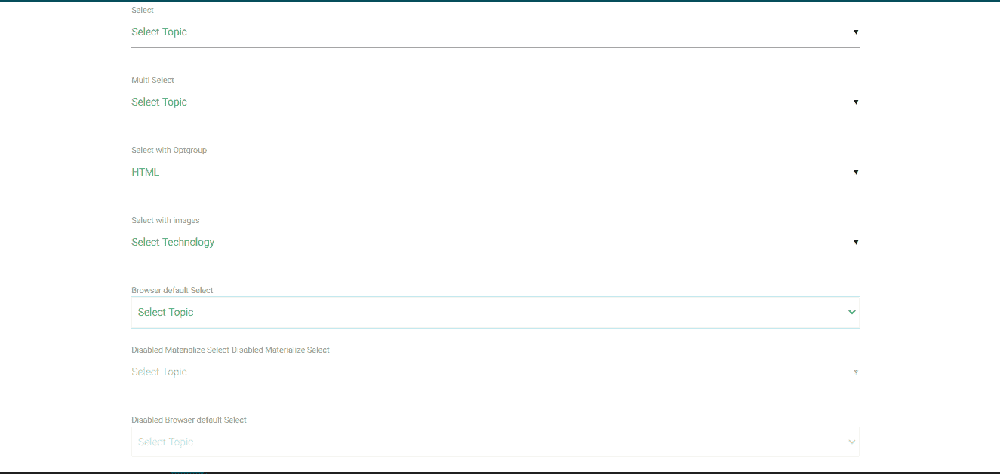

# 物化 CSS 选择

> 原文:[https://www.geeksforgeeks.org/materialize-css-select/](https://www.geeksforgeeks.org/materialize-css-select/)

物化提供了一个选择功能来创建选项，可以很容易地选择这些选项来为 web 表单提供更多信息。以下是不同的选择功能:

*   **简单选择选项:**允许从选择下拉列表中选择一个选项。为此，<选择>和<选项>标签被使用。
*   **通过多个选项选择下拉菜单:**允许从选择下拉菜单中选择多个选项。为此，在<选择>标签中使用了多个属性。
*   **使用选项组选择下拉菜单:**允许从列表中选择基于选择下拉菜单的类别。
*   **选择带图像的下拉菜单:**允许显示带选项的图像。
*   **使用浏览器默认值选择下拉菜单:**它可以与选择标签中的默认类一起使用。

**禁用样式:**

物化选择提供了自己使用的禁用功能。要使整个项目不可选择，将**禁用的**属性添加到选择元素，并禁用单个选项，然后将**禁用的**添加到选项。

**示例:**

## 超文本标记语言

```css
<!DOCTYPE html>
<html>
    <head>
        <!--Import Google Icon Font-->
        <link href=
"https://fonts.googleapis.com/icon?family=Material+Icons"
              rel="stylesheet" />

        <!-- Compiled and minified CSS -->
        <link rel="stylesheet"
              href=
"https://cdnjs.cloudflare.com/ajax/libs/materialize/0.97.5/css/materialize.min.css" />
        <script type="text/javascript"
                src=
     "https://code.jquery.com/jquery-2.1.1.min.js">
      </script>
        <script src=
"https://cdnjs.cloudflare.com/ajax/libs/materialize/0.97.3/js/materialize.min.js">
      </script>

        <!--Let browser know website
            is optimized for mobile-->
        <meta name="viewport"
              content=
              "width=device-width, initial-scale=1.0" />
    </head>

    <body class="container">
        <div class="row">
            <form class="col s12">
                <div class="row">
                    <label>Select</label>
                    <div class="select1 green-text">
                        <select>
                            <option value=""
                                    disabled selected>
                              Select Topic
                          </option>
                            <option value="1">
                              Machine Learning</option>
                            <option value="2">
                              Web Development</option>
                            <option value="3">
                              Language</option>
                        </select>
                    </div>
                </div>

                <div class="row green-text">
                    <label>Multi Select</label>
                    <select multiple>
                        <option value=""
                                disabled selected>
                          Select Topic</option>
                        <option value="1">
                          Machine Learning</option>
                        <option value="2">
                          Web Development</option>
                        <option value="3">
                          Language</option>
                    </select>
                </div>

                <div class="row green-text">
                    <label>Select with Optgroup</label>
                    <select>
                        <optgroup label="Web Development">
                            <option value="1">
                              HTML</option>
                            <option value="2">
                              CSS</option>
                            <option value="3">
                              JavaScript</option>
                        </optgroup>

                        <optgroup label="Language">
                            <option value="4">
                              Python</option>
                            <option value="5">
                              C</option>
                            <option value="6">
                              Java</option>
                        </optgroup>
                    </select>
                </div>

                <div class="row green-text">
                    <label>Select with images</label>
                    <select class="icons">
                        <option value=""
                                disabled selected>
                          Select Technology</option>
                        <option value="1"
                                data-icon=
"https://pbs.twimg.com/profile_images/1138375574726955008/1fNUyEdv_400x400.png"
                                class="circle"> HTML</option>
                        <option value="2">JavaScript</option>
                        <option value="3">CSS</option>
                    </select>
                </div>

                <div class="row green-text">
                    <label>Browser default Select</label>
                    <select class="browser-default">
                        <option value=""
                                disabled selected>
                          Select Topic</option>
                        <option value="1">
                          Machine Learning</option>
                        <option value="2">
                          Web Development</option>
                        <option value="3">
                          Language</option>
                    </select>
                </div>

                <div class="row green-text">
                    <label>
                      Disabled Materialize Select</label>
                    <label>
                      Disabled Materialize Select</label>
                    <select disabled>
                        <option value=""
                                disabled selected>
                          Select Topic</option>
                        <option value="1">
                          Machine Learning</option>
                        <option value="2">
                          Web Development</option>
                        <option value="3">
                          Language</option>
                    </select>
                </div>

                <div class="row green-text">
                    <label>Disabled Browser
                      default Select</label>
                    <select class="browser-default"
                            disabled>
                        <option value=""
                                disabled selected>
                          Select Topic</option>
                        <option value="1">
                          Machine Learning</option>
                        <option value="2">
                          Web Development</option>
                        <option value="3">
                          Language</option>
                    </select>
                </div>
            </form>
        </div>

        <script>
            $(document).ready(function () {
                $("select").material_select();
            });
        </script>
        <!-- Compiled and minified JavaScript -->
        <script src=
"https://cdnjs.cloudflare.com/ajax/libs/materialize/0.97.5/js/materialize.min.js">
      </script>
    </body>
</html>
```

**输出:**

