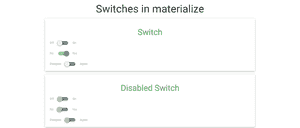

# 物化 CSS 开关

> 原文:[https://www.geeksforgeeks.org/materialize-css-switches/](https://www.geeksforgeeks.org/materialize-css-switches/)

物化提供开关，允许查看者在两个可用选项中选择一个。通常，开关是用于二进制状态的特殊复选框，如开/关或是/否或同意/不同意。

可以使用包装器 div 中的**“switch”**类创建开关，输入类型= **“复选框”**。另一个必需的类是< span >标签中使用的**“杠杆”**。通过添加 CSS 元素，可以根据自己的选择修改开关。下面是 switch 的基本视图。

**示例:**

```
<!DOCTYPE html>
<html>
    <head>
        <!--Import Google Icon Font-->
        <link href=
"https://fonts.googleapis.com/icon?family=Material+Icons" 
              rel="stylesheet" />

        <!-- Compiled and minified CSS -->
        <link rel="stylesheet" 
              href=
"https://cdnjs.cloudflare.com/ajax/libs/materialize/0.97.5/css/materialize.min.css" />
        <script type="text/javascript" 
                src=
"https://code.jquery.com/jquery-2.1.1.min.js"></script>
        <script src=
"https://cdnjs.cloudflare.com/ajax/libs/materialize/0.97.3/js/materialize.min.js">
      </script>

        <!--Let browser know website
              is optimized for mobile-->
        <meta name="viewport" 
              content="width=device-width, 
                       initial-scale=1.0" />
    </head>

    <body class="container">
        <div class="center">
          <h3>Switches in materialize</h3>
      </div>
        <div class="card-panel green-text">
            <h4 class="center">Switch</h4>
            <!-- Switch -->
            <div class="switch">
                <label>
                    Off
                    <input type="checkbox" />
                    <span class="lever"></span>
                    On
                </label>
            </div>
            <br />
            <div class="switch">
                <label>
                    No
                    <input type="checkbox" />
                    <span class="lever"></span>
                    Yes
                </label>
            </div>
            <br />
            <div class="switch">
                <label>
                    Disagree
                    <input type="checkbox" />
                    <span class="lever"></span>
                    Agree
                </label>
            </div>
        </div>

        <div class="card-panel green-text">
            <h4 class="center">Disabled Switch</h4>
            <div class="switch">
                <label>
                    Off
                    <input disabled type="checkbox" />
                    <span class="lever"></span>
                    On
                </label>
            </div>
            <br />
            <div class="switch">
                <label>
                    No
                    <input disabled type="checkbox" />
                    <span class="lever"></span>
                    Yes
                </label>
            </div>
            <br />
            <div class="switch">
                <label>
                    Disagree
                    <input disabled type="checkbox" />
                    <span class="lever"></span>
                    Agree
                </label>
            </div>
        </div>
        <!-- Disabled Switch -->

        <!-- Compiled and minified JavaScript -->
        <script src=
"https://cdnjs.cloudflare.com/ajax/libs/materialize/0.97.5/js/materialize.min.js">
      </script>
    </body>
</html>
```

**输出:**

