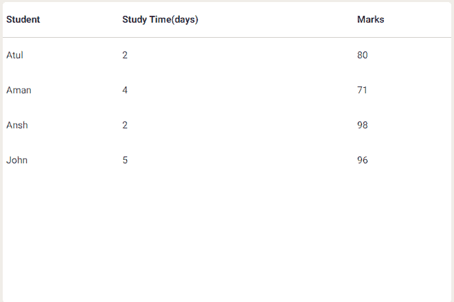
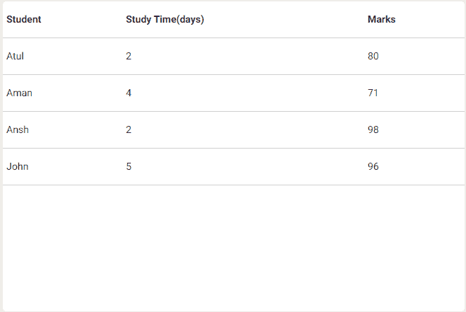
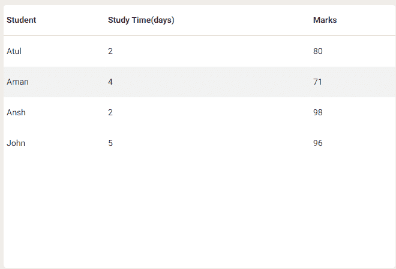
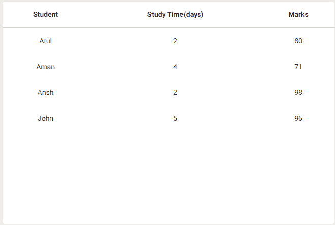
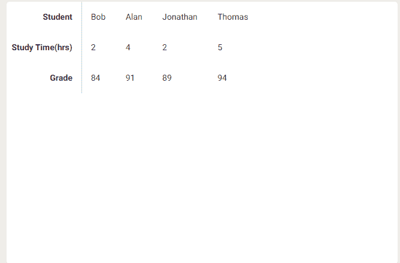

# 物化 CSS |表格

> 原文:[https://www.geeksforgeeks.org/materialize-css-tables/](https://www.geeksforgeeks.org/materialize-css-tables/)

表格是组织大量数据的一种很好且简单的方式。物化 CSS 提供了一些工具类来设置表格的样式。除了改善移动体验，手机屏幕宽度上的所有表格都自动居中。以下是表格的样式:

*   **Stripped Table:**

    ```html
    <!DOCTYPE html>
    <html>

    <head>

        <!--Import Google Icon Font-->
        <link href=
    "https://fonts.googleapis.com/icon?family=Material+Icons"
            rel="stylesheet">

        <!-- Compiled and minified CSS -->
        <link rel="stylesheet" href=
    "https://cdnjs.cloudflare.com/ajax/libs/materialize/0.97.5/css/materialize.min.css">

        <!--Let browser know website is 
            optimized for mobile-->
        <meta name="viewport" content=
            "width=device-width, initial-scale=1.0" />
    </head>

    <body>
        <table class="striped">
            <thead>
                <tr>
                    <th>Student</th>
                    <th>Study Time(days)</th>
                    <th>Marks</th>
                </tr>
            </thead>

            <tbody>
                <tr>
                    <td>Atul</td>
                    <td>2</td>
                    <td>80</td>
                </tr>
                <tr>
                    <td>Aman</td>
                    <td>4</td>
                    <td>71</td>
                </tr>
                <tr>
                    <td>Ansh</td>
                    <td>2</td>
                    <td>98</td>
                </tr>
                <tr>
                    <td>John</td>
                    <td>5</td>
                    <td>96</td>
                </tr>
            </tbody>
        </table>

        <!-- Compiled and minified JavaScript -->
        <script src=
    "https://cdnjs.cloudflare.com/ajax/libs/materialize/0.97.5/js/materialize.min.js">
        </script>
    </body>

    </html>
    ```

    **输出:**

    

*   **Bordered Table:**

    ```html
    <!DOCTYPE html>
    <html>

    <head>
        <!--Import Google Icon Font-->
        <link href=
    "https://fonts.googleapis.com/icon?family=Material+Icons"
            rel="stylesheet">

        <!-- Compiled and minified CSS -->
        <link rel="stylesheet" href=
    "https://cdnjs.cloudflare.com/ajax/libs/materialize/0.97.5/css/materialize.min.css">

        <!--Let browser know website is
            optimized for mobile-->
        <meta name="viewport" content=
            "width=device-width, initial-scale=1.0" />
    </head>

    <body>
        <table class="bordered">
            <thead>
                <tr>
                    <th>Student</th>
                    <th>Study Time(days)</th>
                    <th>Marks</th>
                </tr>
            </thead>

            <tbody>
                <tr>
                    <td>Atul</td>
                    <td>2</td>
                    <td>80</td>
                </tr>
                <tr>
                    <td>Aman</td>
                    <td>4</td>
                    <td>71</td>
                </tr>
                <tr>
                    <td>Ansh</td>
                    <td>2</td>
                    <td>98</td>
                </tr>
                <tr>
                    <td>John</td>
                    <td>5</td>
                    <td>96</td>
                </tr>
            </tbody>
        </table>

        <!-- Compiled and minified JavaScript -->
        <script src=
    "https://cdnjs.cloudflare.com/ajax/libs/materialize/0.97.5/js/materialize.min.js">
        </script>
    </body>

    </html>
    ```

    **输出:**

    

*   **Highlighted Table:**

    ```html
    <!DOCTYPE html>
    <html>

    <head>
        <!--Import Google Icon Font-->
        <link href=
    "https://fonts.googleapis.com/icon?family=Material+Icons"
            rel="stylesheet">

        <!-- Compiled and minified CSS -->
        <link rel="stylesheet" href=
    "https://cdnjs.cloudflare.com/ajax/libs/materialize/0.97.5/css/materialize.min.css">

        <!--Let browser know website is 
            optimized for mobile-->
        <meta name="viewport" content=
            "width=device-width, initial-scale=1.0" />
    </head>

    <body>
        <table class="highlight">
            <thead>
                <tr>
                    <th>Student</th>
                    <th>Study Time(days)</th>
                    <th>Marks</th>
                </tr>
            </thead>

            <tbody>
                <tr>
                    <td>Atul</td>
                    <td>2</td>
                    <td>80</td>
                </tr>
                <tr>
                    <td>Aman</td>
                    <td>4</td>
                    <td>71</td>
                </tr>
                <tr>
                    <td>Ansh</td>
                    <td>2</td>
                    <td>98</td>
                </tr>
                <tr>
                    <td>John</td>
                    <td>5</td>
                    <td>96</td>
                </tr>
            </tbody>
        </table>

        <!-- Compiled and minified JavaScript -->
        <script src=
    "https://cdnjs.cloudflare.com/ajax/libs/materialize/0.97.5/js/materialize.min.js">
        </script>
    </body>

    </html>
    ```

    **输出:**

    

*   **Centered Table:**

    ```html
    <!DOCTYPE html>
    <html>

    <head>
        <!--Import Google Icon Font-->
        <link href=
    "https://fonts.googleapis.com/icon?family=Material+Icons"
            rel="stylesheet">

        <!-- Compiled and minified CSS -->
        <link rel="stylesheet" href=
    "https://cdnjs.cloudflare.com/ajax/libs/materialize/0.97.5/css/materialize.min.css">

        <!--Let browser know website is 
            optimized for mobile-->
        <meta name="viewport" content=
            "width=device-width, initial-scale=1.0" />
    </head>

    <body>
        <table class="centered">
            <thead>
                <tr>
                    <th>Student</th>
                    <th>Study Time(days)</th>
                    <th>Marks</th>
                </tr>
            </thead>

            <tbody>
                <tr>
                    <td>Atul</td>
                    <td>2</td>
                    <td>80</td>
                </tr>
                <tr>
                    <td>Aman</td>
                    <td>4</td>
                    <td>71</td>
                </tr>
                <tr>
                    <td>Ansh</td>
                    <td>2</td>
                    <td>98</td>
                </tr>
                <tr>
                    <td>John</td>
                    <td>5</td>
                    <td>96</td>
                </tr>
            </tbody>
        </table>

        <!-- Compiled and minified JavaScript -->
        <script src=
    "https://cdnjs.cloudflare.com/ajax/libs/materialize/0.97.5/js/materialize.min.js">
        </script>
    </body>

    </html>
    ```

    **输出:**

    

*   **Responsive Table:**

    ```html
    <!DOCTYPE html>
    <html>

    <head>
        <!--Import Google Icon Font-->
        <link href=
    "https://fonts.googleapis.com/icon?family=Material+Icons"
            rel="stylesheet">

        <!-- Compiled and minified CSS -->
        <link rel="stylesheet" href=
    "https://cdnjs.cloudflare.com/ajax/libs/materialize/0.97.5/css/materialize.min.css">

        <!--Let browser know website is 
            optimized for mobile-->
        <meta name="viewport" content=
            "width=device-width, initial-scale=1.0" />
    </head>

    <body>
        <table class="responsive-table">
            <thead>
                <tr>
                    <th>Student</th>
                    <th>Study Time(days)</th>
                    <th>Marks</th>
                </tr>
            </thead>

            <tbody>
                <tr>
                    <td>Atul</td>
                    <td>2</td>
                    <td>80</td>
                </tr>
                <tr>
                    <td>Aman</td>
                    <td>4</td>
                    <td>71</td>
                </tr>
                <tr>
                    <td>Ansh</td>
                    <td>2</td>
                    <td>98</td>
                </tr>
                <tr>
                    <td>John</td>
                    <td>5</td>
                    <td>96</td>
                </tr>
            </tbody>
        </table>

        <!-- Compiled and minified JavaScript -->
        <script src=
    "https://cdnjs.cloudflare.com/ajax/libs/materialize/0.97.5/js/materialize.min.js">
        </script>
    </body>

    </html>
    ```

    **听着:**

    