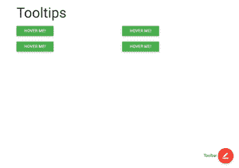

# 物化 CSS |工具提示

> 原文:[https://www.geeksforgeeks.org/materialize-css-tooltips/](https://www.geeksforgeeks.org/materialize-css-tooltips/)

工具提示是小的、文本的但交互的提示，主要用于图形目的。它帮助图标或按钮阐明其功能。为此，添加了**工具提示类**及其位置，如:顶部、底部、左侧或右侧。语法如下:

```html
 <a class="btn tooltipped" data-position="bottom" data-tooltip="I am a tooltip">Hover me!</a>
```

**示例:**

## 超文本标记语言

```html
<!DOCTYPE html>
<html>
    <head>
        <meta
            name="viewport"
            content="width = device-width,
                       initial-scale = 1"
        />
        <link rel="stylesheet"
              href=
"https://fonts.googleapis.com/icon?family=Material+Icons" />
        <link rel="stylesheet"
              href=
"https://cdnjs.cloudflare.com/ajax/libs/materialize/0.97.3/css/materialize.min.css" />
        <script type="text/javascript"
                src=
"https://code.jquery.com/jquery-2.1.1.min.js">
      </script>
        <script src=
"https://cdnjs.cloudflare.com/ajax/libs/materialize/0.97.3/js/materialize.min.js">
      </script>
    </head>

    <body class="container">
        <div class="fixed-action-btn toolbar">
            <strong>Toolbar</strong>
            <a class="btn-floating btn-large red">
                <i class="large material-icons">
                  border_color</i>
            </a>
            <ul>
                <li class="waves-effect waves-light">
                    <a href="#!">
                      <i class="material-icons">
                        insert_chart</i></a>
                </li>
                <li class="waves-effect waves-light">
                    <a href="#!">
                      <i class="material-icons">
                        format_quote</i></a>
                </li>
                <li class="waves-effect waves-light">
                    <a href="#!">
                      <i class="material-icons">
                        publish</i></a>
                </li>
                <li class="waves-effect waves-light">
                    <a href="#!">
                      <i class="material-icons">
                        attach_file</i></a>
                </li>
            </ul>
        </div>
        <h2>Tooltips</h2>
        <div class="row">
            <div class="col s6">
                <a class="btn tooltipped green"
                   data-position="bottom"
                   data-delay="50"
                   data-tooltip="Additional Information">
                  Hover me!
              </a>
            </div>
            <div class="col s6">
                <a class="btn tooltipped green"
                   data-position="top"
                   data-delay="50"
                   data-tooltip="Additional Information">
                  Hover me!
              </a>
            </div>
        </div>
        <div class="row">
            <div class="col s6">
                <a class="btn tooltipped green"
                   data-position="left"
                   data-delay="50"
                   data-tooltip="Additional Information">
                  Hover me!
              </a>
            </div>
            <div class="col s6">
                <a class="btn tooltipped green"
                   data-position="top"
                   data-delay="50"
                   data-tooltip="Additional Information">
                  Hover me!
              </a>
            </div>
        </div>
    </body>
</html>
```

**输出:**

