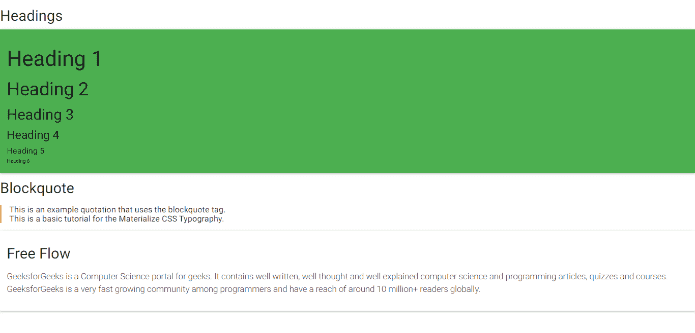

# 物化 CSS |排版

> 原文:[https://www.geeksforgeeks.org/materialize-css-typography/](https://www.geeksforgeeks.org/materialize-css-typography/)

物化 CSS 提供了几个可用于页面排版的元素:

*   头球
*   引用
*   流动文本

**标题:**物化 CSS 提供了用于标题标签的基本样式。下面的标签显示了由物化 CSS 样式化的可用标题标签:

```css
<h1>Heading 1</h1>  
<h2>Heading 2</h2>  
<h3>Heading 3</h3>  
<h4>Heading 4</h4>  
<h5>Heading 5</h5>  
<h6>Heading 6</h6>  

```

**区块引用:**区块引用用于强调引用或引文。它也可以用于额外的文本层次和强调。

```css
<blockquote>
    This is an example quotation using blockquote tag.
</blockquote>

```

**流文本:**流文本类可用于流畅地调整需要缩放的文本的字体大小和行高。要使用流文本，需要将类**流文本**添加到所需的标签中。下面的例子显示了这个类的用法。

```css
<p class="flow-text">I am Flow Text</p>

```

**注意:**物化 CSS 使用的标准字体是 **Roboto 2.0** 字体。这种字体可以通过简单地改变字体堆栈来替换。这可以通过修改下面的代码来完成，以包含所需的字体并添加到自定义 CSS 中。

```css
html {
   font-family: GillSans, Calibri, Trebuchet, sans-serif;
}
```

**示例:**

## 超文本标记语言

```css
<!DOCTYPE html>
<html>

<head>
    <!-- Include the Google Icon Font -->
    <link rel="stylesheet" href=
"https://fonts.googleapis.com/icon?family=Material+Icons">

    <!-- Include compiled and
        minified Materialize CSS -->
    <link rel="stylesheet" href=
"https://cdnjs.cloudflare.com/ajax/libs/materialize/0.97.5/css/materialize.min.css">

    <!-- Include jQuery -->
    <script type="text/javascript" 
    src="https://code.jquery.com/jquery-2.1.1.min.js">
    </script>
</head>

<body>
    <h3>Headings</h3>
    <div class="card-panel green">

        <!-- Using all the headers -->
        <h1>Heading 1</h1>
        <h2>Heading 2</h2>
        <h3>Heading 3</h3>
        <h4>Heading 4</h4>
        <h5>Heading 5</h5>
        <h6>Heading 6</h6>
    </div>

    <!-- Using blockquotes -->
    <h3>Blockquote</h3>
    <h5>
        <blockquote>
            <p>
                This is an example quotation
                that uses the blockquote tag.
                <br>
                This is a basic tutorial for
                the Materialize CSS Typography.
            </p>
        </blockquote>
    </h5>

    <div class="card-panel">
        <h3>Free Flow</h3>

        <!-- Using the flow-text class -->
        <p class="flow-text">
            GeeksforGeeks is a Computer
            Science portal for geeks.
            It contains well written,
            well thought and well explained
            computer science and programming
            articles, quizzes and courses.
            GeeksforGeeks is a very fast
            growing community among programmers
            and have a reach of around 10
            million+ readers globally.
        </p>
    </div>

    <!-- Include the compiled and
        minified Materialize JavaScript -->
    <script src=
"https://cdnjs.cloudflare.com/ajax/libs/materialize/0.97.5/js/materialize.min.js">
    </script>
</body>

</html>
```

**输出:**

