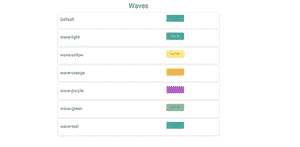

# 物化 CSS |波浪

> 原文:[https://www.geeksforgeeks.org/materialize-css-waves/](https://www.geeksforgeeks.org/materialize-css-waves/)

物化包括一个外部库波，以创建材料设计中概述的油墨效果。波浪可以应用于任何元素，要在按钮上使用这种效果，**波浪效果类**被添加到按钮上。

有几种方法可以对波进行分类。它可以通过预先创建的类或创建一个不同颜色的新类来完成。

```
<a class="waves-effect waves-light btn-large" href="#">Wave</a>
```

**示例:**

```

<!DOCTYPE html>
    <html>
      <head>
        <!--Import Google Icon Font-->
        <link href=
"https://fonts.googleapis.com/icon?family=Material+Icons"
              rel="stylesheet">

        <!-- Compiled and minified CSS -->
        <link rel="stylesheet" 
              href=
"https://cdnjs.cloudflare.com/ajax/libs/materialize/0.97.5/css/materialize.min.css">
        <script type = "text/javascript"
                src = 
"https://code.jquery.com/jquery-2.1.1.min.js">
        </script>           
     <script src = 
"https://cdnjs.cloudflare.com/ajax/libs/materialize/0.97.3/js/materialize.min.js">
     </script>
        <!--Let browser know website is optimized for mobile-->
        <meta name="viewport" 
              content="width=device-width,
                       initial-scale=1.0"/>
      </head>

      <body class="container">
        <h2 class="center">Waves</h2>
       <div class="card-panel ">
         <div class="row">
         <div class="col s8"><h4>Default </h4></div>
        <div class="col s4"><a href="#!"
             class=
"btn-large waves-effect waves-teal black-text white">
          Click me!!</a></div>
       </div>
      </div>
      <div class="card-panel">
        <div class="row">
        <div class="col s8"><h4>wave-light</h4></div>
       <div class="col s4"><a href="#!" 
            class="btn-large waves-effect waves-light">
              Click me!!</a></div>
      </div>
     </div>
      <div class="card-panel">
        <div class="row">
        <div class="col s8"><h4>wave-yellow </h4></div>
      <div class="col s4">
          <a href="#!" 
             class=
"btn-large waves-effect waves-yellow black-text white">
         Click me!!</a></div>
      </div>
    </div>
      <div class="card-panel">
        <div class="row">
        <div class="col s8"><h4>wave-orange </h4></div>
      <div class="col s4">
           <a href="#!" 
              class=
"btn-large waves-effect waves-orange black-text white">
                Click me!!</a></div>
      </div>
    </div>
    <div class="card-panel">
      <div class="row">
      <div class="col s8"><h4>wave-purple</h4></div>
    <div class="col s4">
       <a href="#!"
          class=
"btn-large waves-effect waves-purple black-text white">
             Click me!!</a></div>
    </div>
        </div>
    <div class="card-panel">
      <div class="row">
      <div class="col s8"><h4>wave-green</h4></div>
    <div class="col s4">
          <a href="#!" 
             class=
"btn-large waves-effect waves-green black-text white">
               Click me!!</a></div>
    </div>
    </div>
    <div class="card-panel">
      <div class="row">
      <div class="col s8"><h4>wave-teal</h4></div>
    <div class="col s4">
         <a href="#!" 
            class=
"btn-large waves-effect waves-teal black-text white">
                Click me!!</a></div>
    </div>
    </div>

        <!-- Compiled and minified JavaScript -->
        <script src=
"https://cdnjs.cloudflare.com/ajax/libs/materialize/0.97.5/js/materialize.min.js">
        </script>

      </body>
</html>
```

**输出:**

