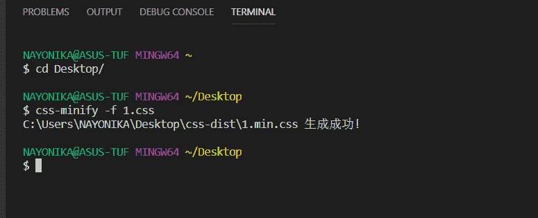
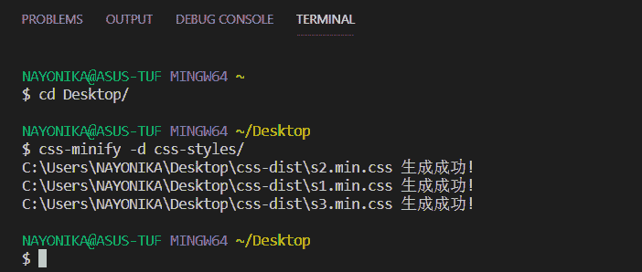
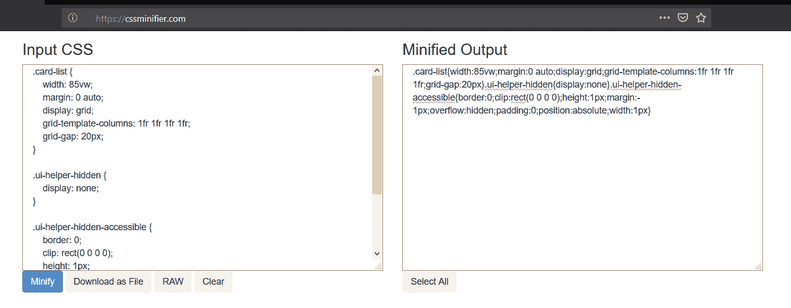

# CSS 文件的缩小

> 原文:[https://www.geeksforgeeks.org/minification-of-css-files/](https://www.geeksforgeeks.org/minification-of-css-files/)

缩小一个 CSS 文件意味着删除源代码中不必要的字符，以减小文件大小并促进网站的更快加载。当用户请求一个网页时，发送的是缩小版而不是完整版，这导致**更快的响应时间**和**更低的带宽成本**。它提高了网站的速度和可访问性，并帮助搜索引擎排名上升。

缩小过程中删除的不必要字符包括空格、换行符、注释和块分隔符。缩小后的 CSS 文件以**. min . CSS '**扩展名结尾。

**缩小前 CSS:**

```html
.card-list {
    width: 85vw;
    margin: 0 auto;
    display: grid;
    grid-template-columns: 1fr 1fr 1fr 1fr;
    grid-gap: 20px;
}

.ui-helper-hidden {
    display: none;
}

.ui-helper-hidden-accessible {
    border: 0;
    height: 1px;
    margin: -1px;
    overflow: hidden;
    padding: 0;
    position: absolute;
    width: 1px;
    clip: rect(0 0 0 0);
}
```

**缩小后的 CSS:**

> 。卡片列表{宽度:85vw 边距:0 自动；显示:网格；网格-模板-柱:1fr 1fr 1fr 1fr 网格间距:20px}。ui-helper-隐藏{显示:无}。ui-helper-隐藏-可访问{边框:0；身高:1px 边距:-1px；溢出:隐藏；填充:0；位置:绝对；宽度:1px 剪辑:rect(0 0 0 0)

**本文讨论了两种缩小 CSS 文件的方法。**

1.  **css-minify npm**
    *   首先，使用

        ```html
        npm install css-minify -g
        ```

        安装工具
    *   要缩小单个 CSS 文件，请键入以下命令:

        ```html
        css-minify -f filename
        ```

    *   To minify all the css files of a directory, type:

        ```html
        css-minify -d sourcedir
        ```

        其中 sourcedir 是包含 css 文件的文件夹的名称。

    缩小后的 CSS 文件将存储在名为**“CSS-dist”**的文件夹中。所以，一定要在存储你的 css 文件/文件夹的同一个目录中创建一个**“CSS-dist”**文件夹。

    **示例:**
    在桌面上，我们有一个名为**‘1 . css’**的 CSS 文件和一个包含所有 CSS 文件的文件夹**‘CSS-style’**。
    我们还创建了一个**‘css-dist’**文件夹来存储缩小的 CSS 文件。

    **缩小单个 CSS 文件:**
    
    这会将缩小后的**【1 . min . CSS】**文件存储在**【CSS-dist】**文件夹中。

    **缩小 css 样式文件夹中的 CSS 文件:**
    

2.  **Online tool like CSS Minifier:**
    *   粘贴源代码或上传源代码文件。
    *   单击按钮缩小或压缩代码。
    *   复制精简代码输出或下载精简代码文件。

    