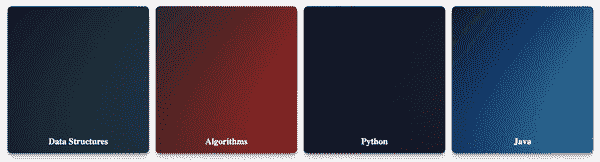

# 现代 CSS 卡

> 原文:[https://www.geeksforgeeks.org/modern-css-cards/](https://www.geeksforgeeks.org/modern-css-cards/)

卡片是一个灵活的盒子，里面有一些填充物。它包括只向用户显示有用信息的动画。它取代了面板、井和缩略图的使用。它可以在一个叫做卡片的容器中使用。要制作动画现代 CSS 卡，你需要有一点 HTML 和 CSS 知识，因为这将有助于创建它。

**示例:**

## 超文本标记语言

```css
<!DOCTYPE html>
<html>

<head>
    <title>CSS Cards</title>
    <link rel="stylesheet" href='./index.css' />
</head>

<body>
    <div class="container">
        <div class="card">
            <div class="content">
                <h2 class="title">Data Structures</h2>
                <p class="data">
                    A data structure is a particular way 
                    of organizing data in a computer so 
                    that it can be used effectively.
                </p>
            </div>
        </div>

        <div class="card">
            <div class="content">
                <h2 class="title">Algorithms</h2>
                <p class="data"> 
                    Algorithm refers to a set of 
                    rules/instructions that step-by
                    -step define how a work is to be
                    executed upon in order to get the 
                    expected results.
                </p>
            </div>
        </div>

        <div class="card">
            <div class="content">
                <h2 class="title">Python</h2>
                <p class="data">
                    Python is a high-level, general-
                    purpose and a very popular 
                    programming language.
                </p>
            </div>
        </div>

        <div class="card">
            <div class="content">
                <h2 class="title">Java</h2>
                <p class="data">
                    Java is one of the most popular 
                    and widely used programming language.
                </p>
            </div>
        </div>
    </div>
</body>

</html>
```

**index.css:** 这个文件包含了创建自定义动画边栏的所有 css 样式规则。

## 半铸钢ˌ钢性铸铁(Cast Semi-Steel)

```css
* {
    box-sizing: border-box;
}

body {
    display: grid;
    place-items: center;
}

.container {
    display: grid;
    grid-gap: 1rem;
    padding: 1rem;
    grid-template-columns: repeat(4, 1fr);
}

.card {
    position: relative;
    display: flex;
    align-items: flex-end;
    overflow: hidden;
    text-align: center;
    color: white;
    border-radius: 10px;
    box-shadow: 
        0 1px 1px rgba(0, 0, 0, 0.1), 
        0 2px 2px rgba(0, 0, 0, 0.1), 
        0 4px 4px rgba(0, 0, 0, 0.1), 
        0 8px 8px rgba(0, 0, 0, 0.1), 
        0 16px 16px rgba(0, 0, 0, 0.1);
    height: 350px;
}

.card:before {
    content: "";
    position: absolute;
    top: 0;
    left: 0;
    width: 100%;
    height: 110%;
    background-size: cover;
    background-position: 0 0;
    transition: transform 
        calc(var(850ms) * 1.5) 
        var(cubic-bezier(0.19, 1, 0.22, 1));
}

.card:after {
    content: "";
    display: block;
    position: absolute;
    top: 0;
    left: 0;
    width: 100%;
    height: 200%;
    background-image: linear-gradient( 
        to bottom, rgba(0, 0, 0, 0) 0%, 
        rgba(0, 0, 0, 0.009) 11.7%, 
        rgba(0, 0, 0, 0.034) 22.1%, 
        rgba(0, 0, 0, 0.072) 31.2%, 
        rgba(0, 0, 0, 0.123) 39.4%, 
        rgba(0, 0, 0, 0.182) 46.6%, 
        rgba(0, 0, 0, 0.249) 53.1%, 
        rgba(0, 0, 0, 0.32) 58.9%, 
        rgba(0, 0, 0, 0.394) 64.3%,
        rgba(0, 0, 0, 0.468) 69.3%, 
        rgba(0, 0, 0, 0.54) 74.1%, 
        rgba(0, 0, 0, 0.607) 78.8%, 
        rgba(0, 0, 0, 0.668) 83.6%, 
        rgba(0, 0, 0, 0.721) 88.7%, 
        rgba(0, 0, 0, 0.762) 94.1%, 
        rgba(0, 0, 0, 0.79) 100%);
    transform: translateY(-50%);

    transition: transform calc(var(850ms) * 2) 
        var(cubic-bezier(0.19, 1, 0.22, 1));
}

.card:nth-child(1):before {
    background-image: linear-gradient(
        to bottom right, #0F2027, #2C5364);
}

.card:nth-child(2):before {
    background-image: linear-gradient(
        to bottom right, #333333, #dd1818);
}

.card:nth-child(3):before {
    background-image: linear-gradient(
        to bottom right, #0f0c29, #24243e);
}

.card:nth-child(4):before {
    background-image: linear-gradient(
        to bottom right, #000046, #1CB5E0);
}

.content {
    position: relative;
    display: flex;
    flex-direction: column;
    align-items: center;
    width: 100%;
    padding: 1rem;
    transition: transform var(850ms) 
        var(cubic-bezier(0.19, 1, 0.22, 1));
    z-index: 1;
}

.title {
    font-size: 1.3rem;
    font-weight: bold;
    line-height: 1.2;
}

.data {
    margin-top: 1rem;
    font-size: 1.125rem;
    font-style: italic;
    line-height: 1.35;
}

.card:after {
    transform: translateY(0);
}

.content {
    transform: translateY(calc(100% - 4.5rem));
}

.content>*:not(.title) {
    opacity: 0;
    transform: translateY(1rem);
    transition: transform var(850ms) 
        var(cubic-bezier(0.19, 1, 0.22, 1)), 
        opacity var(850ms) 
        var(cubic-bezier(0.19, 1, 0.22, 1));
}

.card:hover,
.card:focus-within {
    align-items: center;
}

.card:hover:before,
.card:focus-within:before {
    transform: translateY(-4%);
}

.card:hover:after,
.card:focus-within:after {
    transform: translateY(-50%);
}

.card:hover .content,
.card:focus-within .content {
    transform: translateY(0);
}

.card:hover .content>*:not(.title),
.card:focus-within .content>*:not(.title) {
    opacity: 1;
    transform: translateY(0);
    transition-delay: calc(var(850ms) / 8);
}
```

**输出:**



**支持的浏览器:**

*   谷歌 Chrome
*   边缘
*   Mozilla Firefox
*   歌剧
*   旅行队