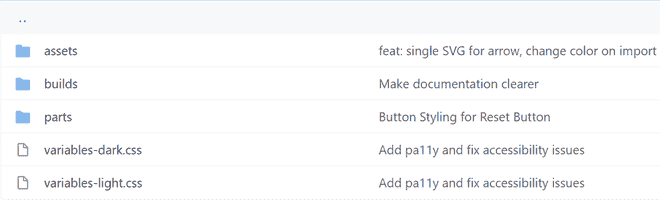

# 网页开发人员最常犯的 CSS 错误

> 原文:[https://www . geeksforgeeks . org/最常见的错误-CSS-web-开发人员犯的错误/](https://www.geeksforgeeks.org/most-common-css-mistakes-that-web-developers-make/)

级联样式表是一种用于在 HTML 标签上应用样式的样式表语言。大多数人认为 CSS 很容易学，但事实是，CSS 真的很容易学，但很难掌握。掌握 CSS 需要大量的练习。每个网络开发人员在使用 CSS 时都会犯一些常见的错误。犯错没什么大不了的，但是当你在做一个大项目的时候，小错误可能会成为你头疼的问题。所以，你应该知道自己的错误，并从中吸取教训。在本文中，我们将了解网络开发人员最常犯的 5 个 CSS 错误。

**1。不使用一致的命名:**在您的项目中使用单一的命名约定是一个很好的做法，因为如果您在一个团队中工作，那么保持一致性是很重要的，否则一切都会变得一团糟。我们还应该为类和 id 使用有意义的名称，这样我们调试代码就变得容易了，也使我们的代码更易读。

**示例:**

## 超文本标记语言

```html
<!DOCTYPE html>
<html>

<head>
    <style>
        .spiderMan {
            color: red;
        }

        .black-widow {
            font-size: 3rem;
        }
    </style>
</head>

<body>
    <h2 class="spiderMan">
        Welcome To GFG
    </h2>

    <p class="black-widow">
        Top 5 CSS mistakes that 
        web developer makes
    </p>
</body>

</html>
```

在上面的例子中，使用的类名是“蜘蛛侠”和“黑寡妇”。如果我们使用不恰当的类名和 id 名，这种做法会使我们的代码难以阅读，看起来也不专业。这里使用了两种命名惯例(即骆驼箱和烤肉串箱)。它使我们的代码看起来不一致和丑陋。因此，为您的项目使用单一命名约定并使用适当的类和 id 名称是一个很好的做法。

我们可以使用单个命名约定(在本例中，我们使用的是 camelCase)和适当的名称，方式如下:

## 超文本标记语言

```html
<!DOCTYPE html>
<html>

<head>
    <style>
        .exampleHeading {
            color: red;
        }

        .exampleContent {
            font-size: 3rem;
        }
    </style>
</head>

<body>
    <h2 class="exampleHeading">
        Welcome To GFG
    </h2>

    <p class="exampleContent">
        Top 5 CSS mistakes that 
        web developer makes
    </p>
</body>

</html>
```

上面的代码看起来比前一个代码更好，也更一致。这种做法也节省了你的时间，因为现在，你不用再去想“蜘蛛侠”和“黑寡妇”这样花哨的变量名了。

**2。使用内嵌 CSS:** 内嵌 CSS 是一种将 CSS 链接到 HTML 的方法。我们可以用这个方法来链接 CSS，没有错，但是我们应该知道什么时候应该使用内联链接 CSS，什么时候不应该。作为程序员，我们应该始终遵循 DRY(不要重复自己)原则。内联 CSS 阻止重用我们的代码，因为在它里面 CSS 属性只特定于一个元素，所以使用 CSS 类是更好的做法，因为它们是为了重用。

**示例:**

## 超文本标记语言

```html
<!DOCTYPE html>
<html>

<head>
    <title>INLINE EXAMPLE</title>
</head>

<body>
    <h2 style="color:blue;font-size:3rem;">RAY</h2>
    <h2 style="color:blue;font-size:3rem;">SHYAM</h2>
    <h2 style="color:blue;font-size:3rem;">RIDHIMA</h2>
    <h2 style="color:blue;font-size:3rem;">MAYANK</h2>
    <h2 style="color:blue;font-size:3rem;">ARJUN</h2>
</body>

</html>
```

在上面的例子中，我们有五个 h2 元素，它们都有相同的样式属性，我们在这里使用的是内嵌 CSS，这违反了 DRY 原则。因此，我们可以定义一个类来代替内联 CSS，这样可以节省您的时间，并避免内联 CSS 可能造成的混乱。

我们可以通过以下方式以更好的方式重写上述代码:

## 超文本标记语言

```html
<!DOCTYPE html>
<html>

<head>
    <title>INLINE EXAMPLE</title>

    <style>
        .example {
            color: blue;
            font-size: 3rem;
        }
    </style>
</head>

<body>
    <h2 class="example">RAY</h2>
    <h2 class="example">SHYAM</h2>
    <h2 class="example">RIDHIMA</h2>
    <h2 class="example">MAYANK</h2>
    <h2 class="example">ARJUN</h2>
</body>

</html>
```

建议使用内部或外部 CSS，而不是内联 CSS，因为这可能会在代码中造成巨大的混乱，并且更新内联 CSS 也很困难。

**3。使用绝对单位而不是相对单位:**在某些情况下使用绝对单位是可以的，但是如果你只使用绝对单位，那么这是一个巨大的错误。在当今世界，我们希望我们的网站具有响应性，这样我们就可以在不同的设备上使用它们，因此元素必须相对于窗口大小进行缩放。当窗口大小改变时，绝对单位不会缩放，因此它们对我们的响应网站不太有利。所以强烈建议用相对单位代替绝对单位。亲戚的一些单位是 vh、%、em、rem 等。

**示例:**

```html
h1 {
    font-size: 16px;
    line-height: 20px;
    margin-bottom: 8px;
}
```

在上述代码中，使用的绝对单位对我们的响应网站不利，因此我们可以通过以下方式使用相对单位来代替绝对单位:-

```html
h1 {
    font-size: 1rem;
    line-height: 1.25;
    margin-bottom: 0.5em;
}
```

**4。不在代码中放注释:**作为开发人员，我们多次听说在代码中放注释是一种很好的做法。注释可以节省您几个小时的调试时间。如果你在一个团队中工作，或者你正在进行一些大规模的工作，有必要在你的代码中加入注释，这样你的队友就可以很容易地快速理解你的 CSS，你也可以很容易地进行调试。对您的 CSS 代码进行注释是必要的，因为即使是一个单独的 HTML 页面也可能有许多与其链接的 CSS，因此强烈建议使用注释。请注意，您不应该使用长而不适当的评论，评论应该简短而适当。

**5。仅使用单个样式表:**如果您正在处理一些小项目，使用单个样式表是可以的。但是，如果您正在从事一些大规模的项目，那么强烈建议将样式表拆分成不同的样式表，因为这将变得易于维护，并将提供更好的模块化。对于不同的修复，我们可以有不同的 CSS 文件。

示例:



在上例中，有两个样式表。一个是黑暗主题，一个是光明主题。