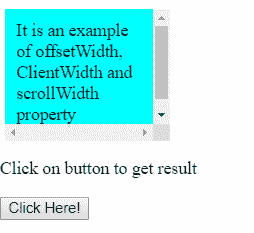
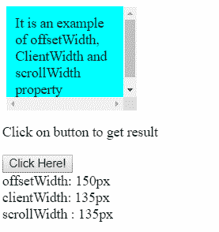
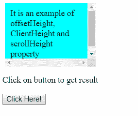
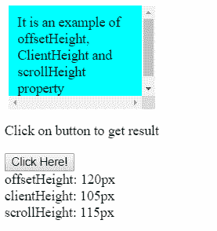

# CSS 中的偏移宽度、客户端宽度、滚动宽度和高度

> 原文:[https://www . geeksforgeeks . org/offsettwidth-client width-scroll width-and-height-分别 in-css/](https://www.geeksforgeeks.org/offsetwidth-clientwidth-scrollwidth-and-height-respectively-in-css/)

**offsetWidth:** 返回 HTML 元素的宽度，包括填充、边框和滚动条，以像素为单位，但不包括边距宽度。如果元素没有任何关联的布局框，则返回零。

**语法:**

```
element.offsetWidth
```

**clientWidth:** 返回包含像素填充的 HTML 元素的宽度，但不包含边距、边框和滚动条宽度。

**语法:**

```
element.clientWidth
```

**scrollWidth:** 返回 html 元素中包含的内容的宽度，包括填充但不包括边距、边框和滚动条。

**语法:**

```
element.scrollWidth
```

**示例:**此示例说明了 offsetWidth、clientWidth 和 scrollWidth 属性的使用。

```
<!DOCTYPE html>
<html>

<head>
    <title>
        Use of offsetWidth, ClientWidth
        and scrollWidth property
    </title>

    <style>
        #box {
            height: 100px;
            width: 130px;
            border: 5px black;
            padding: 10px;
            margin: 5px;
            overflow: scroll; 
            background-color: aqua;
        }
    </style>
</head>

<body>
    <div id="box">
        It is an example of offsetWidth, ClientWidth
        and scrollWidth property
    </div>

    <p>Click on button to get result</p>

    <button onClick="display()">
        Click Here!
    </button> 

    <div id="result"></div>

    <!-- Script to uses offsetWidth, ClientWidth
        and scrollWidth property -->
    <script>
        function display() {
            var ele = document.getElementById("box");
            var osw = ele.offsetWidth;
            var sw = ele.scrollWidth;
            var cw = ele.clientWidth;

            document.getElementById("result").innerHTML
                = "offsetWidth: " + osw + "px<br>clientWidth: "
                  + cw + "px<br>scrollWidth : " + sw + "px" ;
        }
    </script>
</body>

</html>                    
```

**输出:**
**点击按钮前:**

**点击按钮后:**


**offset thight:**返回 HTML 元素的高度，包括填充、边框和滚动条，以像素为单位，但不包括边距高度。如果元素没有任何关联的布局框，则返回零。

**语法:**

```
element.offsetHeight
```

**clientHeight:** 返回 HTML 元素的高度，包括像素填充，但不包括边距、边框和滚动条高度。

**语法:**

```
element.clientHeight
```

**scrollHeight:** 返回 html 元素中包含的内容的高度，包括填充但不包括边距、边框和滚动条。

**语法:**

```
element.scrollHeight
```

**示例:**此示例说明了 offsetHeight、clientHeight 和 scrollHeight 属性的使用。

```
<!DOCTYPE html>
<html>

<head>
    <title>
        Use of offsetHeight, ClientHeight
        and scrollHeight property
    </title>

    <style>
        #box {
            height: 100px;
            width: 150px;
            border: 5px black;
            padding: 10px;
            margin: 5px;
            overflow: scroll; 
            background-color: aqua;
        }
    </style>
</head>

<body>
    <div id="box">
        It is an example of offsetHeight, ClientHeight
        and scrollHeight property
    </div>

    <p>Click on button to get result</p>

    <button onClick="display()">
        Click Here!
    </button> 

    <div id="result"></div>

    <script>
        function display() {
            var ele = document.getElementById("box");
            var osw = ele.offsetHeight;
            var sw = ele.scrollHeight;
            var cw = ele.clientHeight;

            document.getElementById("result").innerHTML
                = "offsetHeight: " + osw + "px<br>clientHeight: "
                  + cw + "px<br>scrollHeight: " + sw + "px" ;
        }
    </script>
</body>

</html>                    
```

**输出:**
**点击按钮前:**

**点击按钮后:**
